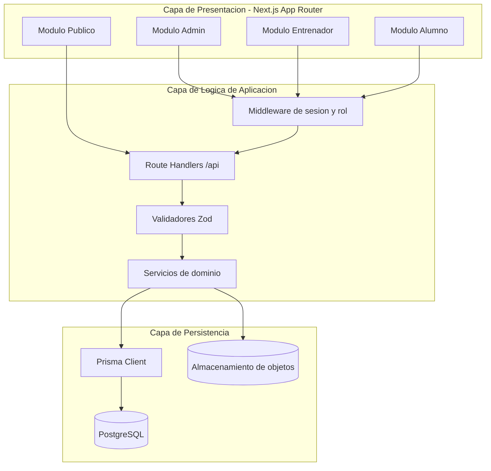
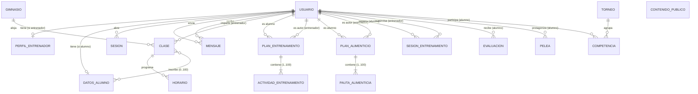

# Design Document

## Overview

Este documento define el diseño técnico para dos entregables complementarios del proyecto **Corazón Azteca** (`corazon_jab`):

1. **Documentación de arquitectura del sistema**: descripción de capas, módulos por rol, roles de acceso, estado actual vs. objetivo y un diagrama del sistema.
2. **Diseño de base de datos y persistencia real**: un modelo de datos relacional completo con claves, relaciones e integridad referencial, una estrategia de autenticación real y control de acceso por rol, una estrategia de almacenamiento de imágenes por referencia y un plan de migración desde `localStorage`.

El estado actual del proyecto es una aplicación Next.js 16 (App Router) con React 19, TypeScript y Tailwind CSS 4 **sin backend ni base de datos**. La persistencia se realiza en `localStorage` mediante `app/lib/entrenadorStorage.ts` y `app/lib/sesionStorage.ts`, y la autenticación es simulada (una sesión por defecto de admin).

El objetivo del diseño es reemplazar esa persistencia efímera y basada en el navegador por una capa de persistencia real ejecutada en el servidor, autenticación con credenciales cifradas y control de acceso por rol, manteniendo la coherencia con las 15 áreas de requisitos aprobadas.

### Alcance del diseño

- Definir el stack concreto de backend y persistencia adecuado para Next.js.
- Definir el esquema relacional de todas las entidades del documento de requisitos (Req. 2, 5, 6, 7, 8, 9, 10, 11, 12, 13).
- Definir la estrategia de autenticación, sesión, bloqueo por intentos y expiración (Req. 3).
- Definir el control de acceso por rol y la protección de módulos (Req. 4).
- Definir la integridad referencial y las políticas de eliminación (Req. 14).
- Definir el almacenamiento de imágenes por referencia (Req. 15.5).
- Definir el plan de migración desde `localStorage` (Req. 15).

### Fuera de alcance

- Implementación de código de producción (corresponde a la fase de tareas).
- Diseño visual/UX de las pantallas existentes.
- Infraestructura de despliegue (CI/CD, hosting), salvo lo necesario para justificar decisiones de stack.

## Decisiones técnicas (Architecture Decision Records)

Conforme al criterio 1.6, se registran las decisiones técnicas con opciones consideradas y estado.

### ADR-1: Framework de backend — **Resuelta**

**Decisión:** Usar **Route Handlers de Next.js** (`app/api/**/route.ts`) como capa de backend, ejecutados en el runtime Node.js.

**Opciones consideradas:**
- **A. Route Handlers de Next.js (elegida):** cero servicios adicionales, mismo repositorio y despliegue, tipos compartidos entre frontend y backend, Server Actions disponibles para mutaciones.
- **B. Servidor backend independiente (Express/NestJS):** mayor separación pero duplica despliegue, configuración y superficie de mantenimiento para un proyecto de un solo equipo.

**Justificación:** El proyecto ya es Next.js; los Route Handlers cubren todas las necesidades (REST/JSON, middleware de autenticación, streaming) sin añadir un segundo runtime.

### ADR-2: ORM / capa de acceso a datos — **Resuelta**

**Decisión:** Usar **Prisma ORM** como capa de acceso a datos y fuente única del esquema.

**Opciones consideradas:**
- **A. Prisma (elegida):** esquema declarativo (`schema.prisma`), migraciones versionadas (`prisma migrate`), tipos TypeScript generados, integridad referencial declarativa y buen encaje con Next.js.
- **B. Drizzle ORM:** más ligero y cercano a SQL, pero con ecosistema de migraciones menos maduro para el equipo.
- **C. SQL crudo + query builder (Kysely):** máximo control, pero traslada la integridad y el mapeo de tipos al desarrollador.

**Justificación:** Prisma minimiza el código de infraestructura y ofrece integridad referencial declarativa alineada con Req. 14.

### ADR-3: Motor de base de datos relacional — **Resuelta**

**Decisión:** Usar **PostgreSQL** como motor relacional (SQLite para desarrollo local y pruebas rápidas mediante el mismo esquema Prisma).

**Opciones consideradas:**
- **A. PostgreSQL (elegida):** soporte robusto de claves foráneas, `CHECK`, tipos `enum` nativos, transacciones y despliegue gestionado ampliamente disponible.
- **B. MySQL/MariaDB:** válido, pero enums y `CHECK` históricamente menos consistentes.
- **C. SQLite en producción:** simple, pero limitado en concurrencia para una plataforma multiusuario.

**Justificación:** PostgreSQL cubre integridad referencial, restricciones de dominio y concurrencia. SQLite se mantiene como objetivo de pruebas por compatibilidad con Prisma.

### ADR-4: Estrategia de sesión y hashing de credenciales — **Resuelta**

**Decisión:** Sesiones persistidas del lado servidor (tabla `Session`) referenciadas por una cookie **HttpOnly, Secure, SameSite=Lax**. Credenciales cifradas con **Argon2id** (alternativa `bcrypt`).

**Opciones consideradas:**
- **A. Sesión en base de datos + cookie opaca (elegida):** permite invalidación inmediata en logout (Req. 3.5) y expiración por inactividad (Req. 3.6) al controlar el estado en el servidor.
- **B. JWT sin estado:** difícil de invalidar antes de su expiración sin una lista de revocación, lo que complica Req. 3.5.

**Justificación:** Los requisitos exigen invalidación explícita y expiración por inactividad, que se resuelven de forma natural con sesiones con estado.

### ADR-5: Almacenamiento de imágenes — **Resuelta**

**Decisión:** Guardar los binarios en un **almacenamiento de objetos** (S3 compatible; sistema de archivos local en desarrollo) y persistir en la base de datos únicamente **referencias** (clave/URL), no base64 (Req. 15.5).

**Opciones consideradas:**
- **A. Almacenamiento de objetos + referencia en BD (elegida):** mantiene la BD pequeña, permite CDN y descarga directa.
- **B. Base64 embebido (estado actual):** infla filas, degrada consultas y viola Req. 15.5.
- **C. Binarios como BLOB en BD:** posible, pero penaliza rendimiento y respaldo.

### ADR-6: Librería de validación — **Resuelta**

**Decisión:** Usar **Zod** para validar todas las entradas en el límite de la API, generando los mensajes de error de campo requeridos por los criterios de validación.

**Opciones consideradas:**
- **A. Zod (elegida):** esquemas componibles, inferencia de tipos, mensajes por campo.
- **B. Validación manual:** propensa a errores e inconsistente.

### ADR-7: Política de eliminación de Usuario — **Pendiente**

**Decisión:** Pendiente de confirmación con el equipo de producto.

**Descripción:** El criterio 14.4 exige aplicar una política definida (cascada o rechazo) al eliminar un Usuario, sin dejar registros dependientes huérfanos.

**Opciones consideradas:**
- **A. Soft-delete (marcado `deletedAt`):** conserva historial (sesiones, evaluaciones, peleas) para auditoría; requiere filtrar registros marcados en todas las consultas.
- **B. Eliminación en cascada:** elimina todos los dependientes; simple pero destruye historial competitivo y de progreso.
- **C. Rechazo si existen dependientes:** máxima protección de datos, obliga a reasignar antes de borrar.

**Estado:** Pendiente. El diseño asume **soft-delete** como valor por defecto provisional; se confirmará en revisión.

## Architecture

### Capas del sistema (Req. 1.1)

El sistema se organiza en tres capas:

| Capa | Responsabilidad | Componentes |
|------|-----------------|-------------|
| **Presentación** | Renderizar UI, capturar entrada, invocar la API. Next.js App Router (Server + Client Components). | `app/**/page.tsx`, `app/components/**`, navegaciones por rol (`AdminNav`, `EntrenadorNav`), layouts. |
| **Lógica de aplicación** | Autenticación, autorización por rol, validación, reglas de negocio, orquestación de casos de uso. | Route Handlers (`app/api/**/route.ts`), middleware de sesión (`middleware.ts`), servicios de dominio (`app/server/services/**`), validadores Zod. |
| **Persistencia** | Almacenamiento duradero y recuperación de datos, integridad referencial. | Prisma Client, `schema.prisma`, PostgreSQL, almacenamiento de objetos para imágenes. |

### Diagrama de capas y flujo



### Módulos funcionales (Req. 1.2)

| Módulo | Descripción | Autenticación |
|--------|-------------|---------------|
| **Público** | Inicio, blog/contenido público, perfiles de entrenador, historia y leyendas. | No requerida |
| **Admin** | Dashboard de administración y Directorio (gestión global). | Rol `admin` |
| **Entrenador** | Alumnos, evaluaciones, clases, horarios, gimnasios, planes de entrenamiento, planes alimenticios, competencias/peleas/torneos y mensajería. | Rol `entrenador` |
| **Alumno** | Entrenamientos, alimentación, progreso, historial, contrincantes/peleas próximas y mensajería. | Rol `usuario` |
| **Autenticación** | Inicio de sesión, cierre de sesión, gestión de sesión (transversal). | Público para login |

### Acceso por rol (Req. 1.3, Req. 4)

| Rol | Módulos accesibles |
|-----|--------------------|
| `admin` | Dashboard de administración, Directorio |
| `entrenador` | Alumnos, evaluaciones, clases, horarios, gimnasios, planes de entrenamiento, planes alimenticios, competencias, mensajería |
| `usuario` (alumno) | Entrenamientos, alimentación, progreso, historial, contrincantes, mensajería |
| *(cualquiera, sin sesión)* | Módulo público |

### Estado actual vs. estado objetivo (Req. 1.4)

| Aspecto | Estado actual (Almacenamiento_Local) | Estado objetivo (Capa_Persistencia) |
|---------|--------------------------------------|--------------------------------------|
| Persistencia | `localStorage` del navegador (`corazon_azteca_*`) | PostgreSQL vía Prisma en el servidor |
| Alcance de datos | Por navegador/dispositivo, no compartido | Centralizado y compartido entre usuarios |
| Autenticación | Simulada (sesión admin por defecto) | Credenciales cifradas + sesión con estado |
| Imágenes | base64 embebido en el registro | Referencia a almacenamiento de objetos |
| Integridad | Ninguna (JSON libre) | Claves foráneas y restricciones en BD |
| Validación | Mínima o inexistente | Zod en el límite de la API + `CHECK` en BD |

## Components and Interfaces

### Middleware de autenticación y autorización

- `middleware.ts` (o verificación en cada Route Handler protegido) resuelve la `Sesion_Autenticacion` a partir de la cookie de sesión.
- Valida existencia, no expiración (Req. 3.6) y rol requerido por la ruta (Req. 4).
- Rutas públicas (`/`, `/blog`, `/entrenadores`, `/api/public/**`) se excluyen de la protección.

### Servicios de dominio

Cada agregado expone un servicio con operaciones de caso de uso que encapsulan validación + persistencia:

- `AuthService`: `login`, `logout`, `resolveSession`, control de intentos y bloqueo.
- `UserService`: creación de usuarios, unicidad de identificador de acceso, asignación de rol.
- `GymService`, `ClassService`, `ScheduleService`.
- `TrainingPlanService`, `NutritionPlanService`.
- `TrainingSessionService`, `EvaluationService`.
- `FightService`, `TournamentService`, `CompetitionService`.
- `MessageService`.
- `TrainerProfileService`, `PublicContentService`.
- `MigrationService`: importación desde `localStorage`.

### Contratos de API (representativos)

| Método | Ruta | Rol | Descripción |
|--------|------|-----|-------------|
| POST | `/api/auth/login` | público | Autenticar y crear sesión (Req. 3.1) |
| POST | `/api/auth/logout` | autenticado | Invalidar sesión (Req. 3.5) |
| POST | `/api/users` | admin | Crear usuario (Req. 2.3) |
| POST | `/api/gyms` | entrenador | Registrar gimnasio (Req. 5.3) |
| DELETE | `/api/gyms/:id` | entrenador | Eliminar gimnasio (Req. 5.6) |
| POST | `/api/classes` | entrenador | Crear clase (Req. 6) |
| POST | `/api/schedules` | entrenador | Crear horario (Req. 6.3) |
| POST | `/api/training-plans` | entrenador | Asignar plan de entrenamiento (Req. 7.3) |
| POST | `/api/nutrition-plans` | entrenador | Asignar plan alimenticio (Req. 9.3) |
| POST | `/api/training-sessions` | usuario | Registrar sesión (Req. 8.2) |
| GET | `/api/training-sessions?tipo=` | usuario | Historial ordenado/filtrado (Req. 8.3, 8.4) |
| POST | `/api/evaluations` | entrenador | Registrar evaluación (Req. 10.3) |
| GET | `/api/evaluations?alumnoId=` | usuario/entrenador | Progreso ordenado (Req. 10.7) |
| POST | `/api/fights` | entrenador | Registrar pelea (Req. 11.4) |
| POST | `/api/messages` | autenticado | Enviar mensaje (Req. 12.2) |
| GET | `/api/messages` | autenticado | Bandeja ordenada (Req. 12.3) |
| GET | `/api/public/trainers` | público | Listar perfiles (Req. 13.3) |
| GET | `/api/public/content` | público | Listar contenido público (Req. 13.6) |

Todas las respuestas de error siguen un formato uniforme (ver Error Handling).

## Data Models

El modelo relacional cubre todas las entidades del documento de requisitos. Cada entidad tiene exactamente una clave primaria única y no nula (Req. 14.1), y cada relación se expresa con una clave foránea hacia la clave primaria de la entidad referenciada (Req. 14.2).

Convenciones:
- Claves primarias: `id` de tipo UUID (o CUID) generado por la aplicación/BD.
- Marcas de tiempo: `createdAt`, `updatedAt`. `deletedAt` opcional para soft-delete (ADR-7).
- Las longitudes y rangos se aplican en Zod (API) y como `CHECK`/tipos en la BD.

### Diagrama entidad-relación (Req. 1.5)



### Entidad: Usuario (Req. 2)

| Campo | Tipo | Restricciones |
|-------|------|---------------|
| `id` | UUID | PK, único, no nulo (14.1) |
| `nombre` | string(1..100) | obligatorio (2.1) |
| `identificadorAcceso` | string(1..255) | único, obligatorio (2.1, 2.6) |
| `credencialHash` | string | hash Argon2id, no texto plano (3.3) |
| `rol` | enum(`admin`,`entrenador`,`usuario`) | obligatorio, exactamente uno (2.1, 2.2) |
| `deletedAt` | timestamp? | soft-delete (14.4) |

- Relación 1:1 opcional con `Perfil_Entrenador` cuando `rol = entrenador` (2.4).
- Relación 1:1 opcional con `Datos_Alumno` cuando `rol = usuario` (2.5).

### Entidad: Datos_Alumno (Req. 2.5)

| Campo | Tipo | Restricciones |
|-------|------|---------------|
| `id` | UUID | PK |
| `usuarioId` | UUID | FK → Usuario.id, único |
| *(campos específicos de alumno)* | — | opcionales |

### Entidad: Perfil_Entrenador (Req. 13.1, 2.4)

| Campo | Tipo | Restricciones |
|-------|------|---------------|
| `id` | UUID | PK |
| `usuarioId` | UUID? | FK → Usuario.id (único) cuando aplica |
| `nombre` | string(1..100) | obligatorio |
| `especialidad` | string(1..100) | obligatorio |
| `anosTrayectoria` | int(0..80) | rango |
| `fotoRef` | string? | referencia a objeto, no base64 (15.5) |
| `bio` | string(0..2000) | opcional |
| `logros` | Logro[] | 0..50 |
| `redes` | RedSocial[] | 0..10 |
| `galeria` | ElementoGaleria[] | 0..50 |

- `Logro`, `RedSocial` y `ElementoGaleria` se modelan como tablas hijas con FK a `Perfil_Entrenador`.
- `ElementoGaleria.imagenRef` almacena una referencia a objeto, no base64 (15.5).

### Entidad: Gimnasio (Req. 5)

| Campo | Tipo | Restricciones |
|-------|------|---------------|
| `id` | UUID | PK, único (5.1, 5.5) |
| `nombre` | string(1..100) | obligatorio (5.1, 5.4) |
| `ubicacion` | string(1..200) | obligatorio (5.1, 5.4) |

- Eliminación con `Clase` asociadas: rechazo (política `RESTRICT`) (5.6, 14.5).

### Entidad: Clase (Req. 6)

| Campo | Tipo | Restricciones |
|-------|------|---------------|
| `id` | UUID | PK |
| `nombre` | string(1..100) | obligatorio (6.1, 6.6) |
| `gimnasioId` | UUID | FK → Gimnasio.id, exactamente uno (6.1) |
| `entrenadorId` | UUID | FK → Usuario.id (rol entrenador), exactamente uno (6.1) |

- Inscripción 0..100 alumnos vía tabla puente `ClaseAlumno` (6.5).

### Entidad: Horario (Req. 6.2)

| Campo | Tipo | Restricciones |
|-------|------|---------------|
| `id` | UUID | PK |
| `claseId` | UUID | FK → Clase.id, exactamente una (6.2) |
| `fecha` | date | obligatoria |
| `horaInicio` | time | obligatoria |
| `horaFin` | time | `horaFin > horaInicio` (6.4) |

### Entidad: ClaseAlumno (puente, Req. 6.5)

| Campo | Tipo | Restricciones |
|-------|------|---------------|
| `claseId` | UUID | FK → Clase.id |
| `alumnoId` | UUID | FK → Usuario.id |
| PK compuesta | (`claseId`,`alumnoId`) | única |

### Entidad: Plan_Entrenamiento (Req. 7)

| Campo | Tipo | Restricciones |
|-------|------|---------------|
| `id` | UUID | PK |
| `nombre` | string(1..100) | obligatorio (7.1, 7.5) |
| `alumnoId` | UUID | FK → Usuario.id, exactamente uno (7.1, 7.4) |
| `entrenadorId` | UUID | FK → Usuario.id, exactamente uno (7.1) |

- `Actividad_Entrenamiento`: tabla hija con FK, 1..100 por plan (7.2, 7.5).

### Entidad: Plan_Alimenticio (Req. 9)

| Campo | Tipo | Restricciones |
|-------|------|---------------|
| `id` | UUID | PK |
| `nombre` | string(1..100) | obligatorio (9.1, 9.5) |
| `alumnoId` | UUID | FK → Usuario.id, exactamente uno (9.1, 9.4) |
| `entrenadorId` | UUID | FK → Usuario.id, exactamente uno (9.1) |

- `Pauta_Alimenticia`: tabla hija con FK, 1..100 por plan (9.2, 9.5).

### Entidad: Sesion_Entrenamiento (Req. 8)

| Campo | Tipo | Restricciones |
|-------|------|---------------|
| `id` | UUID | PK |
| `alumnoId` | UUID | FK → Usuario.id (8.1) |
| `entrenadorId` | UUID | FK → Usuario.id (8.1) |
| `fecha` | date | válida (8.7) |
| `tipo` | string(1..50) | obligatorio (8.1, 8.7) |
| `duracionMin` | int(1..600) | rango (8.1, 8.7) |
| `intensidad` | int(0..10) | rango, numérico (8.1, 8.6) |
| `calificacion` | int(1..5) | rango (8.1, 8.7) |
| `notas` | string? | opcional |

### Entidad: Evaluacion (Req. 10)

| Campo | Tipo | Restricciones |
|-------|------|---------------|
| `id` | UUID | PK |
| `alumnoId` | UUID | FK → Usuario.id (10.1, 10.6) |
| `tipo` | string(1..50) | obligatorio (10.1, 10.5) |
| `fecha` | date | válida (10.5) |
| `velocidad` | int(0..100) | rango (10.1, 10.2, 10.4) |
| `potencia` | int(0..100) | rango |
| `resistencia` | int(0..100) | rango |
| `tecnica` | int(0..100) | rango |
| `defensa` | int(0..100) | rango |
| `ringIQ` | int(0..100) | rango |

### Entidad: Pelea (Req. 11.1)

| Campo | Tipo | Restricciones |
|-------|------|---------------|
| `id` | UUID | PK |
| `alumnoId` | UUID | FK → Usuario.id (11.1, 11.5) |
| `contrincante` | string(1..100) | obligatorio (11.1, 11.5) |
| `fecha` | date | válida (11.5) |
| `evento` | string(1..100) | obligatorio (11.5) |
| `lugar` | string(1..200) | obligatorio (11.5) |

### Entidad: Torneo (Req. 11.2)

| Campo | Tipo | Restricciones |
|-------|------|---------------|
| `id` | UUID | PK |
| `nombre` | string(1..100) | obligatorio |
| `fecha` | date | obligatoria |

### Entidad: Competencia (Req. 11.3)

| Campo | Tipo | Restricciones |
|-------|------|---------------|
| `id` | UUID | PK |
| `alumnoId` | UUID | FK → Usuario.id, exactamente uno (11.3) |
| `torneoId` | UUID | FK → Torneo.id, exactamente uno (11.3) |

### Entidad: Mensaje (Req. 12.1)

| Campo | Tipo | Restricciones |
|-------|------|---------------|
| `id` | UUID | PK |
| `remitenteId` | UUID | FK → Usuario.id (12.1) |
| `destinatarioId` | UUID | FK → Usuario.id (12.1, 12.6) |
| `contenido` | string(1..2000) | obligatorio (12.1, 12.5) |
| `fechaEnvio` | timestamp | obligatoria (12.1, 12.2) |

### Entidad: Contenido_Publico (Req. 13.2)

| Campo | Tipo | Restricciones |
|-------|------|---------------|
| `id` | UUID | PK |
| `tipo` | enum(`blog`,`historia`,`leyenda`) | restringido (13.2) |
| `titulo` | string(1..200) | obligatorio |
| `cuerpo` | string(1..20000) | obligatorio |

### Entidad: Session (Req. 3)

| Campo | Tipo | Restricciones |
|-------|------|---------------|
| `id` | UUID | PK (token opaco) |
| `usuarioId` | UUID | FK → Usuario.id (3.1) |
| `rol` | enum | copia del rol al iniciar sesión (3.4) |
| `createdAt` | timestamp | |
| `lastActivityAt` | timestamp | base de expiración por inactividad (3.6) |
| `expiresAt` | timestamp | expiración |
| `revokedAt` | timestamp? | invalidación por logout (3.5) |

### Entidad: IntentosAcceso (Req. 3.7)

| Campo | Tipo | Restricciones |
|-------|------|---------------|
| `identificadorAcceso` | string | clave lógica |
| `intentosFallidos` | int | contador consecutivo |
| `bloqueadoHasta` | timestamp? | ventana de bloqueo de 15 min tras 5 fallos |

### Políticas de integridad referencial (Req. 14)

| Relación | Política de eliminación | Criterio |
|----------|-------------------------|----------|
| Gimnasio → Clase | RESTRICT (rechazo si hay clases) | 5.6, 14.5 |
| Usuario → dependientes | Según ADR-7 (soft-delete por defecto) | 14.4 |
| Clase → Horario | CASCADE | 14.4 |
| Plan → Actividad/Pauta | CASCADE | 14.4 |
| Torneo → Competencia | RESTRICT | 14.5 |

Toda operación de escritura que referencie una entidad inexistente se rechaza antes de persistir (14.3), y el esquema garantiza que ninguna FK apunte a una PK inexistente (14.6).

## Correctness Properties

*Una propiedad es una característica o comportamiento que debe cumplirse en todas las ejecuciones válidas de un sistema; esencialmente, un enunciado formal sobre lo que el sistema debe hacer. Las propiedades sirven de puente entre las especificaciones legibles por humanos y las garantías de corrección verificables por máquina.*

Tras la reflexión sobre redundancia, se consolidaron los criterios de validación por entidad en propiedades por entidad (aceptar válidos / rechazar inválidos con mensaje de campo), las consultas históricas ordenadas descendentemente en una sola propiedad de orden, y los múltiples criterios de FK inexistente (7.4, 10.6, 11.5, 12.6, 14.3) en una única propiedad de integridad referencial. Los criterios documentales (1.x, 14.2, 15.1-15.2) y los de acceso público (13.3, 13.6) no son propiedades y se cubren con smoke/example tests.

### Property 1: Validación de campos de entidad

*Para toda* entidad de datos (Usuario, Gimnasio, Clase, Horario, Plan_Entrenamiento, Plan_Alimenticio, Sesion_Entrenamiento, Evaluacion, Pelea, Torneo, Mensaje, Perfil_Entrenador, Contenido_Publico) y todo conjunto de valores de sus campos, la operación de creación es aceptada si y solo si todos los campos cumplen sus restricciones de longitud, rango y dominio; en caso contrario se rechaza sin persistir y se retorna un mensaje que identifica el campo inválido.

**Validates: Requirements 2.1, 2.2, 2.7, 5.1, 5.4, 6.1, 6.6, 7.1, 7.5, 8.1, 8.6, 8.7, 9.1, 9.5, 10.1, 10.4, 10.5, 11.1, 11.2, 11.5, 12.1, 12.5, 13.1, 13.2**

### Property 2: Cardinalidad de colecciones hijas

*Para todo* Plan_Entrenamiento y Plan_Alimenticio, el almacenamiento se acepta si y solo si contiene entre 1 y 100 elementos hijos (actividades o pautas); y *para toda* Clase, el número de alumnos asociados permanece entre 0 y 100.

**Validates: Requirements 6.5, 7.2, 9.2**

### Property 3: Orden cronológico de horarios

*Para todo* Horario, su almacenamiento se acepta si y solo si su hora de fin es estrictamente posterior a su hora de inicio.

**Validates: Requirements 6.4**

### Property 4: Round-trip de persistencia

*Para toda* entidad válida creada en la Capa_Persistencia, su posterior recuperación por identificador devuelve una entidad equivalente, preservando su identificador único y sus campos.

**Validates: Requirements 2.3, 5.3, 6.3, 7.3, 8.2, 9.3, 10.3, 11.4, 12.2, 13.4**

### Property 5: Unicidad de claves lógicas

*Para todo* estado de la Capa_Persistencia, intentar crear un Usuario con un identificador de acceso ya existente, o cualquier entidad con un identificador ya existente, se rechaza, no altera el estado almacenado y retorna un mensaje de duplicidad.

**Validates: Requirements 2.6, 5.5**

### Property 6: Hashing de credenciales

*Para toda* credencial en texto plano, el valor almacenado difiere del texto plano y la verificación de la credencial correcta contra su hash es verdadera, mientras que la verificación de cualquier credencial distinta es falsa.

**Validates: Requirements 3.3**

### Property 7: Autenticación exitosa crea sesión coherente

*Para todo* Usuario válido, autenticarse con su identificador de acceso y su credencial correcta crea una Sesion_Autenticacion cuyo usuarioId y rol coinciden con los del Usuario.

**Validates: Requirements 3.1, 3.4**

### Property 8: Rechazo de autenticación indistinguible

*Para todo* intento con identificador de acceso inexistente o con credencial incorrecta, la autenticación se rechaza, no se crea ninguna sesión y el mensaje de error es idéntico en ambos casos (no revela cuál dato es incorrecto).

**Validates: Requirements 3.2**

### Property 9: Invalidación de sesión por cierre

*Para toda* Sesion_Autenticacion, después de cerrar sesión, cualquier intento posterior de resolver esa sesión para acceder a un módulo protegido falla.

**Validates: Requirements 3.5**

### Property 10: Expiración por inactividad

*Para toda* Sesion_Autenticacion y todo instante actual, la sesión se considera válida si y solo si transcurrieron menos de 30 minutos desde su última actividad; alcanzados o superados los 30 minutos de inactividad, la sesión está inválida y requiere nueva autenticación.

**Validates: Requirements 3.6**

### Property 11: Bloqueo por intentos fallidos

*Para toda* secuencia de intentos de autenticación sobre un identificador de acceso, tras 5 fallos consecutivos los nuevos intentos se rechazan con mensaje de bloqueo durante 15 minutos; transcurrido ese periodo, se vuelve a permitir el intento.

**Validates: Requirements 3.7**

### Property 12: Autorización por rol

*Para todo* rol de sesión y todo módulo, el acceso se concede si y solo si el módulo pertenece al conjunto de módulos autorizados para ese rol; ante un módulo no autorizado se deniega el acceso, no se exponen datos del módulo y la sesión permanece activa. *Para todo* módulo protegido solicitado sin sesión activa, el acceso se deniega y se exige autenticación.

**Validates: Requirements 4.1, 4.2, 4.3, 4.4, 4.5**

### Property 13: Integridad referencial en escrituras

*Para toda* operación de creación o modificación que referencie el identificador de una entidad relacionada (alumno, entrenador, gimnasio, clase, torneo o destinatario), la operación se acepta si y solo si la entidad referenciada existe; en caso contrario se rechaza, no se persiste ni modifica el registro y se retorna un mensaje de error de integridad.

**Validates: Requirements 7.4, 10.6, 11.5, 12.6, 14.3**

### Property 14: Ausencia de referencias colgantes

*Para toda* secuencia de operaciones válidas sobre la Capa_Persistencia, en el estado resultante ninguna clave foránea referencia una clave primaria inexistente.

**Validates: Requirements 14.6**

### Property 15: Políticas de eliminación sin huérfanos

*Para todo* Gimnasio con una o más Clases asociadas (y toda entidad con política de rechazo y dependientes), la eliminación se rechaza y conserva el registro con sus dependientes; y *para todo* Usuario eliminado bajo la política definida, en el estado resultante no queda ningún registro dependiente huérfano.

**Validates: Requirements 5.6, 14.4, 14.5**

### Property 16: Consultas históricas ordenadas y filtradas por pertenencia

*Para todo* Alumno o Usuario y todo conjunto de registros, las consultas de historial de entrenamientos, progreso de evaluaciones y bandeja de mensajería devuelven únicamente los registros que pertenecen a ese Alumno/Usuario (como titular, remitente o destinatario según corresponda) ordenados por fecha en orden descendente; y cuando no existen registros asociados, devuelven un conjunto vacío sin error.

**Validates: Requirements 8.3, 8.5, 10.7, 10.8, 12.3, 12.4**

### Property 17: Filtrado exacto por tipo de entrenamiento

*Para todo* Alumno, conjunto de sesiones y valor de filtro de tipo, la consulta filtrada devuelve exactamente las Sesion_Entrenamiento del Alumno cuyo tipo coincide de forma exacta con el filtro.

**Validates: Requirements 8.4**

### Property 18: Visibilidad de planes asignados

*Para todo* Alumno, su módulo de entrenamientos muestra exactamente sus Plan_Entrenamiento asignados y su módulo de alimentación muestra exactamente sus Plan_Alimenticio asignados.

**Validates: Requirements 7.6, 9.6**

### Property 19: Visibilidad de peleas futuras

*Para todo* Alumno y conjunto de Peleas, su módulo de contrincante muestra exactamente las Peleas del Alumno cuya fecha es posterior a la fecha actual.

**Validates: Requirements 11.6**

### Property 20: Migración preserva identidad y relaciones

*Para todo* dato válido del Almacenamiento_Local, tras la migración su identificador único y sus relaciones con otras entidades se preservan sin alteración en la Capa_Persistencia.

**Validates: Requirements 15.3**

### Property 21: Migración resiliente ante datos inválidos

*Para toda* mezcla de datos válidos e inválidos en el Almacenamiento_Local, la migración transfiere los datos válidos, registra cada dato inválido en el informe (con clave de origen, entidad destino y motivo), conserva el dato original y continúa sin interrumpir el proceso.

**Validates: Requirements 15.4**

### Property 22: Migración de imágenes por referencia

*Para todo* Perfil_Entrenador con fotos o galería en base64 en el Almacenamiento_Local, tras la migración el registro persistido almacena una referencia al almacenamiento de archivos y no contiene la cadena base64 embebida.

**Validates: Requirements 15.5**

### Property 23: Informe de migración consistente

*Para todo* lote migrado, el informe cumple que, por cada entidad, el número de registros migrados más el número de registros rechazados es igual al total de registros de origen de esa entidad, y el número de migrados coincide con los registros efectivamente persistidos.

**Validates: Requirements 15.6**

### Property 24: Idempotencia de la migración

*Para todo* conjunto de datos, ejecutar la migración dos veces produce el mismo estado de la Capa_Persistencia que ejecutarla una sola vez: los datos ya migrados se identifican por su identificador único y no se reinsertan.

**Validates: Requirements 15.7**

### Property 25: Estructura completa de evaluaciones

*Para toda* Evaluacion almacenada, contiene las seis categorías de puntuación (velocidad, potencia, resistencia, técnica, defensa y ring IQ), cada una en el rango de 0 a 100.

**Validates: Requirements 10.2**

### Property 26: Relaciones obligatorias por rol y agregado

*Para todo* Usuario con rol `entrenador` existe su Perfil_Entrenador asociado y *para todo* Usuario con rol `usuario` existen sus datos de Alumno asociados; *para toda* Clase existe exactamente un Gimnasio y un Entrenador asociados; *para toda* Competencia existen exactamente un Alumno y un Torneo asociados.

**Validates: Requirements 2.4, 2.5, 5.2, 6.1, 11.3**

## Plan de Migración (Req. 15)

### Correspondencia clave localStorage → entidad destino (Req. 15.1)

| Clave de Almacenamiento_Local | Módulo origen | Entidad destino |
|-------------------------------|---------------|-----------------|
| `corazon_azteca_perfil_entrenador` | `entrenadorStorage.ts` | Perfil_Entrenador (+ Logro, RedSocial, ElementoGaleria) |
| `corazon_azteca_entrenadores` | `entrenadorStorage.ts` | Perfil_Entrenador (listado público) |
| `corazon_azteca_sesion` | `sesionStorage.ts` | Usuario (identidad) / Session |
| `corazon_azteca_peleas_proximas` | `sesionStorage.ts` | Pelea |

### Pasos de transferencia (Req. 15.2)

1. **Extracción**: leer cada clave de `localStorage` y deserializar su JSON.
2. **Normalización**: mapear campos al esquema destino; para `foto`/`galeria` en base64, subir el binario al almacenamiento de objetos y sustituir por su referencia (Req. 15.5).
3. **Validación**: aplicar los esquemas Zod de cada entidad; los datos que fallan se registran en el informe y se conservan en origen (Req. 15.4).
4. **Resolución de relaciones**: mapear `usuarioId`/`contrincanteId` de peleas a los `Usuario` migrados, preservando identificadores (Req. 15.3).
5. **Inserción idempotente**: insertar solo si el identificador único no existe ya en la Capa_Persistencia (Req. 15.7).
6. **Informe**: acumular por entidad los conteos de migrados y rechazados (Req. 15.6).

## Error Handling

### Formato uniforme de error

Todas las respuestas de error de la API usan una envoltura consistente:

```json
{
  "error": {
    "code": "VALIDATION_ERROR | DUPLICATE | NOT_FOUND | UNAUTHENTICATED | FORBIDDEN | REFERENTIAL_INTEGRITY | AUTH_FAILED | RATE_LIMITED",
    "message": "Descripción legible",
    "field": "nombreDelCampo (opcional, para errores de validación)"
  }
}
```

### Estrategia por categoría

| Categoría | Código | HTTP | Criterios |
|-----------|--------|------|-----------|
| Validación de campo | `VALIDATION_ERROR` | 400 | 2.7, 5.4, 6.4, 6.6, 7.5, 8.6, 8.7, 9.5, 10.4, 10.5, 11.5, 12.5 |
| Duplicado | `DUPLICATE` | 409 | 2.6, 5.5 |
| No encontrado | `NOT_FOUND` | 404 | 13.5, 13.7 |
| Integridad referencial | `REFERENTIAL_INTEGRITY` | 409 | 7.4, 10.6, 12.6, 14.3, 5.6, 14.5 |
| Autenticación fallida | `AUTH_FAILED` | 401 | 3.2 (mensaje genérico, no revela el dato) |
| Bloqueo temporal | `RATE_LIMITED` | 429 | 3.7 |
| Sin sesión | `UNAUTHENTICATED` | 401 | 4.5 |
| Rol insuficiente | `FORBIDDEN` | 403 | 4.4 |

### Principios

- La validación ocurre en el límite de la API (Zod) antes de tocar la Capa_Persistencia; ningún dato inválido llega a la BD.
- Las operaciones que combinan validación + escritura se ejecutan en transacciones para preservar la invariancia del estado ante rechazos (Property 5, 13, 15).
- El mensaje de autenticación fallida es idéntico para "identificador inexistente" y "credencial incorrecta" (Property 8).
- La migración nunca aborta por un dato inválido: lo reporta y continúa (Property 21).

## Testing Strategy

### Enfoque dual

- **Pruebas unitarias / de ejemplo**: casos concretos, integración entre componentes y condiciones de borde puntuales (p. ej. 8.5, 10.8, 12.4, 13.3, 13.5, 13.6, 13.7).
- **Pruebas basadas en propiedades (PBT)**: validan las propiedades universales de la sección Correctness Properties sobre muchas entradas generadas.

### Aplicabilidad de PBT

PBT es apropiado aquí porque la mayor parte de la lógica objetivo son funciones con entrada/salida clara: validadores, reglas de dominio, funciones de expiración/bloqueo de sesión, autorización por rol, ordenamiento/filtrado de consultas e integridad referencial, así como round-trips de persistencia y migración. Se prueba la **capa de lógica** con una Capa_Persistencia real de pruebas (SQLite vía el mismo esquema Prisma) o repositorios en memoria, evitando dependencias externas costosas.

**No aplican a PBT** (se cubren con smoke/example/integración):
- Contenido del Documento_Arquitectura y del Plan_Migracion (Req. 1.x, 14.2, 15.1, 15.2): verificación documental.
- Acceso público de listados (Req. 13.3, 13.6): pruebas de ejemplo.
- Configuración del esquema Prisma / FK declaradas (14.2): validación de esquema (`prisma validate` + revisión).

### Librería y configuración

- **Librería PBT**: `fast-check` (ecosistema TypeScript/Node), integrada con el runner de pruebas (Vitest o Jest). No se implementará PBT desde cero.
- **Iteraciones**: mínimo **100 iteraciones** por prueba de propiedad.
- **Generadores**: modelar generadores por entidad que produzcan tanto valores válidos como inválidos (longitudes en/fuera de rango, cadenas whitespace, fechas inválidas, valores no numéricos, caracteres especiales/Unicode, límites 0/100/600/2000/20000) para cubrir los EDGE_CASE identificados en el prework.
- **Etiquetado**: cada prueba de propiedad incluye un comentario con el formato **Feature: arquitectura-base-datos, Property {número}: {texto}** y se implementa con una **única** prueba de propiedad por propiedad de diseño.

### Cobertura de propiedades

Cada una de las Properties 1–26 se implementa con una prueba de propiedad. Las pruebas de integración cubren el cableado de Route Handlers, middleware de sesión y almacenamiento de objetos con 1–3 ejemplos representativos. Las pruebas de ejemplo cubren accesos públicos y respuestas de "no encontrado".

### Requisitos de infraestructura de pruebas

- Base de datos de pruebas efímera (SQLite en archivo temporal o PostgreSQL en contenedor) migrada con el esquema Prisma antes de cada suite.
- Reloj inyectable/simulable para las propiedades temporales (expiración por inactividad y bloqueo por intentos: Properties 10 y 11).
- Almacenamiento de objetos simulado (mock) para las propiedades de migración de imágenes (Property 22).
