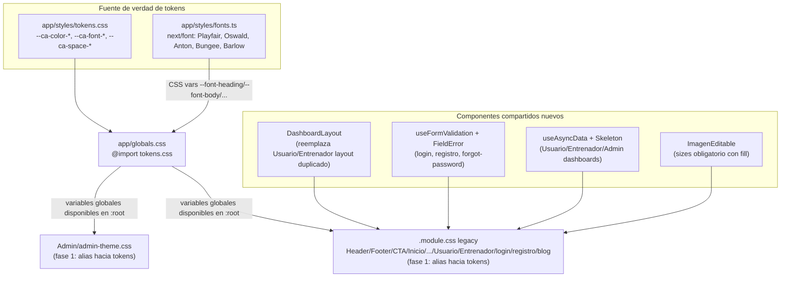
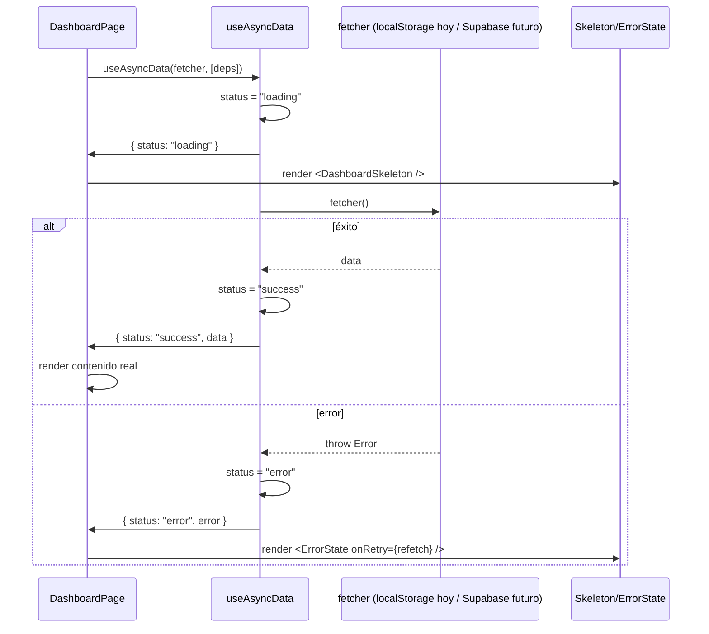

# Design Document: Unificación del Sistema de Diseño (Corazón Azteca)

## Overview

Corazón Azteca (`corazon_jab`) creció módulo por módulo y terminó con dos temas visuales coexistiendo (`--gold/--red/--cream` duplicadas en cada `.module.css` "moderno" y `--ca-oro/--ca-rojo/--ca-crema` en `admin-theme.css`), un layout de dashboard copiado casi al carácter entre `Usuario` y `Entrenador`, formularios de autenticación sin asociación `label`↔`input` ni validación por campo, y dashboards que hoy leen `localStorage` de forma síncrona pero van a pasar a consumir Supabase de forma asíncrona (ver spec `supabase-database-schema`).

Este diseño resuelve los seis hallazgos con cuatro piezas que se pueden implementar y migrar de forma incremental sin romper el look actual:

1. **Design Tokens** — una única fuente de verdad de color/tipografía/espaciado en `app/styles/tokens.css`, con alias retrocompatibles hacia los nombres de variables existentes para que los módulos legacy sigan funcionando sin tocarlos el día 1.
2. **`DashboardLayout`** — un layout de sidebar parametrizable por rol que remplaza la duplicación entre `Usuario.module.css`/`Entrenador.module.css`.
3. **`useFormValidation` + `FieldError`** — un patrón reutilizable de validación por campo (incluida validación de email) con asociación `label`/`input` correcta, aplicado a login, registro (alumno/entrenador/admin) y forgot-password.
4. **`useAsyncData` + skeletons** — un patrón de estados de carga/error para cuando los dashboards de Usuario/Entrenador/Admin dejen de leer `localStorage` de forma síncrona y empiecen a consumir Supabase.

Como remate menor, se endurece `ImagenEditable` para exigir `sizes` cuando se usa `fill`, y se corrige el puñado de usos directos de `next/image` con `fill` que hoy no declaran `sizes`.

Todo el código de ejemplo usa TypeScript / React (Next.js App Router), consistente con el stack real del proyecto.

## Architecture



**Decisiones clave:**

- **No hay "big bang" de CSS.** `tokens.css` se importa una vez desde `globals.css` y define las variables en `:root`. Los módulos legacy siguen usando `var(--gold)`, `var(--ca-oro)`, etc. porque `tokens.css` también declara esos nombres como alias (`--gold: var(--ca-color-gold);`). Esto hace la migración segura: se puede desplegar el paso 1 sin cambiar una sola línea de los `.module.css` existentes.
- **Los módulos legacy dejan de redefinir las variables localmente** en una segunda pasada (limpieza), una vez confirmado que los alias globales producen el mismo render.
- **`DashboardLayout` no reemplaza `RequireRole`**, lo envuelve — mantiene la guarda de ruta existente intacta.
- **`useAsyncData` es agnóstico de Supabase**: recibe un `fetcher: () => Promise<T>`, por lo que hoy puede envolver funciones síncronas de `localStorage` (devueltas como `Promise.resolve(...)`) y el día que `alumnoStorage`/`entrenadorStorage` se muevan a Supabase, solo cambia el fetcher, no el componente de dashboard.

## Sequence Diagrams

### Flujo 1: Render de dashboard con datos async (Usuario/Entrenador/Admin)



### Flujo 2: Validación de formulario (login/registro/forgot-password)

```mermaid
sequenceDiagram
    participant U as Usuario
    participant F as <form>
    participant V as useFormValidation
    participant API as authStorage (hoy) / Supabase Auth (futuro)

    U->>F: escribe en input (onChange)
    F->>V: handleChange(field, value)
    V->>V: valida solo si touched[field]
    V-->>F: errors[field] actualizado (inline)

    U->>F: onBlur en input
    F->>V: handleBlur(field)
    V->>V: touched[field] = true; valida campo
    V-->>F: errors[field]

    U->>F: submit
    F->>V: validateAll(values)
    alt hay errores
        V-->>F: errors (por campo) + isValid = false
        F->>U: muestra mensajes inline, foco en primer campo inválido
    else sin errores
        V-->>F: isValid = true
        F->>API: autenticar(values) / registrarCuenta(values)
        API-->>F: resultado
    end
```

## Components and Interfaces

### 1. Design Tokens (`app/styles/tokens.css` + `app/styles/fonts.ts`)

**Propósito**: Única fuente de verdad de color, tipografía y espaciado. Sustituye la definición duplicada de `--gold/--red/--cream` (9 módulos) y `--ca-oro/--ca-rojo/--ca-crema` (`admin-theme.css`).

**Responsabilidades**:
- Declarar la paleta canónica (`--ca-color-*`), tipografía (`--ca-font-*`) y espaciado (`--ca-space-*`) en `:root`.
- Declarar alias de compatibilidad hacia los nombres legacy (`--gold`, `--red`, `--cream`, `--ca-oro`, `--ca-rojo`, `--ca-crema`, …) para no romper CSS existente durante la migración.
- Centralizar la carga de fuentes vía `next/font/google` en un único módulo (`fonts.ts`) reutilizado por `layout.tsx` raíz, en vez de que cada página (`login`, `registro`, `Usuario`, `Entrenador`, …) reimporte `Playfair_Display`/`Oswald` por su cuenta. Esto también resuelve que `admin-theme.css` usa `'Anton'`/`'Barlow'` como string suelto: se cargan con `next/font` y se exponen como variable CSS.

### 2. `DashboardLayout` (`app/components/DashboardLayout/DashboardLayout.tsx`)

**Propósito**: Layout de sidebar + contenido compartido entre `Usuario` y `Entrenador` (y disponible para `Admin` si adopta sidebar en el futuro). Elimina la duplicación carácter-por-carácter de `.sidebar`, `.navItem`, `.logoutBtn`.

**Interfaz**:
```typescript
export type Rol = "usuario" | "entrenador" | "admin";

export interface NavItem {
  href: string;
  label: string;
  icon: React.ReactNode;
}

export interface DashboardLayoutProps {
  /** Rol requerido para ver este layout; se delega a RequireRole */
  role: Rol;
  /** Ítems de navegación del sidebar, en orden de aparición */
  navItems: NavItem[];
  /** Ancho del sidebar en px. Usuario usaba 220, Entrenador 240. */
  sidebarWidthPx?: number;
  /** Slot opcional para navegación secundaria (ej. tabs horizontales de Entrenador) */
  subNav?: React.ReactNode;
  children: React.ReactNode;
}
```

**Responsabilidades**:
- Envolver el contenido en `RequireRole rolPermitido={role}` (no duplica la lógica de guarda, la reutiliza).
- Renderizar `<aside>` con `navItems`, marcando `navItemActive` según `usePathname()`.
- Renderizar el bloque de usuario (avatar + nombre) y el botón de logout (`cerrarSesion()` + `router.push("/login")`), leyendo la sesión con el mismo `obtenerSesion()` que ya existe.
- Si `subNav` está presente, renderizarlo entre el sidebar y el `<main>` (cubre el caso de las tabs horizontales que hoy vive solo en `Entrenador.module.css`).

### 3. `useFormValidation` + `FieldError` (`app/lib/validation/useFormValidation.ts`)

**Propósito**: Patrón reutilizable de validación por campo con mensajes inline, para login, `registro/alumno`, `registro/entrenador`, `registro/admin` y `forgot-password`. Reemplaza el patrón actual de "un solo `error` genérico al final del formulario".

**Interfaz**:
```typescript
export type FieldRule<TValues> =
  | { type: "required"; message?: string }
  | { type: "email"; message?: string }
  | { type: "minLength"; length: number; message?: string }
  | { type: "matches"; field: keyof TValues; message?: string };

export type ValidationSchema<TValues> = {
  [K in keyof TValues]?: FieldRule<TValues>[];
};

export interface UseFormValidationResult<TValues extends Record<string, string | boolean>> {
  values: TValues;
  errors: Partial<Record<keyof TValues, string>>;
  touched: Partial<Record<keyof TValues, boolean>>;
  isValid: boolean;
  handleChange: (field: keyof TValues, value: TValues[keyof TValues]) => void;
  handleBlur: (field: keyof TValues) => void;
  validateAll: () => boolean;
  setValues: React.Dispatch<React.SetStateAction<TValues>>;
}

export function useFormValidation<TValues extends Record<string, string | boolean>>(
  initialValues: TValues,
  schema: ValidationSchema<TValues>
): UseFormValidationResult<TValues>;
```

**Componente de apoyo** (asociación label/input correcta, obligatoria en todos los campos):
```typescript
export interface FormFieldProps {
  /** id único, compartido entre <label htmlFor> y <input id> */
  id: string;
  label: string;
  error?: string;
  children: React.ReactNode; // el <input>/<select> ya recibe id={id} desde el caller
}
```
`FormField` renderiza `<label htmlFor={id}>{label}</label>` + `{children}` + `{error && <p role="alert" id={`${id}-error`}>{error}</p>}`, y añade `aria-describedby={error ? `${id}-error` : undefined}` al input vía clonación de props o convención de uso (ver "Example Usage").

### 4. `useAsyncData` + estados de carga (`app/lib/async/useAsyncData.ts`)

**Propósito**: Manejo uniforme de loading/error/success para `Usuario/page.tsx`, `Entrenador/page.tsx`, `Admin/page.tsx` y listados relacionados, preparando la migración de `localStorage` síncrono a Supabase asíncrono.

**Interfaz**:
```typescript
export type AsyncStatus = "idle" | "loading" | "success" | "error";

export interface AsyncState<T> {
  status: AsyncStatus;
  data: T | null;
  error: string | null;
}

export interface UseAsyncDataResult<T> extends AsyncState<T> {
  refetch: () => void;
}

export function useAsyncData<T>(
  fetcher: () => Promise<T>,
  deps: React.DependencyList
): UseAsyncDataResult<T>;
```

**Componentes de apoyo**:
```typescript
export interface SkeletonProps {
  /** Número de bloques a renderizar (ej. 4 stat cards) */
  count?: number;
  variant?: "card" | "row" | "text";
}

export function DashboardSkeleton(props: SkeletonProps): JSX.Element;

export interface ErrorStateProps {
  message: string;
  onRetry?: () => void;
}

export function ErrorState(props: ErrorStateProps): JSX.Element;
```

### 5. `ImagenEditable` (ajuste, no reescritura)

**Propósito**: Evitar que `next/image` con `fill` quede sin `sizes` (hoy genera warnings de rendimiento en dev y puede servir imágenes sobredimensionadas).

**Ajuste de interfaz**:
```typescript
interface ImagenEditableProps extends Omit<ImageProps, "src"> {
  clave: string;
  srcOriginal: string;
  wrapperClassName?: string;
}
```
Regla añadida: si `imageProps.fill === true` y `imageProps.sizes` es `undefined`, el componente lanza un error de desarrollo (`console.error` + fallback a `sizes="100vw"` en producción) en vez de renderizar silenciosamente sin `sizes`. Esto convierte el bug puntual en una salvaguarda estructural para usos futuros del componente.

Además, se corrigen los sitios que usan `next/image` (no `ImagenEditable`) con `fill` sin `sizes` hoy: `app/blog/page.tsx` (tarjetas de logros y posts de comunidad), `app/components/MisArticulos/MisArticulos.tsx`, `app/Admin/Articulos/page.tsx`. Todos siguen el mismo patrón de grid de tarjetas que `app/blog/todos/page.tsx` (que sí tiene `sizes`), así que se les aplica el mismo valor: `sizes="(max-width: 768px) 100vw, 33vw"`.

## Data Models

### Token categories (contrato conceptual, no un tipo en runtime)

```typescript
// Documentación de forma, no se importa en runtime: tokens.css es la fuente real.
interface ColorTokens {
  "--ca-color-gold": string;       // antes: --gold (moderno), --ca-oro (admin)
  "--ca-color-gold-light": string; // antes: --gold-light, --ca-oro-suave
  "--ca-color-red": string;        // antes: --red, --ca-rojo
  "--ca-color-red-dark": string;   // antes: --ca-rojo-oscuro
  "--ca-color-cream": string;      // antes: --cream, --ca-crema
  "--ca-color-black": string;      // antes: --ca-negro
  "--ca-color-black-alt": string;  // antes: --ca-negro-alt
  "--ca-color-green": string;      // antes: --ca-verde
  "--ca-color-text-muted": string; // antes: --ca-texto-muted
  "--ca-color-border": string;     // antes: --ca-borde
}

interface TypographyTokens {
  "--ca-font-heading": string; // Playfair Display (next/font)
  "--ca-font-display": string; // Anton (next/font) — antes string suelto en admin-theme.css
  "--ca-font-accent": string;  // Bungee (next/font)
  "--ca-font-body": string;    // Oswald (next/font)
  "--ca-font-body-alt": string; // Barlow (next/font) — antes string suelto en admin-theme.css
}

interface SpacingTokens {
  "--ca-space-1": string; // 4px
  "--ca-space-2": string; // 8px
  "--ca-space-3": string; // 12px
  "--ca-space-4": string; // 16px
  "--ca-space-6": string; // 24px
  "--ca-space-8": string; // 32px
}
```

**Reglas de validación**: ningún valor de color puede ser `""` o `transparent` (se rompería el fallback de alias); cada alias legacy (`--gold`, `--ca-oro`, etc.) debe resolver a exactamente un token canónico — ver "Correctness Properties".

### `FieldRule` / `ValidationSchema` (ya mostrados en Components) — reglas de validación:
- `required`: `value.trim().length > 0` (o `value === true` para checkboxes).
- `email`: `/^[^\s@]+@[^\s@]+\.[^\s@]+$/.test(value)`.
- `minLength`: `value.length >= length`.
- `matches`: `value === values[field]` (usado para "confirmar contraseña").

### `AsyncState<T>` — máquina de estados:
`idle → loading → (success | error)`; `refetch()` siempre vuelve a `loading` desde `success` o `error`, nunca desde `idle` sin haberse llamado `fetcher` al menos una vez.

## Key Functions with Formal Specifications

### `validateField`

```typescript
function validateField<TValues extends Record<string, string | boolean>>(
  value: TValues[keyof TValues],
  rules: FieldRule<TValues>[],
  values: TValues
): string | null
```

**Preconditions:**
- `rules` es un arreglo (posiblemente vacío) de `FieldRule`.
- Si existe una regla `{ type: "matches", field }`, `field` es una key válida de `values`.

**Postconditions:**
- Devuelve el mensaje de la **primera** regla que falla, en el orden en que aparece en `rules` (orden determinista).
- Devuelve `null` si y solo si `value` satisface **todas** las reglas.
- No muta `value`, `rules` ni `values`.

**Loop invariant** (recorre `rules` con un `for`):
- En cada iteración `i`, todas las reglas `rules[0..i-1]` ya fueron evaluadas como verdaderas (si no, la función ya habría retornado).

### `useFormValidation.validateAll`

```typescript
function validateAll(): boolean
```

**Preconditions**: `schema` y `values` fueron provistos al hook y tienen las mismas keys relevantes.

**Postconditions:**
- Recalcula `errors` para **todas** las keys de `schema`, marcando `touched[key] = true` para cada una (para que se muestren inline aunque el usuario no haya pasado por ese campo).
- Retorna `true` si y solo si `errors` queda vacío (ninguna key con mensaje).
- El valor de retorno es consistente con `isValid` inmediatamente después de la llamada.

### `useAsyncData`

```typescript
function useAsyncData<T>(fetcher: () => Promise<T>, deps: React.DependencyList): UseAsyncDataResult<T>
```

**Preconditions:**
- `fetcher` no lanza sincrónicamente (cualquier error se comunica vía rechazo de la promesa).
- `deps` sigue las reglas estándar de dependencias de React (valores estables o memoizados si son objetos).

**Postconditions:**
- Al montar y cada vez que `deps` cambia: `status` transiciona `idle → loading` de forma síncrona (antes de que la promesa resuelva), y luego a `success` con `data` poblado o `error` con `error` poblado (mensaje no vacío) y `data = null`.
- `refetch()` repite la transición `* → loading → (success | error)` usando el mismo `fetcher`.
- Si el componente se desmonta antes de que `fetcher` resuelva, no se llama a `setState` (evita el warning clásico de "unmounted component").

**Loop invariant**: N/A (no contiene loops; la única iteración implícita es el ciclo de renders de React, gobernado por la máquina de estados de `AsyncState`).

### `ImagenEditable` — regla de `sizes` obligatorio con `fill`

```typescript
function assertSizesWhenFill(imageProps: Omit<ImageProps, "src">): void
```

**Preconditions**: `imageProps` es el objeto de props recibido por `ImagenEditable` antes de pasarlo a `next/image`.

**Postconditions:**
- Si `imageProps.fill === true` y `imageProps.sizes` es `undefined`, se emite `console.error(...)` en desarrollo y se aplica `sizes = "100vw"` como fallback antes de renderizar.
- Si `imageProps.fill` no está presente o `sizes` ya viene definido, no hay efecto (no-op).
- Nunca lanza una excepción que rompa el render (es una salvaguarda, no una validación bloqueante).

## Example Usage

### Migración de tokens (paso 1, retrocompatible)

```css
/* app/styles/tokens.css */
:root {
  /* Canónicos */
  --ca-color-gold: #c9a13a;
  --ca-color-gold-light: #e6c565;
  --ca-color-red: #b7212a;
  --ca-color-red-dark: #7a141a;
  --ca-color-cream: #f1e6cf;
  --ca-color-black: #0d0705;
  --ca-color-black-alt: #170d0a;
  --ca-color-green: #2f6b4f;
  --ca-color-text-muted: #cbbfae;
  --ca-color-border: rgba(217, 179, 74, 0.25);

  --ca-font-heading: var(--font-heading);   /* Playfair Display */
  --ca-font-display: var(--font-display);   /* Anton */
  --ca-font-accent: var(--font-accent);     /* Bungee */
  --ca-font-body: var(--font-body);         /* Oswald */
  --ca-font-body-alt: var(--font-body-alt); /* Barlow */

  /* Alias retrocompatibles: el código legacy sigue funcionando sin cambios */
  --gold: var(--ca-color-gold);
  --gold-light: var(--ca-color-gold-light);
  --red: var(--ca-color-red);
  --cream: var(--ca-color-cream);

  --ca-oro: var(--ca-color-gold);
  --ca-oro-suave: var(--ca-color-gold-light);
  --ca-rojo: var(--ca-color-red);
  --ca-rojo-oscuro: var(--ca-color-red-dark);
  --ca-negro: var(--ca-color-black);
  --ca-negro-alt: var(--ca-color-black-alt);
  --ca-verde: var(--ca-color-green);
  --ca-crema: var(--ca-color-cream);
  --ca-texto-muted: var(--ca-color-text-muted);
  --ca-borde: var(--ca-color-border);
}
```

```css
/* app/globals.css */
@import "tailwindcss";
@import "./styles/tokens.css";
/* ...resto sin cambios... */
```

```typescript
// app/styles/fonts.ts
import { Playfair_Display, Oswald, Anton, Bungee, Barlow } from "next/font/google";

export const fontHeading = Playfair_Display({ subsets: ["latin"], weight: ["700"], style: ["normal", "italic"], variable: "--font-heading" });
export const fontBody = Oswald({ subsets: ["latin"], weight: ["400", "500", "600"], variable: "--font-body" });
export const fontDisplay = Anton({ subsets: ["latin"], weight: ["400"], variable: "--font-display" });
export const fontAccent = Bungee({ subsets: ["latin"], weight: ["400"], variable: "--font-accent" });
export const fontBodyAlt = Barlow({ subsets: ["latin"], weight: ["400", "500", "600"], variable: "--font-body-alt" });
```

```typescript
// app/layout.tsx (root) — se agregan las variables de fuente al <html>, una sola vez
import { fontHeading, fontBody, fontDisplay, fontAccent, fontBodyAlt } from "./styles/fonts";

<html
  lang="es"
  className={`${fontHeading.variable} ${fontBody.variable} ${fontDisplay.variable} ${fontAccent.variable} ${fontBodyAlt.variable} h-full antialiased`}
>
```
Con esto, cada página deja de necesitar su propio `const playfair = Playfair_Display(...)` — pero **no es obligatorio borrarlos el día 1**: al ser el mismo `variable` (`--font-heading`), son redundantes pero no conflictivos, así que la limpieza por archivo puede hacerse de forma incremental.

### `DashboardLayout` reemplazando `Usuario/layout.tsx` y `Entrenador/layout.tsx`

```typescript
// app/Usuario/layout.tsx
import DashboardLayout from "../components/DashboardLayout/DashboardLayout";

const navItems = [
  { href: "/Usuario", label: "Dashboard", icon: <DashboardIcon /> },
  { href: "/Usuario/Historial", label: "Historial Deportivo", icon: <HistorialIcon /> },
  // ...resto igual que hoy
];

export default function UsuarioLayout({ children }: { children: React.ReactNode }) {
  return (
    <DashboardLayout role="usuario" navItems={navItems} sidebarWidthPx={220}>
      {children}
    </DashboardLayout>
  );
}
```

```typescript
// app/Entrenador/layout.tsx
import DashboardLayout from "../components/DashboardLayout/DashboardLayout";

export default function EntrenadorLayout({ children }: { children: React.ReactNode }) {
  return (
    <DashboardLayout role="entrenador" navItems={navItems} sidebarWidthPx={240}>
      {children}
    </DashboardLayout>
  );
}
```
Las "Tabs horizontales" que hoy solo existen en `Entrenador.module.css` (`.tabs`/`.tab`/`.tabActive`) se implementan como un componente `EntrenadorTabs` pasado vía `subNav`, en vez de vivir hardcodeado dentro del layout compartido.

### `useFormValidation` en `login/page.tsx`

```typescript
const { values, errors, touched, handleChange, handleBlur, validateAll } = useFormValidation(
  { email: "", password: "", recordarme: false },
  {
    email: [{ type: "required", message: "El correo es obligatorio." }, { type: "email", message: "Ingresa un correo válido." }],
    password: [{ type: "required", message: "La contraseña es obligatoria." }],
  }
);

const handleSubmit = (e: React.FormEvent) => {
  e.preventDefault();
  if (!validateAll()) return;
  const cuenta = autenticar(values.email, values.password);
  // ...
};

// JSX del campo, con asociación label/input correcta:
<div className={styles.field}>
  <label htmlFor="login-email" className={styles.label}>Correo electrónico</label>
  <input
    id="login-email"
    type="email"
    className={styles.input}
    value={values.email}
    onChange={(e) => handleChange("email", e.target.value)}
    onBlur={() => handleBlur("email")}
    aria-invalid={Boolean(touched.email && errors.email)}
    aria-describedby={errors.email ? "login-email-error" : undefined}
  />
  {touched.email && errors.email && (
    <p id="login-email-error" role="alert" className={styles.fieldError}>{errors.email}</p>
  )}
</div>

// Checkbox "Recordarme" con id/htmlFor (hoy no lo tiene):
<label htmlFor="login-recordarme" className={styles.rememberLabel}>
  <input id="login-recordarme" type="checkbox" className={styles.checkbox} checked={values.recordarme} onChange={(e) => handleChange("recordarme", e.target.checked)} />
  <span>Recordarme</span>
</label>
```

### `useAsyncData` en `Usuario/page.tsx`

```typescript
const sesion = obtenerSesion();

const { status, data: datosAlumno, error, refetch } = useAsyncData(
  () => Promise.resolve(obtenerAlumnoPorUsuarioId(sesion.usuarioId)), // hoy: localStorage envuelto en Promise
  [sesion.usuarioId]
  // futuro: () => supabase.from("alumnos").select("*").eq("usuario_id", sesion.usuarioId).single()
);

if (status === "loading") return <DashboardSkeleton count={4} variant="card" />;
if (status === "error") return <ErrorState message={error ?? "No se pudo cargar tu información."} onRetry={refetch} />;

// status === "success": datosAlumno ya no es null aquí (invariante de AsyncState)
```

## Correctness Properties

*Una propiedad es una característica o comportamiento que debe cumplirse en todas las ejecuciones válidas de un sistema; esencialmente, un enunciado formal sobre lo que el sistema debe hacer. Las propiedades sirven de puente entre las especificaciones legibles por humanos y las garantías de corrección verificables por máquina.*

> Nota de reflexión: las reglas `required`, `email` y `matches` de `validateField` se consolidan en una única Property 6 generalizada sobre el tipo de regla, en vez de tres propiedades casi idénticas (una por regla). La asociación `label`↔`input` (Requirement 4.1/4.2) y el enlace `aria-describedby` del mensaje de error (Requirement 4.3) se consolidan en una única Property 5, porque ambas describen la misma superficie de accesibilidad de `FormField`.

### Property 1: Alias de tokens legacy resuelven al mismo valor que su token canónico

*Para toda* variable legacy `v` ∈ {`--gold`, `--gold-light`, `--red`, `--cream`, `--ca-oro`, `--ca-oro-suave`, `--ca-rojo`, `--ca-rojo-oscuro`, `--ca-negro`, `--ca-negro-alt`, `--ca-verde`, `--ca-crema`, `--ca-texto-muted`, `--ca-borde`}, el valor resuelto de `v` en `:root` es idéntico al valor resuelto de su token canónico correspondiente (garantiza que ningún módulo cambie de color visualmente tras la migración de tokens).

**Validates: Requirements 1.2**

### Property 2: Los alias son referencias vivas, no copias

*Para todo* par de tokens `(--ca-color-X, alias legacy equivalente)`, cambiar el token canónico cambia el alias en el mismo render (son la misma fuente, no una copia) — evita que un futuro rebrand tenga que tocar 9+ archivos.

**Validates: Requirements 1.5**

### Property 3: `DashboardLayout` preserva la guarda de acceso por rol

*Para toda* instancia de `DashboardLayout` con `role = r` y cualquier sesión con rol `s`, el usuario ve el contenido si y solo si `s === r`, delegando exactamente el mismo comportamiento que `RequireRole` tenía antes de la refactorización (no se relaja ni se endurece la guarda de acceso).

**Validates: Requirements 3.2**

### Property 4: Exactamente un ítem de navegación activo por ruta

*Para todo* `navItem` en `navItems` y cualquier ruta activa, `navItemActive` se aplica si y solo si `usePathname() === navItem.href` (exactamente un ítem activo a la vez, o ninguno si la ruta no coincide con nada).

**Validates: Requirements 3.4, 3.5**

### Property 5: Asociación label-input y `aria-describedby` total en formularios validados

*Para todo* campo de formulario gestionado por `useFormValidation`/`FormField` (incluido el checkbox "Recordarme"), existe un `id` único compartido entre `<label htmlFor>` y el control de entrada, y cuando ese campo tiene un `Error_Campo` visible, el control expone `aria-describedby` apuntando al `id` del mensaje de error — ningún `<label>` queda sin asociación programática y ningún error visible queda sin enlazar.

**Validates: Requirements 4.1, 4.2, 4.3**

### Property 6: Validación por regla es exacta respecto a su predicado declarado

*Para todo* valor (o par de valores) y tipo de regla `r` ∈ {`required`, `email`, `minLength`, `matches`}, `validateField(value, [r], values)` es `null` si y solo si `value` satisface el predicado de `r`: `required` ⟺ `value.trim().length > 0` (o `value === true`); `email` ⟺ `value` matchea `/^[^\s@]+@[^\s@]+\.[^\s@]+$/`; `minLength` ⟺ `value.length >= length`; `matches` ⟺ `value === values[field]` (no hay falsos negativos/positivos respecto al predicado declarado de cada regla).

**Validates: Requirements 5.2, 5.3, 5.4**

### Property 7: Los `Error_Campo` permanecen ocultos hasta que el campo es tocado o se envía el formulario

*Para todo* campo gestionado por `useFormValidation` que no ha recibido `handleBlur` ni ha pasado por `validateAll()`, su `Error_Campo` no se renderiza aunque `errors[field]` ya contenga un mensaje calculado — la visibilidad del error depende exclusivamente de `touched[field]`, nunca de la validez del valor por sí sola.

**Validates: Requirements 5.5**

### Property 8: `validateAll()` es consistente con el contenido de `errors`

*Para toda* llamada a `validateAll()`, retorna `true` si y solo si `Object.keys(errors).length === 0` inmediatamente después de la llamada, y todo campo declarado en `schema` queda marcado `touched === true` (no hay estado intermedio inconsistente entre el valor de retorno y `errors`).

**Validates: Requirements 5.6**

### Property 9: La máquina de estados de `useAsyncData` nunca queda inconsistente

*Para toda* instancia de `useAsyncData` y cualquier secuencia de resoluciones/rechazos/`refetch()`, la secuencia de `status` observada es un subcamino válido de `idle → loading → (success | error)`, y `refetch()` siempre reinicia en `loading` — nunca se observa `data` poblado simultáneamente con `status === "error"`, ni `error` poblado simultáneamente con `status === "success"`.

**Validates: Requirements 6.2, 6.4, 6.5, 6.6**

### Property 10: `useAsyncData` no actualiza estado tras el desmontaje del componente

*Para todo* momento de desmontaje `t` (antes, durante o después de que `fetcher()` resuelva o se rechace), si el componente que invocó `useAsyncData` se desmonta en `t`, ninguna transición de `status`/`data`/`error` ocurre después de `t` (no hay advertencia de "set state on unmounted component" ni efectos observables posteriores al desmontaje).

**Validates: Requirements 6.8**

### Property 11: Toda imagen con `fill` tiene `sizes` definido

*Para todo* uso de `next/image` (directo o vía `ImagenEditable`) con `fill === true`, el elemento renderizado tiene un atributo `sizes` no vacío (ya sea provisto por el caller o inyectado por el fallback de `ImagenEditable`), y si el caller ya provee `sizes`, ese valor se preserva sin modificación.

**Validates: Requirements 7.1, 7.2**

## Error Handling

### Escenario 1: `fetcher` de `useAsyncData` rechaza (timeout, error de red, error de Supabase)

**Condición**: la promesa retornada por `fetcher` se rechaza.
**Respuesta**: `status = "error"`, `data = null`, `error = mensaje legible` (nunca el stack técnico crudo; se normaliza con `error instanceof Error ? error.message : "Error desconocido"`).
**Recuperación**: se renderiza `<ErrorState message={error} onRetry={refetch} />`; `refetch()` vuelve a intentar sin recargar la página.

### Escenario 2: Validación falla en `validateAll()` al enviar el formulario

**Condición**: una o más reglas de `schema` fallan.
**Respuesta**: `errors` se puebla por campo, `touched` marca todos los campos del schema como tocados, el submit se cancela (`return` antes de llamar a `autenticar`/`registrarCuenta`).
**Recuperación**: el usuario corrige el campo marcado; `handleChange` revalida solo ese campo en tiempo real una vez `touched[field] === true`.

### Escenario 3: Autenticación/registro falla en el backend (credenciales incorrectas, correo duplicado)

**Condición**: `autenticar()`/`registrarCuenta()` retorna `null`/lanza, independientemente de que la validación de formato haya pasado.
**Respuesta**: se mantiene un mensaje de error a nivel de formulario (no por campo, porque no es un error de formato sino de negocio) usando el mismo componente de mensaje que hoy existe (`styles.errorMsg`), pero ahora con `role="alert"` para accesibilidad.
**Recuperación**: el usuario puede reintentar sin perder los valores ya escritos (el hook no limpia `values` en error).

### Escenario 4: `fill` sin `sizes` en `ImagenEditable`

**Condición**: `imageProps.fill === true` y `imageProps.sizes === undefined`.
**Respuesta**: en desarrollo, `console.error` con el `clave` de la imagen para ubicar el caller; en cualquier entorno, fallback a `sizes="100vw"` para evitar la degradación de performance de servir la imagen a resolución completa en todos los breakpoints.
**Recuperación**: no bloquea el render; es una corrección silenciosa con aviso, no un error fatal.

## Testing Strategy

### Unit Testing

- `validateField`: casos por tipo de regla (`required`, `email`, `minLength`, `matches`), incluyendo el orden de evaluación (primera regla que falla gana).
- `useFormValidation`: `handleChange` solo valida campos `touched`; `validateAll` marca todos como `touched` y es consistente con su valor de retorno.
- `useAsyncData`: transiciones de estado con fetcher mockeado (éxito, error, desmontaje antes de resolver — usando `renderHook` de React Testing Library + `act`).
- `DashboardLayout`: dado `role="usuario"` y una sesión con `rol="entrenador"`, se redirige (delegando en `RequireRole`, que ya se testea por separado); dado el rol correcto, se renderizan todos los `navItems` y el activo coincide con `usePathname()` mockeado.
- `ImagenEditable`: dado `fill` sin `sizes`, el elemento `` final tiene `sizes="100vw"`; dado `fill` con `sizes` explícito, se respeta el valor del caller.

### Property-Based Testing

**Librería recomendada**: `fast-check` (TypeScript/JS), junto con `vitest` como test runner (el proyecto no tiene runner configurado hoy; ninguno de los dos es dependencia actual, ver "Dependencies").

- **Property 1 y 2 (alias de tokens)**: ∀ nombre de variable legacy en la lista fija de 14 alias, resolver su valor computado en un DOM de prueba (jsdom) es idéntico a resolver el token canónico correspondiente; y cambiar el token canónico en tiempo de prueba cambia el alias en el mismo render.
- **Property 3 (guarda de rol)**: ∀ combinación de `role` de `DashboardLayout` y `rol` de sesión (generados de {`usuario`,`entrenador`,`admin`}), el contenido es visible si y solo si coinciden.
- **Property 4 (ítem activo)**: ∀ lista arbitraria de `navItems` y ruta activa arbitraria, exactamente el `navItem` cuyo `href` coincide queda marcado activo, o ninguno si no hay coincidencia.
- **Property 5 (label/aria-describedby)**: ∀ configuración arbitraria de campos con o sin error visible, todo `<label>` tiene `htmlFor` apuntando a un `id` existente, y todo campo con error visible tiene `aria-describedby` apuntando al `id` del mensaje.
- **Property 6 (reglas de validación)**: ∀ string/par de strings generado y ∀ tipo de regla, `validateField` es `null` si y solo si se satisface el predicado de esa regla — generar tanto strings arbitrarios como strings construidos a partir de la gramática `local@domain.tld` para tener suficientes positivos de email.
- **Property 7 (errores ocultos hasta touched)**: ∀ campo y valor arbitrario (válido o no), si `touched[field]` es `false`, el `Error_Campo` no se renderiza.
- **Property 8 (`validateAll` consistente)**: ∀ esquema y valores arbitrarios, el retorno de `validateAll()` coincide con `Object.keys(errors).length === 0`.
- **Property 9 y 10 (máquina de estados de `useAsyncData`)**: ∀ secuencia arbitraria de resoluciones/rechazos/refetch/desmontaje generada por `fast-check`, la secuencia de `status` observada nunca viola `idle → loading → (success|error)`, y ninguna transición ocurre después del desmontaje (se modela como un autómata y se verifica con `fc.commands` o un reductor de estados equivalente).
- **Property 11 (`sizes` en imágenes)**: ∀ combinación arbitraria de props `{fill: boolean, sizes?: string}` pasada a `ImagenEditable`, el elemento renderizado final siempre tiene `sizes` definido cuando `fill === true`, y preserva el valor del caller cuando este lo provee.

### Integration Testing

- Formulario de login completo: usuario escribe email inválido → ve error inline sin submit; corrige → error desaparece; submit con credenciales incorrectas → ve error de formulario (no de campo).
- `Usuario/page.tsx` con `useAsyncData` mockeando Supabase: loading → skeleton visible → success → contenido visible → error → `ErrorState` con retry funcional.

## Performance Considerations

- Cargar las 5 familias tipográficas (`Playfair Display`, `Oswald`, `Anton`, `Bungee`, `Barlow`) una sola vez desde el layout raíz vía `next/font` evita el parpadeo de fuente sin cargar que hoy sufre `admin-theme.css` (fallback del navegador) y reduce requests duplicados de fuente que hoy ocurren porque cada página reimporta `Playfair_Display`/`Oswald` por separado.
- `DashboardSkeleton` evita el salto de layout (CLS) mientras se resuelve `useAsyncData`, reemplazando el "flash" actual donde el dashboard aparece vacío/con datos sync instantáneos.
- Los `sizes` correctos en imágenes con `fill` evitan que el navegador descargue la imagen a la resolución más grande disponible en viewports pequeños.

## Security Considerations

- La validación de `useFormValidation` es exclusivamente de experiencia de usuario (client-side); no reemplaza la validación server-side que debe existir cuando `authStorage`/registro migren a Supabase Auth — se debe seguir rechazando/validando en el backend independientemente de lo que el formulario ya validó.
- `DashboardLayout` no cambia el modelo de autorización: sigue siendo `RequireRole` (basado en sesión en `localStorage` hoy) quien decide acceso; este diseño no introduce ni corrige controles de autorización del lado del servidor, que quedan fuera de alcance de esta spec.

## Dependencies

- Sin nuevas dependencias de producción: `useFormValidation`, `useAsyncData`, `DashboardLayout` se implementan con React/TypeScript puro, consistente con el resto de `app/lib/*.ts` (sin `zod`/`yup`).
- Para habilitar la estrategia de property-based testing se recomienda añadir como `devDependencies` (versión fija, a confirmar antes de instalar): `vitest` (test runner, no existe ninguno configurado hoy) y `fast-check` (property-based testing). El proyecto hoy no tiene `test` script en `package.json`.
- `next/font/google` (ya en uso) para consolidar la carga de Anton/Barlow, que hoy no pasan por `next/font`.
