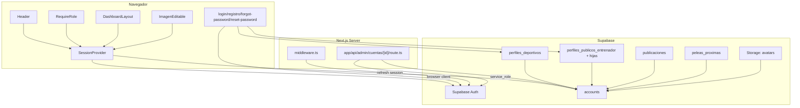

# Design Document: Supabase Auth Integration

## Overview

Este diseño reemplaza `authStorage.ts` y `sesionStorage.ts` (localStorage, contraseñas en texto plano) por autenticación real contra Supabase Auth, reutilizando el esquema ya implementado en `supabase-database-schema` (tabla `accounts`, trigger `handle_new_user`, RPC `aprobar_cuenta_admin`, RLS, `perfiles_deportivos`, `perfiles_publicos_entrenador` + tablas hijas, `publicaciones`, `peleas_proximas`, bucket `avatars`).

Piezas principales:

1. **`middleware.ts`** — refresca la sesión de Supabase en cada petición (patrón `@supabase/ssr`).
2. **`SessionProvider` + `useSesion()`** — contexto de React que traduce el modelo async de Supabase Auth a un valor síncrono consumible por los Client Components existentes (`RequireRole`, `DashboardLayout`, `Header`, `ImagenEditable`).
3. **`app/lib/auth/authService.ts`** — reemplaza `authStorage.ts`: `signUp`, `signInWithPassword`, `signOut`, `resetPasswordForEmail`, `updateUser`, resolución de `rutaDestino(rol, estado_cuenta)`.
4. **Almacenes migrados a Supabase**: `alumnoStorage.ts`, `entrenadorStorage.ts`, `blogStorage.ts`, y la porción de `sesionStorage.ts` relativa a `peleasProximas`, todos re-implementados sobre tablas reales usando `cuenta_id`/`autor_id` (UUID) en vez de IDs numéricos.
5. **`Admin/Directorio`** conectado a `accounts` + `perfiles_deportivos`/`perfiles_publicos_entrenador`, con eliminación vía un Route Handler server-side con `service_role`.
6. **Fotos de perfil** en el bucket `avatars` (Supabase Storage) en vez de base64.
7. **Script de siembra** (`scripts/seed-cuentas-prueba.ts`) que recrea las 15 cuentas de prueba como usuarios reales de Supabase Auth.

### Estado de migraciones (reconciliación)

El repo ya tiene `supabase/migrations/00000000000000_init_extensions.sql` y `00000000000001_create_accounts.sql`, pero el resto del esquema de `supabase-database-schema` (perfiles, publicaciones, peleas, Storage, etc.) se aplicó directo a la base remota vía SQL Editor y no tiene migración física correspondiente. Este spec no introduce cambios de esquema nuevos (todas las tablas que usa ya existen en remoto), así que no se requieren migraciones SQL nuevas de `CREATE TABLE`. Las únicas piezas de infraestructura de este spec son:

- `middleware.ts` (código de aplicación, no SQL).
- Un archivo de migración nuevo `supabase/migrations/00000000000002_rpc_eliminar_cuenta_admin_check.sql` **no** es necesario: la eliminación usa `auth.admin.deleteUser` desde `service_role` en un Route Handler, no una función SQL nueva. No se agregan objetos de base de datos nuevos.
- El script de siembra vive en `scripts/` (código de aplicación), no en `supabase/`.

La base remota sigue siendo la fuente de verdad para el esquema ya existente; este spec no la modifica.

## Architecture



### Decisión: SessionProvider síncrono sobre API async

Supabase Auth es inherentemente asíncrono (`getSession()`, `getUser()` devuelven promesas) pero casi todos los consumidores actuales (`RequireRole`, `DashboardLayout`, `Header`, `ImagenEditable`) leen la sesión de forma síncrona desde `sesionStorage.ts`. En vez de reescribir cada componente para manejar promesas individualmente (duplicando loading/error en cada uno), se centraliza el estado async en un único `SessionProvider` de React que:

- Vive en `app/layout.tsx` (root), envolviendo toda la aplicación.
- Mantiene un estado `EstadoSesion` con tres variantes: `{ estado: "cargando" }`, `{ estado: "sin_sesion" }`, `{ estado: "con_sesion", cuenta: CuentaSesion }`.
- Se suscribe una sola vez a `supabase.auth.onAuthStateChange` y, en cada cambio, vuelve a resolver los datos de `accounts` para poblar `CuentaSesion`.
- Expone `useSesion()` (hook) que cualquier Client Component descendiente puede leer de forma síncrona (ya resuelto por el Provider).

Esto evita que cada componente implemente su propio fetch a Supabase y mantiene un único punto de verdad para "quién es el usuario actual", igual que hoy `obtenerSesion()` es la única fuente de verdad de `sesionStorage.ts`.

### Decisión: Route Handler con `service_role` para eliminación de cuentas

Eliminar un usuario de `auth.users` requiere `supabase.auth.admin.deleteUser`, que solo funciona con la `service_role` key. Esa key nunca debe llegar al navegador. Por eso la eliminación se implementa en `app/api/admin/cuentas/[id]/route.ts`, un Route Handler que:

1. Lee la sesión del solicitante desde las cookies (usando `crearClienteSupabaseServidor`, con la clave pública, no `service_role`).
2. Verifica en `accounts` que el solicitante tiene `rol = 'admin'` y `estado_cuenta = 'aprobado'`.
3. Solo si la verificación pasa, crea un segundo cliente Supabase con `service_role` (leído de una variable de entorno **sin** prefijo `NEXT_PUBLIC_`, p. ej. `SUPABASE_SERVICE_ROLE_KEY`) y ejecuta `auth.admin.deleteUser(id)`.
4. El borrado en cascada ya configurado (`accounts.id references auth.users(id) on delete cascade`, y de ahí en cascada hacia `perfiles_deportivos`/`perfiles_publicos_entrenador`/etc.) se encarga del resto.

**Nota de seguridad**: `SUPABASE_SERVICE_ROLE_KEY` debe añadirse a `.env.local` (no versionado) y nunca debe importarse desde un archivo que también se use en Client Components. Se aísla en `app/lib/supabase/admin.ts`, importado únicamente por Route Handlers y el script de siembra.

## Components and Interfaces

### `middleware.ts` (nuevo, raíz del proyecto)

```typescript
// middleware.ts
import { type NextRequest, NextResponse } from "next/server";
import { createServerClient } from "@supabase/ssr";

export async function middleware(request: NextRequest) {
  let response = NextResponse.next({ request });

  const supabase = createServerClient(
    process.env.NEXT_PUBLIC_SUPABASE_URL!,
    process.env.NEXT_PUBLIC_SUPABASE_PUBLISHABLE_KEY!,
    {
      cookies: {
        getAll() {
          return request.cookies.getAll();
        },
        setAll(cookiesToSet) {
          cookiesToSet.forEach(({ name, value }) => request.cookies.set(name, value));
          response = NextResponse.next({ request });
          cookiesToSet.forEach(({ name, value, options }) =>
            response.cookies.set(name, value, options)
          );
        },
      },
    }
  );

  // Refresca el token si expiró; sincroniza las cookies de sesión.
  await supabase.auth.getUser();

  return response;
}

export const config = {
  matcher: [
    "/((?!_next/static|_next/image|favicon.ico|.*\\.(?:svg|png|jpg|jpeg|gif|webp)$).*)",
  ],
};
```

### `app/lib/auth/SessionProvider.tsx` (nuevo)

```typescript
"use client";

import { createContext, useContext, useEffect, useRef, useState } from "react";
import { crearClienteSupabaseNavegador } from "../supabase/client";

export type Rol = "admin" | "entrenador" | "usuario";

export interface CuentaSesion {
  id: string; // UUID = accounts.id = auth.users.id
  nombre: string;
  rol: Rol;
  estadoCuenta: "pendiente" | "aprobado";
  fotoRef: string | null;
}

export type EstadoSesion =
  | { estado: "cargando" }
  | { estado: "sin_sesion" }
  | { estado: "con_sesion"; cuenta: CuentaSesion };

interface SesionContextValue {
  sesion: EstadoSesion;
  cerrarSesion: () => Promise<void>;
}

const SesionContext = createContext<SesionContextValue | null>(null);

export function SessionProvider({ children }: { children: React.ReactNode }) {
  const [sesion, setSesion] = useState<EstadoSesion>({ estado: "cargando" });
  const supabase = useRef(crearClienteSupabaseNavegador()).current;
  const cerrarSesionPendiente = useRef(false);
  const montado = useRef(false);

  async function resolverCuenta(userId: string): Promise<CuentaSesion | null> {
    const { data } = await supabase
      .from("accounts")
      .select("id, nombre, rol, estado_cuenta, foto_ref")
      .eq("id", userId)
      .maybeSingle();
    if (!data) return null;
    return {
      id: data.id,
      nombre: data.nombre,
      rol: data.rol,
      estadoCuenta: data.estado_cuenta,
      fotoRef: data.foto_ref,
    };
  }

  useEffect(() => {
    let activo = true;

    supabase.auth.getSession().then(async ({ data }) => {
      if (!activo) return;
      if (!data.session) {
        setSesion({ estado: "sin_sesion" });
      } else {
        const cuenta = await resolverCuenta(data.session.user.id);
        setSesion(cuenta ? { estado: "con_sesion", cuenta } : { estado: "sin_sesion" });
      }
      montado.current = true;
      if (cerrarSesionPendiente.current) {
        cerrarSesionPendiente.current = false;
        void supabase.auth.signOut();
      }
    });

    const { data: sub } = supabase.auth.onAuthStateChange(async (_evento, session) => {
      if (!activo) return;
      if (!session) {
        setSesion({ estado: "sin_sesion" });
        return;
      }
      const cuenta = await resolverCuenta(session.user.id);
      setSesion(cuenta ? { estado: "con_sesion", cuenta } : { estado: "sin_sesion" });
    });

    return () => {
      activo = false;
      sub.subscription.unsubscribe();
    };
  }, [supabase]);

  async function cerrarSesion() {
    if (!montado.current) {
      cerrarSesionPendiente.current = true;
      return;
    }
    await supabase.auth.signOut();
  }

  return (
    <SesionContext.Provider value={{ sesion, cerrarSesion }}>
      {children}
    </SesionContext.Provider>
  );
}

export function useSesion(): SesionContextValue {
  const ctx = useContext(SesionContext);
  if (!ctx) throw new Error("useSesion debe usarse dentro de <SessionProvider>");
  return ctx;
}
```

### `app/lib/auth/rutaDestino.ts` (nuevo — función pura, corazón de las properties de redirección)

```typescript
import type { Rol } from "./SessionProvider";

export type EstadoCuenta = "pendiente" | "aprobado";

/**
 * Función pura y determinista: dado un rol y estado de aprobación,
 * calcula a qué ruta debe dirigirse la sesión. Reutilizada por login,
 * registro, redirección desde /login con sesión activa, y RequireRole.
 */
export function rutaDestino(rol: Rol, estadoCuenta: EstadoCuenta): string {
  if (rol === "admin") {
    return estadoCuenta === "aprobado" ? "/Admin" : "/Admin/esperando-aprobacion";
  }
  if (rol === "entrenador") return "/Entrenador";
  return "/Usuario";
}
```

### `app/lib/auth/authService.ts` (nuevo — reemplaza `authStorage.ts`)

```typescript
import { crearClienteSupabaseNavegador } from "../supabase/client";
import type { Rol } from "./SessionProvider";

export interface DatosRegistro {
  email: string;
  password: string;
  nombre: string;
  rol: Rol;
}

export async function registrarCuenta(datos: DatosRegistro) {
  const supabase = crearClienteSupabaseNavegador();
  return supabase.auth.signUp({
    email: datos.email,
    password: datos.password,
    options: { data: { nombre: datos.nombre, rol: datos.rol } },
  });
}

export async function iniciarSesion(email: string, password: string) {
  const supabase = crearClienteSupabaseNavegador();
  return supabase.auth.signInWithPassword({ email, password });
}

export async function solicitarRecuperacion(email: string) {
  const supabase = crearClienteSupabaseNavegador();
  return supabase.auth.resetPasswordForEmail(email, {
    redirectTo: `${window.location.origin}/reset-password`,
  });
}

export async function actualizarContrasena(nuevaPassword: string) {
  const supabase = crearClienteSupabaseNavegador();
  return supabase.auth.updateUser({ password: nuevaPassword });
}
```

### `app/lib/auth/fotoPerfil.ts` (nuevo — Storage `avatars`)

```typescript
import { crearClienteSupabaseNavegador } from "../supabase/client";

export async function subirFotoPerfil(cuentaId: string, archivo: File): Promise<string> {
  const supabase = crearClienteSupabaseNavegador();
  const extension = archivo.name.split(".").pop() ?? "jpg";
  const ruta = `${cuentaId}/${crypto.randomUUID()}.${extension}`;
  const { error } = await supabase.storage.from("avatars").upload(ruta, archivo, {
    upsert: true,
  });
  if (error) throw error;

  await supabase.from("accounts").update({ foto_ref: ruta }).eq("id", cuentaId);
  return ruta;
}

/** Dado un foto_ref (o null), retorna la URL pública a renderizar, o null si no hay foto. */
export function resolverUrlFoto(fotoRef: string | null): string | null {
  if (!fotoRef) return null;
  const supabase = crearClienteSupabaseNavegador();
  return supabase.storage.from("avatars").getPublicUrl(fotoRef).data.publicUrl;
}
```

### Almacenes migrados a Supabase

`app/lib/alumnoStorage.ts`, `app/lib/entrenadorStorage.ts`, `app/lib/blogStorage.ts` y la porción de peleas próximas de `app/lib/sesionStorage.ts` se reescriben para leer/escribir directamente Supabase vía `crearClienteSupabaseNavegador()`, manteniendo la misma superficie de funciones exportadas (mismos nombres donde sea razonable) pero cambiando la firma de `usuarioId: number` a `cuentaId: string`.

Ejemplo representativo (`alumnoStorage.ts`):

```typescript
// app/lib/alumnoStorage.ts
import { crearClienteSupabaseNavegador } from "./supabase/client";

export type OrigenEntrenador = "directorio" | "manual" | "independiente";

export interface DatosAlumno {
  cuentaId: string;
  nombre: string;
  apellido: string;
  apodo?: string;
  fechaNacimiento: string;
  peso: number;
  nivel: string;
  objetivo: string;
  ciudad: string;
  origenEntrenador: OrigenEntrenador;
  entrenadorId?: string;
  nombreEntrenadorManual?: string;
}

function limpiarCamposEntrenador(datos: {
  origenEntrenador: OrigenEntrenador;
  entrenadorId?: string;
  nombreEntrenadorManual?: string;
}) {
  // Invariante (Property 6): solo el campo correspondiente al origen actual
  // queda poblado; los demás se anulan explícitamente.
  return {
    origen_entrenador: datos.origenEntrenador,
    entrenador_directorio_id: datos.origenEntrenador === "directorio" ? datos.entrenadorId ?? null : null,
    entrenador_manual_nombre: datos.origenEntrenador === "manual" ? datos.nombreEntrenadorManual ?? null : null,
  };
}

export async function obtenerAlumnoPorCuentaId(cuentaId: string): Promise<DatosAlumno | null> {
  const supabase = crearClienteSupabaseNavegador();
  const { data } = await supabase
    .from("perfiles_deportivos")
    .select("*")
    .eq("cuenta_id", cuentaId)
    .maybeSingle();
  return data ? mapearFila(data) : null;
}

export async function actualizarEntrenadorAlumno(
  cuentaId: string,
  datos: { origenEntrenador: OrigenEntrenador; entrenadorId?: string; nombreEntrenadorManual?: string }
): Promise<void> {
  const supabase = crearClienteSupabaseNavegador();
  const campos = limpiarCamposEntrenador(datos);

  const { data: existente } = await supabase
    .from("perfiles_deportivos")
    .select("id")
    .eq("cuenta_id", cuentaId)
    .maybeSingle();

  if (existente) {
    const { error } = await supabase.from("perfiles_deportivos").update(campos).eq("cuenta_id", cuentaId);
    if (error) throw error; // Requirement 8.5: propaga el error, no persiste parcial.
  } else {
    const { error } = await supabase
      .from("perfiles_deportivos")
      .insert({ cuenta_id: cuentaId, nivel: "Principiante", objetivo: "Acondicionamiento físico", ...campos });
    if (error) throw error;
  }
}

export async function actualizarPerfilAlumno(
  cuentaId: string,
  datos: Partial<Pick<DatosAlumno, "apodo" | "fechaNacimiento" | "peso" | "nivel" | "objetivo" | "ciudad" | "nombre" | "apellido">>
): Promise<DatosAlumno> {
  const supabase = crearClienteSupabaseNavegador();
  const { data, error } = await supabase
    .from("perfiles_deportivos")
    .upsert({ cuenta_id: cuentaId, ...mapearADb(datos) }, { onConflict: "cuenta_id" })
    .select()
    .single();
  if (error) throw error;
  return mapearFila(data);
}

function mapearFila(fila: any): DatosAlumno { /* ... mapeo columnas snake_case -> camelCase ... */ return fila; }
function mapearADb(datos: Partial<DatosAlumno>): Record<string, unknown> { /* ... */ return datos; }
```

`entrenadorStorage.ts` sigue el mismo patrón para `perfiles_publicos_entrenador`, con la sincronización atómica de tablas hijas descrita en "Error Handling" (transacción vía función RPC o `Promise.all` + compensación manual, ver más abajo).

`blogStorage.ts` reescribe cada función (`obtenerArticulosAprobados`, `obtenerLogrosAprobados`, `obtenerArticulosPendientes`, `obtenerMisArticulos`, `enviarArticulo`, `aprobarArticulo`, `rechazarArticulo`, `eliminarArticulo`) como consultas/mutaciones sobre `publicaciones`, recibiendo `cuentaId` en vez de leer `obtenerSesion()` internamente (el llamador, ya con acceso a `useSesion()`, lo provee).

La porción de `PeleaProxima` se extrae a `app/lib/peleasProximasStorage.ts`, leyendo/escribiendo `peleas_proximas` con `usuario_id`/`contrincante_id` como UUID.

### Sincronización atómica de colecciones hijas de entrenador

Dado que Postgres/PostgREST no ofrece transacciones multi-tabla desde el cliente JS, la sincronización de `logros_entrenador`, `redes_sociales_entrenador` y `galeria_entrenador` (Requirement 9.5: revertir todo si falla una) se implementa con una función RPC `sincronizar_perfil_entrenador` (`SECURITY INVOKER`, ejecuta dentro de una transacción de Postgres) que recibe el perfil y las tres colecciones como JSON y hace `delete + insert` de cada tabla hija dentro de la misma transacción SQL. Esto evita el problema de "rollback manual" del lado del cliente: si cualquier paso falla, la transacción completa se revierte a nivel de base de datos.

```sql
-- Nueva función RPC (sin nueva tabla): vive junto al resto de funciones de
-- perfiles_publicos_entrenador. No requiere migración de esquema porque no
-- crea tablas nuevas, solo una función.
create or replace function public.sincronizar_perfil_entrenador(
  p_perfil_id uuid,
  p_logros text[],
  p_redes jsonb,
  p_galeria jsonb
) returns void
language plpgsql
security invoker
as $$
begin
  delete from public.logros_entrenador where perfil_entrenador_id = p_perfil_id;
  insert into public.logros_entrenador (perfil_entrenador_id, descripcion)
    select p_perfil_id, unnest(p_logros) where array_length(p_logros, 1) > 0;

  delete from public.redes_sociales_entrenador where perfil_entrenador_id = p_perfil_id;
  insert into public.redes_sociales_entrenador (perfil_entrenador_id, nombre, usuario, url)
    select p_perfil_id, r->>'nombre', r->>'usuario', r->>'url'
    from jsonb_array_elements(p_redes) as r;

  delete from public.galeria_entrenador where perfil_entrenador_id = p_perfil_id;
  insert into public.galeria_entrenador (perfil_entrenador_id, imagen_ref, texto_alternativo)
    select p_perfil_id, g->>'imagenRef', g->>'alt'
    from jsonb_array_elements(p_galeria) as g;
end;
$$;
```

Esta función se agrega como una migración nueva `supabase/migrations/00000000000002_sincronizar_perfil_entrenador.sql`, ya que sí introduce un objeto de base de datos nuevo (a diferencia del resto del spec, que solo consume el esquema existente).

### `Admin/Directorio/page.tsx` (reescrito)

Reemplaza los arrays hardcodeados (`USUARIOS_INICIALES`) por dos consultas a Supabase al montar:

```typescript
const { data: alumnos } = await supabase
  .from("accounts")
  .select("id, nombre, foto_ref, perfiles_deportivos(peso_kg, nivel, ciudad, origen_entrenador, entrenador_directorio_id, entrenador_manual_nombre)")
  .eq("rol", "usuario");

const { data: entrenadores } = await supabase
  .from("accounts")
  .select("id, nombre, foto_ref, perfiles_publicos_entrenador(especialidad, anos_trayectoria, biografia, logros_entrenador(descripcion))")
  .eq("rol", "entrenador");
```

La eliminación llama a `fetch(`/api/admin/cuentas/${id}`, { method: "DELETE" })`.

### `app/api/admin/cuentas/[id]/route.ts` (nuevo)

```typescript
import { NextResponse } from "next/server";
import { crearClienteSupabaseServidor } from "../../../../lib/supabase/server";
import { crearClienteSupabaseAdmin } from "../../../../lib/supabase/admin";

export async function DELETE(_req: Request, { params }: { params: { id: string } }) {
  const supabase = await crearClienteSupabaseServidor();
  const { data: userData } = await supabase.auth.getUser();
  if (!userData.user) {
    return NextResponse.json({ error: "No autenticado" }, { status: 401 });
  }

  const { data: cuenta } = await supabase
    .from("accounts")
    .select("rol, estado_cuenta")
    .eq("id", userData.user.id)
    .single();

  if (!cuenta || cuenta.rol !== "admin" || cuenta.estado_cuenta !== "aprobado") {
    return NextResponse.json({ error: "No autorizado" }, { status: 403 });
  }

  const admin = crearClienteSupabaseAdmin();
  const { error } = await admin.auth.admin.deleteUser(params.id);
  if (error) {
    return NextResponse.json({ error: error.message }, { status: 500 });
  }

  return NextResponse.json({ ok: true });
}
```

### `app/lib/supabase/admin.ts` (nuevo)

```typescript
// SOLO importar desde Route Handlers o scripts server-side (nunca desde
// Client Components ni desde código compartido con el navegador).
import { createClient } from "@supabase/supabase-js";

export function crearClienteSupabaseAdmin() {
  return createClient(
    process.env.NEXT_PUBLIC_SUPABASE_URL!,
    process.env.SUPABASE_SERVICE_ROLE_KEY!,
    { auth: { autoRefreshToken: false, persistSession: false } }
  );
}
```

### `scripts/seed-cuentas-prueba.ts` (nuevo)

Script Node/TypeScript ejecutado manualmente (`tsx scripts/seed-cuentas-prueba.ts`) que:

1. Para cada una de las 15 cuentas definidas (mismos datos que hoy en `authStorage.ts`), llama `admin.auth.admin.createUser({ email, password, email_confirm: true, user_metadata: { nombre, rol } })`.
2. Si el error indica correo duplicado, lo omite y continúa con la siguiente cuenta (no aborta el script completo).
3. Para las cuentas de rol `admin`, aprueba automáticamente la primera (`admin1@corazonazteca.com`) actualizando `estado_cuenta = 'aprobado'` directamente (bootstrap; el resto se aprueban desde la app usando ese primer admin).
4. Para cuentas `usuario`, inserta el registro correspondiente en `perfiles_deportivos`; para `entrenador`, inserta en `perfiles_publicos_entrenador` (+ hijas si aplica), replicando los datos hoy hardcodeados en `alumnoStorage.ts`/`entrenadorStorage.ts`.

### Componentes actualizados

- **`RequireRole`**: usa `useSesion()` en vez de `haySesion()`/`obtenerSesion()`. Renderiza el estado de verificación mientras `sesion.estado === "cargando"`, redirige a `/login` si `sin_sesion`, y usa `rutaDestino()` para decidir si redirige o renderiza el contenido (ver Property 7).
- **`DashboardLayout`**: usa `useSesion()` para nombre/foto (resuelta con `resolverUrlFoto`) y `cerrarSesion()` del contexto en vez de `cerrarSesion()`/`obtenerSesion()` de `sesionStorage`.
- **`Header`**: usa `useSesion()` en vez de `haySesion()`/`obtenerSesion()`/`cerrarSesion()`.
- **`ImagenEditable`**: usa `useSesion()` y compara `sesion.estado === "con_sesion" && sesion.cuenta.rol === "admin"` en vez de `esAdmin()`.
- **`Usuario/page.tsx`, `Usuario/Perfil/page.tsx`, `Usuario/contrincante/page.tsx`, `Entrenador/page.tsx`**: obtienen `cuentaId` de `useSesion()` y lo pasan a los almacenes migrados.
- **`blog/escribir/page.tsx`, `MisArticulos`, `Admin/Articulos/page.tsx`**: obtienen `cuentaId`/`rol` de `useSesion()` y usan el `blogStorage.ts` migrado.
- **`login/page.tsx`**: usa `authService.iniciarSesion` + `rutaDestino`; si ya hay sesión (`useSesion()` con `estado === "con_sesion"`), redirige de inmediato sin mostrar el formulario.
- **`registro/alumno|entrenador|admin/page.tsx`**: usan `authService.registrarCuenta`; alumno/entrenador crean su perfil correspondiente y navegan según `rutaDestino`; admin muestra confirmación de solicitud enviada.
- **`forgot-password/page.tsx`**: usa `authService.solicitarRecuperacion`, siempre muestra el mismo mensaje de confirmación.
- **`reset-password/page.tsx`** (nuevo): lee la sesión de recuperación que Supabase deja tras seguir el enlace del correo; si es inválida/expiró, muestra error con link a `/forgot-password`; si es válida, permite definir y confirmar nueva contraseña, llama `authService.actualizarContrasena`, y redirige a `/login`.
- **`Admin/esperando-aprobacion/page.tsx`** (nuevo): la Pantalla_Espera_Aprobacion, con botón de cerrar sesión.

## Data Models

No se introducen tablas nuevas. Se reutilizan (definidas en `supabase-database-schema/design.md`):

- `accounts (id uuid, nombre, rol, foto_ref, estado_cuenta, aprobado_por, aprobado_en, creado_en)`
- `perfiles_deportivos (id, cuenta_id, apellido, apodo, fecha_nacimiento, peso_kg, nivel, objetivo, ciudad, origen_entrenador, entrenador_directorio_id, entrenador_manual_nombre)`
- `perfiles_publicos_entrenador (id, cuenta_id, especialidad, anos_trayectoria, foto_ref, biografia)` + `logros_entrenador`, `redes_sociales_entrenador`, `galeria_entrenador`
- `publicaciones (id, tipo, titulo, extracto, contenido, categoria, imagen_ref, icono, autor_id, estado_publicacion, motivo_rechazo, creado_en)`
- `peleas_proximas (id, usuario_id, contrincante_id, fecha, evento, lugar)`
- Bucket `avatars` (Storage)

Único objeto nuevo: la función RPC `sincronizar_perfil_entrenador` (sin tabla nueva).

### Tipos TypeScript nuevos/actualizados (`app/lib/auth/SessionProvider.tsx`)

```typescript
export type Rol = "admin" | "entrenador" | "usuario";
export type EstadoCuentaAprobacion = "pendiente" | "aprobado";

export interface CuentaSesion {
  id: string;
  nombre: string;
  rol: Rol;
  estadoCuenta: EstadoCuentaAprobacion;
  fotoRef: string | null;
}
```

## Error Handling

| Escenario | Manejo |
|---|---|
| `signUp`/`signInWithPassword` fallan por red o Supabase caído | Se captura el error y se muestra un mensaje genérico de "no se pudo procesar tu solicitud, intenta de nuevo"; no se navega. |
| Credenciales inválidas en login | Mensaje único "correo o contraseña incorrectos", sin distinguir cuál campo falló (Requirement 4.2). |
| Correo duplicado en registro | Mensaje "ya existe una cuenta con ese correo" (Requirement 3.5), detectado por el código de error de Supabase (`user_already_exists` / mensaje `already registered`). |
| Fallo al crear/actualizar `perfiles_deportivos`/`perfiles_publicos_entrenador` | El error se propaga (`throw`) sin dejar escritura parcial; la UI muestra un mensaje de error y permite reintentar (Requirement 8.5). |
| Fallo en sincronización de logros/redes/galería | La función RPC `sincronizar_perfil_entrenador` corre en una transacción SQL: si cualquier `insert` falla, Postgres revierte automáticamente todos los `delete`/`insert` de esa invocación (Requirement 9.5). |
| Enlace de recuperación de contraseña inválido/expirado | `reset-password/page.tsx` detecta la ausencia de una sesión de recuperación válida (`getSession()` sin sesión tras el redirect) y muestra el mensaje de enlace inválido con link a `/forgot-password` (Requirement 6.5). |
| Admin pendiente accede a rutas de `/Admin` | `RequireRole`/`rutaDestino` redirige siempre a `/Admin/esperando-aprobacion` (Requirement 5.1, 5.2). |
| Endpoint de eliminación invocado por no-admin o admin no aprobado | Responde `403` sin invocar `service_role` (Requirement 12.4, 12.5). |
| Endpoint de eliminación invocado sin sesión | Responde `401`. |
| Script de siembra encuentra un correo ya existente | Registra un aviso en consola y continúa con la siguiente cuenta, sin abortar el script (Requirement 14.5). |
| Falla `getPublicUrl`/`upload` de Storage | Se propaga el error a la UI de edición de perfil; no se actualiza `foto_ref` hasta que la subida sea exitosa (Requirement 13.1, 13.2). |

## Correctness Properties

*A property is a characteristic or behavior that should hold true across all valid executions of a system-essentially, a formal statement about what the system should do. Properties serve as the bridge between human-readable specifications and machine-verifiable correctness guarantees.*

### Property 1: Transición de estado del Proveedor_Sesion según eventos de autenticación

*Para toda* secuencia de eventos emitidos por `onAuthStateChange` (incluyendo `SIGNED_IN` con una sesión válida y `SIGNED_OUT`), el estado expuesto por `useSesion()` tras procesar el último evento refleja exactamente ese último evento: `sin_sesion` si el último evento no tiene sesión, o los datos de la cuenta resuelta desde `accounts` si el último evento tiene una sesión con cuenta existente.

**Validates: Requirements 2.1**

### Property 2: `signOut` siempre deja la sesión en `sin_sesion`

*Para todo* estado previo del Proveedor_Sesion (`cargando`, `sin_sesion`, o `con_sesion` con cualquier combinación de rol/estado de aprobación), invocar `cerrarSesion()` una vez el proveedor está montado resulta en un estado final `sin_sesion`.

**Validates: Requirements 2.4**

### Property 3: Metadata de rol en `signUp`

*Para todo* conjunto de datos de registro válidos (email, password, nombre) y cualquier rol (`admin`, `entrenador`, `usuario`), la llamada a `signUp` generada por `registrarCuenta` incluye ese rol exacto en `options.data.rol`.

**Validates: Requirements 3.1, 3.2**

### Property 4: Redirección determinista tras registro exitoso

*Para todo* rol distinto de `admin`, tras un `signUp` exitoso, el flujo de registro navega a la misma ruta que retorna `rutaDestino(rol, "aprobado")`.

**Validates: Requirements 3.3**

### Property 5: Creación coherente de `perfiles_deportivos` al registrar un alumno

*Para todo* conjunto válido de datos de alumno y cualquier opción de entrenador (`directorio` con un `entrenadorId`, `manual` con un nombre, o `independiente`), el registro creado en `perfiles_deportivos` tiene `cuenta_id` igual al de la cuenta recién creada, y únicamente el campo de entrenador correspondiente a la opción elegida queda poblado (los otros dos quedan nulos).

**Validates: Requirements 3.6**

### Property 6: Coherencia de campos de entrenador tras actualización

*Para todo* estado previo de `perfiles_deportivos` y toda actualización de `origen_entrenador` (`directorio`, `manual` o `independiente`) con sus datos asociados, tras `actualizarEntrenadorAlumno`, exactamente el campo correspondiente al nuevo `origen_entrenador` queda poblado y los otros dos (`entrenador_directorio_id`, `entrenador_manual_nombre`) quedan nulos.

**Validates: Requirements 8.2**

### Property 7: Round-trip de actualización de perfil de alumno

*Para todo* conjunto válido de campos de perfil de alumno (apodo, peso, nivel, objetivo, ciudad, fecha de nacimiento), guardar esos campos con `actualizarPerfilAlumno` y luego leer el perfil con `obtenerAlumnoPorCuentaId` retorna esos mismos valores.

**Validates: Requirements 8.3, 8.4**

### Property 8: Sincronización exacta de colecciones hijas de entrenador

*Para toda* lista de logros, lista de redes sociales y lista de elementos de galería (incluyendo listas vacías), tras invocar la sincronización de perfil de entrenador, el contenido de `logros_entrenador`, `redes_sociales_entrenador` y `galeria_entrenador` para ese `perfil_entrenador_id` es exactamente equivalente a las listas proporcionadas, sin elementos sobrantes de una sincronización anterior.

**Validates: Requirements 9.2, 9.3, 9.4**

### Property 9: Atomicidad de la sincronización de perfil de entrenador

*Para todo* estado previo de las tablas hijas de un entrenador y toda sincronización cuyo paso de inserción falla en cualquiera de las tres colecciones, el estado final de `logros_entrenador`, `redes_sociales_entrenador` y `galeria_entrenador` para ese `perfil_entrenador_id` es idéntico al estado previo al intento (ninguna tabla queda parcialmente modificada).

**Validates: Requirements 9.5**

### Property 10: Invariante del mensaje de recuperación de contraseña

*Para todo* resultado posible de `resetPasswordForEmail` (éxito, o error de "correo no encontrado"), el mensaje de confirmación mostrado al usuario en `/forgot-password` es idéntico, sin revelar si el correo está registrado.

**Validates: Requirements 6.2**

### Property 11: Validación de longitud mínima de nueva contraseña

*Para toda* cadena de texto usada como nueva contraseña en el Formulario_Nueva_Contrasena, el envío se rechaza (mostrando el error de validación) si y solo si la longitud de la cadena es menor al mínimo exigido por el esquema de validación.

**Validates: Requirements 6.6**

### Property 12: Comportamiento determinista de la Guarda_Rol según (rol requerido, estado de sesión)

*Para toda* combinación de rol requerido por una ruta, y todo estado de la Sesion_Activa (`cargando`, `sin_sesion`, o `con_sesion` con cualquier rol y cualquier `estado_cuenta`), el resultado de `RequireRole` es exactamente uno de: (a) estado de verificación sin redirección, si la sesión está `cargando`; (b) redirección a `/login`, si `sin_sesion`; (c) redirección a `rutaDestino(rol de la sesión, estado_cuenta de la sesión)`, si el rol de la sesión no coincide con el rol requerido, o si coincide pero es `admin` con `estado_cuenta = 'pendiente'`; (d) renderizado del contenido protegido, en cualquier otro caso donde el rol coincide y (si es admin) está aprobado.

**Validates: Requirements 4.3, 4.4, 4.5, 4.7, 5.1, 5.2, 5.4, 7.1, 7.2, 7.3, 7.4**

### Property 13: Mapeo de `autor_id` al crear una publicación

*Para todo* dato válido de artículo o logro enviado por una cuenta autenticada, la fila creada en `publicaciones` tiene `autor_id` igual al `cuentaId` de quien lo envió.

**Validates: Requirements 10.1**

### Property 14: Filtrado correcto de publicaciones por estado y tipo

*Para todo* conjunto de publicaciones con combinaciones arbitrarias de `estado_publicacion` (`pendiente`, `aprobado`, `rechazado`) y `tipo` (`articulo`, `logro`), las funciones de consulta del Almacen_Blog retornan exactamente: las de `estado_publicacion = 'aprobado' AND tipo = 'articulo'` para el blog público; las de `estado_publicacion = 'aprobado' AND tipo = 'logro'` para logros aprobados; y las de `estado_publicacion = 'pendiente'` (de cualquier tipo) para el panel de administración — sin incluir ninguna fila fuera de su filtro correspondiente.

**Validates: Requirements 10.2, 10.3, 10.4**

### Property 15: Moderación actualiza estado y motivo de forma coherente

*Para toda* publicación pendiente y toda decisión de moderación (aprobar, o rechazar con un motivo opcional), tras aplicar la decisión, `estado_publicacion` refleja la decisión tomada y `motivo_rechazo` contiene el motivo proporcionado si se rechazó, o queda nulo si se aprobó.

**Validates: Requirements 10.5**

### Property 16: Filtrado por rol en el listado del Directorio de administración

*Para todo* conjunto de cuentas con roles arbitrarios (`admin`, `entrenador`, `usuario`) y sus perfiles asociados, el listado de "alumnos" de `Admin/Directorio` incluye exactamente las cuentas con `rol = 'usuario'` junto con sus datos de `perfiles_deportivos`, y el listado de "entrenadores" incluye exactamente las cuentas con `rol = 'entrenador'` junto con sus datos de `perfiles_publicos_entrenador`.

**Validates: Requirements 12.1, 12.2**

### Property 17: Autorización binaria del Endpoint_Eliminacion_Cuenta

*Para toda* combinación de rol y estado de aprobación de quien invoca el Endpoint_Eliminacion_Cuenta, la solicitud es autorizada si y solo si el rol es `admin` y el `estado_cuenta` es `aprobado`; en cualquier otra combinación, la solicitud se rechaza sin invocar la eliminación.

**Validates: Requirements 12.4, 12.5**

### Property 18: Prefijo de ruta de subida de foto de perfil

*Para todo* `cuentaId` y todo archivo válido, la ruta generada para subir la foto de perfil al Bucket_Avatars comienza con `${cuentaId}/`.

**Validates: Requirements 13.1**

### Property 19: `foto_ref` nunca contiene una cadena base64

*Para todo* resultado exitoso de subida de foto de perfil, el valor persistido en la columna `foto_ref` de `accounts` es la ruta de objeto retornada por Storage (no comienza con `data:`), y `resolverUrlFoto` aplicado a esa ruta produce una URL que la contiene como sufijo.

**Validates: Requirements 13.2, 13.3**

### Property 20: Respaldo visual consistente sin `foto_ref`

*Para todo* nombre de cuenta y todo valor nulo/indefinido de `fotoRef`, el respaldo visual mostrado es la primera letra del nombre en mayúscula, independientemente del componente o contexto donde se renderice.

**Validates: Requirements 13.4**

### Property 21: Continuidad de la siembra ante correos duplicados

*Para todo* subconjunto de las 15 cuentas de prueba que ya existan en Supabase Auth (simulado con un mock que retorna error de "correo duplicado" para ese subconjunto), el Script_Siembra continúa procesando y crea exitosamente el resto de las cuentas que no estaban duplicadas.

**Validates: Requirements 14.5**

## Testing Strategy

- **Unit tests** (Vitest, como el resto del proyecto): funciones puras (`rutaDestino`, `limpiarCamposEntrenador`, validación de contraseña) y componentes (`RequireRole`, `Header`, `ImagenEditable`, `Admin/esperando-aprobacion`) con `@testing-library/react`, mockeando `crearClienteSupabaseNavegador` y `useSesion`.
- **Property tests** (`fast-check`, mínimo 100 iteraciones cada una): las 21 properties de arriba, implementadas contra los almacenes y servicios (`authService`, `alumnoStorage`, `entrenadorStorage`, `blogStorage`, `SessionProvider`, `rutaDestino`, endpoint de eliminación) usando un cliente Supabase mockeado en memoria (para no depender de una base real en cada corrida de CI) más al menos una corrida contra Supabase local/remoto para las properties que involucran la función RPC `sincronizar_perfil_entrenador` (Property 8, 9) y RLS de eliminación (Property 17), siguiendo el mismo patrón de `supabase/tests/property/helpers/auth.ts` ya usado en `supabase-database-schema`.
- **Integration tests** (1-3 ejemplos, no PBT): comportamiento del `middleware.ts` (con/sin cookie de sesión), wiring de `login`/`registro`/`forgot-password` hacia Supabase Auth, wiring del Script_Siembra contra Supabase local, y verificación de que `service_role` solo se importa desde `app/lib/supabase/admin.ts` y archivos server-side.
- Cada prueba de propiedad se etiqueta **Feature: supabase-auth-integration, Property {n}: {texto de la propiedad}**.
