# Design Document

## Overview

Este documento define el diseño técnico del esquema de base de datos de **Supabase** para migrar **Corazón Azteca** (`corazon_jab`) desde el prototipo actual basado en `localStorage` (`app/lib/authStorage.ts`, `sesionStorage.ts`, `alumnoStorage.ts`, `entrenadorStorage.ts`, `blogStorage.ts`, `contenidoStorage.ts`) hacia una plataforma con persistencia real, gestionada íntegramente por Supabase:

- **Autenticacion_Supabase** (Supabase Auth) para identidad y credenciales.
- **Base_Datos** en Postgres para todas las entidades de negocio.
- **Almacenamiento_Archivos** (Supabase Storage) para todas las imágenes, sustituyendo el base64 embebido.
- **Politica_RLS** (Row Level Security) de Postgres como único mecanismo de control de acceso a los datos, en lugar de lógica de autorización centralizada en un backend intermedio.

El diseño es **greenfield**: no hay esquema SQL previo ni datos de producción que preservar. Los datos en `localStorage` son de demostración y no requieren un plan de migración de datos (a diferencia del spec `arquitectura-base-datos`, que sí contemplaba una migración de datos real).

### Enfoque de migración

1. **Identidad**: `auth.users` (gestionado por Supabase Auth) es la fuente de verdad de credenciales. Una tabla `public.accounts` (Cuenta) se vincula 1:1 mediante clave primaria compartida (`accounts.id = auth.users.id`) y añade los atributos de negocio (nombre, rol, foto, estado de aprobación para admins). Un trigger `on_auth_user_created` crea automáticamente la fila de `accounts` cuando Supabase Auth crea un usuario, leyendo el rol solicitado desde `raw_user_meta_data`.
2. **Autorización**: no existe una capa de backend intermedia que centralice permisos; cada tabla de negocio define sus propias `Politica_RLS` de Postgres para `SELECT`/`INSERT`/`UPDATE`/`DELETE`, evaluadas contra `auth.uid()` y el rol/estado de la cuenta autenticada. Esto cumple el Requirement 20 de forma nativa en la base de datos, sin depender de que el cliente respete las reglas.
3. **Archivos**: toda referencia a imagen (`foto_ref`, `imagen_ref`) es una ruta de objeto en un bucket de **Almacenamiento_Archivos**, nunca una cadena base64. El cliente sube el archivo a Storage y luego persiste solo la ruta devuelta.
4. **Datos**: como el proyecto parte de cero, no se migran datos existentes; se crea el esquema completo mediante migraciones SQL versionadas (`supabase/migrations/*.sql`) y, opcionalmente, un script de siembra (seed) para desarrollo.

### Fuera de alcance

- Migración de datos reales desde `localStorage` (no existen datos de producción que preservar).
- Emparejamiento de sparring e insights de IA (Requirement 21): se derivan en tiempo de consulta a partir de datos existentes, sin tabla propia.
- Implementación del frontend/cliente Supabase (corresponde a la fase de tareas).

## Architecture

### Componentes de la plataforma

```mermaid
flowchart TD
    subgraph Client[Cliente Next.js]
        PUB[Modulo Publico]
        ADM[Modulo Admin]
        ENT[Modulo Entrenador]
        ALU[Modulo Alumno]
        SDK[Supabase JS Client]
    end

    subgraph Supabase[Proyecto Supabase]
        AUTH[(Supabase Auth<br/>auth.users)]
        PG[(Postgres<br/>esquema public + RLS)]
        STORAGE[(Supabase Storage<br/>buckets)]
        TRIG[Triggers y funciones SQL]
    end

    PUB --> SDK
    ADM --> SDK
    ENT --> SDK
    ALU --> SDK

    SDK -->|signUp / signIn / signOut| AUTH
    SDK -->|select / insert / update / delete<br/>sujeto a RLS| PG
    SDK -->|upload / getPublicUrl| STORAGE

    AUTH -->|on_auth_user_created| TRIG
    TRIG -->|crea fila accounts| PG
    PG -->|politicas RLS evaluan auth.uid()| AUTH
```

El cliente Next.js habla directamente con Supabase mediante el SDK (`@supabase/supabase-js` / `@supabase/ssr`), sin una capa de backend propia que reimplemente autorización: toda regla de acceso vive como `Politica_RLS` en Postgres. Esto es una diferencia deliberada respecto al spec `arquitectura-base-datos` (que usaba Route Handlers + Prisma): aquí Supabase es la única fuente de reglas de negocio de acceso a datos.

### Decisiones técnicas (Architecture Decision Records)

#### ADR-1: Sincronización `auth.users` → `accounts` — **Resuelta**

**Decisión:** Un trigger `AFTER INSERT ON auth.users` ejecuta la función `handle_new_user()`, que inserta en `public.accounts` usando el mismo `id` y el `rol` recibido en `raw_user_meta_data->>'rol'`.

**Opciones consideradas:**
- **A. Trigger en `auth.users` (elegida):** garantiza que toda Cuenta exista automáticamente sin depender de que el cliente ejecute un segundo `insert`; imposible olvidar el paso.
- **B. Insert manual desde el cliente tras `signUp`:** más simple de leer, pero permite estados inconsistentes si la segunda escritura falla (usuario Auth sin `accounts`).

**Justificación:** Requirement 1.3 exige que la creación del perfil sea consecuencia directa de la creación en Auth; un trigger lo garantiza atómicamente dentro de la misma transacción de Supabase Auth.

#### ADR-2: Almacenamiento de imágenes — **Resuelta**

**Decisión:** Usar **Supabase Storage** con buckets dedicados por tipo de imagen; la Base_Datos solo almacena la ruta del objeto (`foto_ref` / `imagen_ref`), nunca el binario ni base64 (Req. 1.6, 4.1, 4.4, 5.4, 6.1).

**Opciones consideradas:**
- **A. Supabase Storage + referencia en BD (elegida):** integrado nativamente con Supabase Auth y RLS de Storage; sin infraestructura adicional.
- **B. Base64 embebido (estado actual del prototipo):** infla las filas y las respuestas de la API; ya identificado como no deseado en el propio glosario de requisitos.

#### ADR-3: Verificación de rol de autor en `Publicacion` — **Resuelta**

**Decisión:** Como un `CHECK` de Postgres no puede consultar otra tabla, la regla "el autor debe tener rol `entrenador` o `usuario`" (Req. 5.2) se aplica con un **trigger `BEFORE INSERT`** sobre `publicaciones` que valida `accounts.rol` del autor, en vez de una política RLS de `INSERT` (que solo controla *quién* puede insertar, no el rol de un tercero referenciado). Se combina con una política RLS que además exige `autor_id = auth.uid()`.

**Opciones consideradas:**
- **A. Trigger de validación (elegida):** centraliza la regla junto al resto de constraints del esquema.
- **B. Solo política RLS `WITH CHECK (autor_id = auth.uid())`:** cubre que el autor sea el propio usuario, pero no impide que una Cuenta con rol `admin` cree una Publicacion como "autor" de sí misma, lo que violaría 5.2 si un admin pudiera ser autor.

**Justificación:** El trigger cubre ambos casos (autoría propia + rol permitido) de forma explícita y reutilizable si en el futuro se permite inserción vía función `SECURITY DEFINER`.

#### ADR-4: Cálculo de estadísticas de historial de peleas — **Resuelta**

**Decisión:** Exponer una función SQL `estadisticas_pelea(alumno_id uuid)` que agrega `registros_pelea` (conteos por resultado, nocauts, efectividad, rounds, categorías de peso) en el momento de la consulta, en vez de mantener columnas de estadísticas desnormalizadas.

**Opciones consideradas:**
- **A. Función de agregación en consulta (elegida):** siempre consistente con los `registros_pelea` vigentes, sin riesgo de desincronización.
- **B. Columnas desnormalizadas actualizadas por trigger:** evita recalcular en cada lectura, pero introduce riesgo de inconsistencia y complejidad de mantenimiento para un volumen de datos que no lo justifica.

#### ADR-5 (Pendiente): Política de borrado de `accounts` / `perfiles_deportivos`

**Descripción:** Cuando se elimina un usuario de Supabase Auth (o un Admin decide dar de baja una Cuenta), debe definirse qué ocurre con su historial (`registros_pelea`, `evaluaciones_habilidades`, `registros_entrenamiento`, `publicaciones`, etc.).

**Opciones consideradas:**
- **A. `ON DELETE CASCADE`:** al borrar `auth.users`/`accounts` se elimina en cascada todo el historial dependiente. Simple, pero destruye récords deportivos y evaluaciones que podrían tener valor histórico/legal.
- **B. Soft-delete (`accounts.eliminada_en timestamptz`):** la Cuenta se marca como eliminada y las políticas RLS excluyen cuentas marcadas de las consultas normales, sin borrar filas físicamente. Preserva historial e integridad referencial, pero exige que toda política RLS filtre `eliminada_en IS NULL`.
- **C. `ON DELETE RESTRICT`:** impide eliminar una Cuenta con historial asociado hasta que se reasigne o purgue manualmente. Máxima protección, pero operacionalmente incómodo.

**Estado:** Pendiente de confirmación con el equipo de producto. El diseño asume provisionalmente la **Opción A (`ON DELETE CASCADE`) sobre `accounts` → `perfiles_deportivos`/`perfiles_publicos_entrenador`**, y **`ON DELETE CASCADE`** desde ahí hacia el resto de tablas hijas de un mismo alumno/entrenador, dado que el proyecto es greenfield y no hay historial real que proteger todavía. Se documenta como reversible: migrar a soft-delete solo requiere añadir la columna y ajustar las políticas RLS de lectura.

#### ADR-6 (Pendiente): Buckets públicos vs. URLs firmadas en Supabase Storage

**Descripción:** Las imágenes de perfil, galería de entrenador, publicaciones y contenido editorial se muestran en páginas públicas (`/entrenadores`, `/blog`, inicio). Debe decidirse si los buckets son de lectura pública o si se sirven mediante URLs firmadas de corta duración.

**Opciones consideradas:**
- **A. Buckets públicos de solo lectura (elegida provisionalmente):** `getPublicUrl` devuelve una URL estable y cacheable por CDN; simplifica el frontend (`` directo) y es coherente con que estos datos ya son públicos según Requirement 20.7.
- **B. Buckets privados + URLs firmadas (`createSignedUrl`):** mayor control de acceso y expiración, pero añade una llamada de red adicional por imagen y complejidad de cacheo, sin beneficio real dado que el contenido ya es público por diseño.

**Estado:** Pendiente de confirmación. El diseño usa la **Opción A** como default para los buckets `avatars`, `entrenador-galeria`, `publicaciones` y `contenido-editorial`, ya que sus contenidos corresponden a datos que Requirement 20.7 marca como públicos.

## Components and Interfaces

### Funciones y triggers de la Base_Datos

| Función/Trigger | Disparador | Responsabilidad | Requisitos |
|---|---|---|---|
| `handle_new_user()` | `AFTER INSERT ON auth.users` | Crea la fila `accounts` con `rol` desde metadata; fija `estado_cuenta = 'pendiente'` si `rol = 'admin'`, `'aprobado'` en otro caso | 1.3, 1.4, 1.5, 2.2, 2.6 |
| `aprobar_cuenta_admin(cuenta_id uuid)` | Llamada RPC por un admin aprobado | Cambia `estado_cuenta` a `aprobado`, registra `aprobado_por` y `aprobado_en` | 2.4, 2.5 |
| `limpiar_origen_entrenador()` | `BEFORE UPDATE ON perfiles_deportivos` | Si cambia `origen_entrenador`, anula `entrenador_directorio_id`/`entrenador_manual_nombre` que ya no correspondan | 3.7 |
| `validar_autor_publicacion()` | `BEFORE INSERT ON publicaciones` | Verifica que `accounts.rol` del `autor_id` sea `entrenador` o `usuario` | 5.2 |
| `estadisticas_pelea(alumno_id uuid)` | Función `STABLE`, invocada por el cliente | Agrega `registros_pelea` del alumno: conteos, efectividad, rounds, categorías | 8.4 |
| `es_apto_para_contacto(perfil_deportivo_id uuid)` | Función `STABLE`, usada en RLS/`CHECK` de inscripción | Retorna falso si `fichas_salud.lesionado = true AND alta_medica = false` | 13.3 |
| `validar_aptitud_contacto()` | `BEFORE INSERT ON peleas_programadas`, `BEFORE INSERT ON torneo_participantes` | Rechaza la inscripción si `es_apto_para_contacto()` es falso | 13.3 |
| `es_admin_aprobado()` | Función `STABLE SECURITY DEFINER`, usada en políticas RLS | `true` si `auth.uid()` corresponde a una Cuenta con `rol='admin'` y `estado_cuenta='aprobado'` | 2.3, 20.2 |
| `es_entrenador_de(perfil_deportivo_id uuid)` | Función `STABLE SECURITY DEFINER`, usada en políticas RLS | `true` si el Perfil_Deportivo indicado tiene `origen_entrenador='directorio'` apuntando al Entrenador de `auth.uid()` | 20.3, 20.4 |
| `es_propio_perfil(perfil_deportivo_id uuid)` | Función `STABLE SECURITY DEFINER`, usada en políticas RLS | `true` si el Perfil_Deportivo indicado pertenece a `auth.uid()` | 20.5, 20.6 |

Las funciones de política se declaran `SECURITY DEFINER` para poder resolver joins (p. ej. `accounts` → `perfiles_deportivos`) sin recursión de RLS sobre sí mismas, y `STABLE` para permitir su uso eficiente dentro de las políticas.


## Data Models

Convenciones generales:
- Claves primarias `id uuid default gen_random_uuid()`, excepto `accounts.id`, que reutiliza el `id` de `auth.users`.
- Todas las tablas incluyen `creado_en timestamptz not null default now()`; las que reciben actualizaciones incluyen además `actualizado_en timestamptz not null default now()`.
- Los enums de dominio se implementan como `CHECK (columna IN (...))` sobre `text`, no como tipos `ENUM` de Postgres, para simplificar futuras extensiones de valores sin `ALTER TYPE`.
- Toda referencia a imagen es `text` (ruta de objeto en Almacenamiento_Archivos), nunca `bytea` ni base64.

### Diagrama entidad-relación

```mermaid
erDiagram
    AUTH_USERS ||--|| ACCOUNTS : "vincula 1:1"
    ACCOUNTS ||--o| PERFILES_DEPORTIVOS : "si rol=usuario"
    ACCOUNTS ||--o| PERFILES_PUBLICOS_ENTRENADOR : "si rol=entrenador"
    ACCOUNTS ||--o{ PUBLICACIONES : "autora"
    ACCOUNTS ||--o{ ACCOUNTS : "aprueba (admin)"

    PERFILES_PUBLICOS_ENTRENADOR ||--o{ LOGROS_ENTRENADOR : "tiene"
    PERFILES_PUBLICOS_ENTRENADOR ||--o{ REDES_SOCIALES_ENTRENADOR : "tiene"
    PERFILES_PUBLICOS_ENTRENADOR ||--o{ GALERIA_ENTRENADOR : "tiene"
    PERFILES_PUBLICOS_ENTRENADOR ||--o{ PERFILES_DEPORTIVOS : "entrena (origen=directorio)"

    PERFILES_DEPORTIVOS ||--o| FICHAS_SALUD : "tiene"
    PERFILES_DEPORTIVOS ||--o| TITULOS_DIVISION : "tiene"
    PERFILES_DEPORTIVOS ||--o{ EVALUACIONES_HABILIDADES : "acumula"
    PERFILES_DEPORTIVOS ||--o{ OBJETIVOS_ALUMNO : "define"
    PERFILES_DEPORTIVOS ||--o{ REGISTROS_ENTRENAMIENTO : "registra"
    PERFILES_DEPORTIVOS ||--o| PLANES_ALIMENTACION : "tiene"
    PLANES_ALIMENTACION ||--o{ COMIDAS_PLAN : "contiene"
    PERFILES_DEPORTIVOS ||--o{ REGISTROS_MACROS : "registra"
    PERFILES_DEPORTIVOS ||--o| MODOS_CAMPAMENTO : "activa"
    MODOS_CAMPAMENTO ||--o{ CONTROLES_PESO : "serie temporal"
    PERFILES_DEPORTIVOS ||--o{ PELEAS_PROXIMAS : "protagoniza"
    ACCOUNTS ||--o{ PELEAS_PROXIMAS : "es contrincante"
    PERFILES_DEPORTIVOS ||--o{ REGISTROS_PELEA : "acumula"
    PERFILES_DEPORTIVOS ||--o{ PELEAS_PROGRAMADAS : "participa"
    PERFILES_DEPORTIVOS ||--o{ TORNEO_PARTICIPANTES : "se inscribe"
    TORNEOS ||--o{ TORNEO_PARTICIPANTES : "agrupa"
    PERFILES_DEPORTIVOS ||--o{ ASIGNACIONES_PLAN : "recibe"
    PLANTILLAS_PLAN ||--o{ ASIGNACIONES_PLAN : "se asigna"
    ACCOUNTS ||--o{ PLANTILLAS_PLAN : "autora (entrenador)"

    GIMNASIOS ||--o{ RELACIONES_GIMNASIO_ENTRENADOR : "vincula"
    ACCOUNTS ||--o{ RELACIONES_GIMNASIO_ENTRENADOR : "labora/vacante"
    GIMNASIOS ||--o{ HORARIOS_CLASE : "aloja"
    ACCOUNTS ||--o{ HORARIOS_CLASE : "imparte"

    CONTENIDO_EDITORIAL
```



### Tabla: `accounts` (Req. 1)

| Columna | Tipo | Restricciones |
|---|---|---|
| `id` | `uuid` | PK, FK → `auth.users.id` `ON DELETE CASCADE` (1.5) |
| `nombre` | `text` | `not null`, `char_length(nombre) between 1 and 100` (1.2) |
| `rol` | `text` | `not null`, `CHECK (rol IN ('admin','entrenador','usuario'))` (1.2, 1.4) |
| `foto_ref` | `text` | nulo permitido; ruta en bucket `avatars` (1.6) |
| `estado_cuenta` | `text` | `not null default 'aprobado'`, `CHECK (estado_cuenta IN ('pendiente','aprobado'))` (2.1) |
| `aprobado_por` | `uuid` | FK → `accounts.id`, nulo hasta aprobación (2.5) |
| `aprobado_en` | `timestamptz` | nulo hasta aprobación (2.5) |
| `creado_en` | `timestamptz` | `not null default now()` |

Sin columna de contraseña ni credencial (1.1): las credenciales viven exclusivamente en `auth.users`.

### Tabla: `perfiles_deportivos` (Req. 3)

| Columna | Tipo | Restricciones |
|---|---|---|
| `id` | `uuid` | PK |
| `cuenta_id` | `uuid` | `not null unique`, FK → `accounts.id ON DELETE CASCADE` (3.1, 3.8) |
| `apellido` | `text` | `not null`, `char_length between 1 and 100` |
| `apodo` | `text` | nulo permitido |
| `fecha_nacimiento` | `date` | `not null` |
| `peso_kg` | `numeric(5,2)` | `not null`, `CHECK (peso_kg > 0)` |
| `nivel` | `text` | `not null`, `CHECK (nivel IN ('Principiante','Amateur','Semi-profesional','Profesional'))` (3.2) |
| `objetivo` | `text` | nulo permitido |
| `ciudad` | `text` | nulo permitido |
| `origen_entrenador` | `text` | `not null`, `CHECK (origen_entrenador IN ('directorio','manual','independiente'))` (3.3) |
| `entrenador_directorio_id` | `uuid` | FK → `perfiles_publicos_entrenador.id ON DELETE SET NULL`, obligatorio solo si `origen_entrenador='directorio'` (3.4) |
| `entrenador_manual_nombre` | `text` | obligatorio solo si `origen_entrenador='manual'` (3.5) |
| `fecha_registro` | `timestamptz` | `not null default now()` |

Constraint compuesto (3.4, 3.5, 3.6):
```sql
CHECK (
  (origen_entrenador = 'directorio' AND entrenador_directorio_id IS NOT NULL AND entrenador_manual_nombre IS NULL)
  OR (origen_entrenador = 'manual' AND entrenador_manual_nombre IS NOT NULL AND entrenador_directorio_id IS NULL)
  OR (origen_entrenador = 'independiente' AND entrenador_directorio_id IS NULL AND entrenador_manual_nombre IS NULL)
)
```
El trigger `limpiar_origen_entrenador()` (ADR componentes) anula los campos del origen anterior antes de que este `CHECK` se evalúe en un `UPDATE` (3.7).

Nota: el `nombre` del alumno se toma de `accounts.nombre` (no se duplica); `apellido` sí es propio de `perfiles_deportivos` por ser un dato deportivo/administrativo específico del alumno.

### Tabla: `perfiles_publicos_entrenador` (Req. 4)

| Columna | Tipo | Restricciones |
|---|---|---|
| `id` | `uuid` | PK |
| `cuenta_id` | `uuid` | `not null unique`, FK → `accounts.id ON DELETE CASCADE` (4.1, 4.6) |
| `especialidad` | `text` | `not null`, `char_length between 1 and 100` |
| `anos_trayectoria` | `int` | `not null`, `CHECK (anos_trayectoria BETWEEN 0 AND 80)` |
| `foto_ref` | `text` | ruta en bucket `avatars` |
| `biografia` | `text` | `CHECK (char_length(biografia) <= 2000)` |

### Tabla: `logros_entrenador` (Req. 4.2)

| Columna | Tipo | Restricciones |
|---|---|---|
| `id` | `uuid` | PK |
| `perfil_entrenador_id` | `uuid` | `not null`, FK → `perfiles_publicos_entrenador.id ON DELETE CASCADE` |
| `descripcion` | `text` | `not null`, `char_length between 1 and 300` |

### Tabla: `redes_sociales_entrenador` (Req. 4.3)

| Columna | Tipo | Restricciones |
|---|---|---|
| `id` | `uuid` | PK |
| `perfil_entrenador_id` | `uuid` | `not null`, FK → `perfiles_publicos_entrenador.id ON DELETE CASCADE` |
| `red` | `text` | `not null` |
| `usuario` | `text` | `not null` |
| `url` | `text` | `not null` |

### Tabla: `galeria_entrenador` (Req. 4.4)

| Columna | Tipo | Restricciones |
|---|---|---|
| `id` | `uuid` | PK |
| `perfil_entrenador_id` | `uuid` | `not null`, FK → `perfiles_publicos_entrenador.id ON DELETE CASCADE` |
| `imagen_ref` | `text` | `not null`; ruta en bucket `entrenador-galeria` (4.4) |
| `texto_alternativo` | `text` | `not null default ''` |

### Tabla: `publicaciones` (Req. 5)

| Columna | Tipo | Restricciones |
|---|---|---|
| `id` | `uuid` | PK |
| `tipo` | `text` | `not null`, `CHECK (tipo IN ('articulo','logro'))` (5.1) |
| `titulo` | `text` | `not null`, `char_length between 1 and 200` |
| `extracto` | `text` | `CHECK (char_length(extracto) <= 300)` |
| `contenido` | `text` | `not null`, `char_length between 1 and 20000` |
| `categoria` | `text` | nulo permitido |
| `imagen_ref` | `text` | nulo permitido; ruta en bucket `publicaciones` |
| `icono` | `text` | permitido solo si `tipo='logro'` (5.4) |
| `autor_id` | `uuid` | `not null`, FK → `accounts.id ON DELETE CASCADE` (5.2) |
| `estado_publicacion` | `text` | `not null default 'pendiente'`, `CHECK (estado_publicacion IN ('pendiente','aprobado','rechazado'))` (5.1) |
| `motivo_rechazo` | `text` | permitido solo si `estado_publicacion='rechazado'` (5.6) |
| `fecha_envio` | `timestamptz` | `not null default now()` |

El trigger `validar_autor_publicacion()` verifica en `BEFORE INSERT` que `accounts.rol` de `autor_id` sea `entrenador` o `usuario` (5.2, ADR-3).

### Tabla: `contenido_editorial` (Req. 6)

| Columna | Tipo | Restricciones |
|---|---|---|
| `id` | `uuid` | PK |
| `clave` | `text` | `not null unique` (slug) (6.1) |
| `imagen_ref` | `text` | `not null`; ruta en bucket `contenido-editorial` |
| `actualizado_en` | `timestamptz` | `not null default now()` |

### Tabla: `peleas_proximas` (Req. 7)

| Columna | Tipo | Restricciones |
|---|---|---|
| `id` | `uuid` | PK |
| `perfil_deportivo_id` | `uuid` | `not null`, FK → `perfiles_deportivos.id ON DELETE CASCADE` (7.1) |
| `contrincante_cuenta_id` | `uuid` | `not null`, FK → `accounts.id ON DELETE CASCADE` (7.1) |
| `fecha` | `date` | `not null` |
| `evento` | `text` | `not null`, `char_length between 1 and 100` |
| `lugar` | `text` | `not null`, `char_length between 1 and 200` |

### Tabla: `registros_pelea` (Req. 8)

| Columna | Tipo | Restricciones |
|---|---|---|
| `id` | `uuid` | PK |
| `perfil_deportivo_id` | `uuid` | `not null`, FK → `perfiles_deportivos.id ON DELETE CASCADE` (8.1) |
| `fecha` | `date` | `not null` |
| `lugar` | `text` | `not null` |
| `rival_texto` | `text` | obligatorio si `rival_cuenta_id IS NULL` (8.3) |
| `rival_cuenta_id` | `uuid` | FK → `accounts.id ON DELETE SET NULL`, opcional (8.3) |
| `resultado` | `text` | `not null`, `CHECK (resultado IN ('victoria','derrota','empate'))` (8.2) |
| `metodo` | `text` | nulo permitido (p. ej. KO, TKO, decisión) |
| `categoria_peso` | `text` | `not null` |
| `peso_kg` | `numeric(5,2)` | `not null` |
| `rounds` | `int` | `CHECK (rounds > 0)` |

Constraint (8.3): `CHECK (rival_texto IS NOT NULL OR rival_cuenta_id IS NOT NULL)`.

### Tabla: `gimnasios` (Req. 9)

| Columna | Tipo | Restricciones |
|---|---|---|
| `id` | `uuid` | PK |
| `nombre` | `text` | `not null`, `char_length between 1 and 100` |
| `direccion` | `text` | `not null`, `char_length between 1 and 200` |
| `latitud` | `numeric(9,6)` | `not null`, `CHECK (latitud BETWEEN -90 AND 90)` |
| `longitud` | `numeric(9,6)` | `not null`, `CHECK (longitud BETWEEN -180 AND 180)` |

### Tabla: `relaciones_gimnasio_entrenador` (Req. 9.2–9.4)

| Columna | Tipo | Restricciones |
|---|---|---|
| `id` | `uuid` | PK |
| `gimnasio_id` | `uuid` | `not null`, FK → `gimnasios.id ON DELETE CASCADE` (9.2) |
| `tipo_relacion` | `text` | `not null`, `CHECK (tipo_relacion IN ('cliente','vacante'))` (9.2) |
| `entrenador_id` | `uuid` | FK → `accounts.id ON DELETE SET NULL`, obligatorio si `tipo_relacion='cliente'` (9.3) |
| `desde` | `date` | obligatorio si `tipo_relacion='cliente'` (9.3) |

Constraint (9.3, 9.4):
```sql
CHECK (
  (tipo_relacion = 'cliente' AND entrenador_id IS NOT NULL AND desde IS NOT NULL)
  OR (tipo_relacion = 'vacante' AND entrenador_id IS NULL)
)
```

### Tabla: `horarios_clase` (Req. 10)

| Columna | Tipo | Restricciones |
|---|---|---|
| `id` | `uuid` | PK |
| `gimnasio_id` | `uuid` | `not null`, FK → `gimnasios.id ON DELETE CASCADE` (10.1) |
| `entrenador_id` | `uuid` | `not null`, FK → `accounts.id ON DELETE CASCADE` (10.1) |
| `dia_semana` | `int` | `not null`, `CHECK (dia_semana BETWEEN 0 AND 6)` |
| `hora_inicio` | `time` | `not null` |
| `hora_fin` | `time` | `not null`, `CHECK (hora_fin > hora_inicio)` (10.2) |

### Tabla: `plantillas_plan` (Req. 11.1)

| Columna | Tipo | Restricciones |
|---|---|---|
| `id` | `uuid` | PK |
| `entrenador_id` | `uuid` | `not null`, FK → `accounts.id ON DELETE CASCADE` (11.1) |
| `nombre` | `text` | `not null`, `char_length between 1 and 100` |
| `descripcion` | `text` | `CHECK (char_length(descripcion) <= 2000)` |
| `sesiones_por_semana` | `int` | `not null`, `CHECK (sesiones_por_semana BETWEEN 1 AND 14)` |
| `enfoque` | `text` | nulo permitido |

### Tabla: `asignaciones_plan` (Req. 11.2, 11.5)

| Columna | Tipo | Restricciones |
|---|---|---|
| `id` | `uuid` | PK |
| `plantilla_plan_id` | `uuid` | `not null`, FK → `plantillas_plan.id ON DELETE CASCADE` (11.2) |
| `perfil_deportivo_id` | `uuid` | `not null`, FK → `perfiles_deportivos.id ON DELETE CASCADE` (11.2, 11.5) |
| `porcentaje_adherencia` | `numeric(5,2)` | `not null default 0`, `CHECK (porcentaje_adherencia BETWEEN 0 AND 100)` |

La FK a `perfiles_deportivos.id` (en vez de a `accounts.id`) hace que sea imposible asignar un plan a una Cuenta sin Perfil_Deportivo (11.5): la inserción falla por violación de FK si el perfil no existe.

### Tabla: `peleas_programadas` (Req. 12.1–12.3)

| Columna | Tipo | Restricciones |
|---|---|---|
| `id` | `uuid` | PK |
| `perfil_deportivo_id` | `uuid` | `not null`, FK → `perfiles_deportivos.id ON DELETE CASCADE` (12.1) |
| `fecha` | `date` | `not null` |
| `rival` | `text` | `not null` |
| `categoria` | `text` | `not null` |
| `lugar` | `text` | `not null` |
| `estado` | `text` | `not null default 'programada'`, `CHECK (estado IN ('programada','ganada','perdida'))` (12.2) |
| `metodo` | `text` | obligatorio si `estado <> 'programada'` (12.3) |

Constraint (12.3): `CHECK (estado = 'programada' OR metodo IS NOT NULL)`.
Trigger `validar_aptitud_contacto()` rechaza el `INSERT` si `es_apto_para_contacto(perfil_deportivo_id)` es falso (13.3).

### Tabla: `torneos` (Req. 12.4, 12.5)

| Columna | Tipo | Restricciones |
|---|---|---|
| `id` | `uuid` | PK |
| `nombre` | `text` | `not null`, `char_length between 1 and 150` |
| `fecha` | `date` | `not null` |
| `categorias` | `text[]` | `not null default '{}'` |
| `estado` | `text` | `not null default 'pre-inscripcion'`, `CHECK (estado IN ('pre-inscripcion','inscritos','completado'))` (12.5) |

### Tabla: `torneo_participantes` (puente, Req. 12.4)

| Columna | Tipo | Restricciones |
|---|---|---|
| `torneo_id` | `uuid` | `not null`, FK → `torneos.id ON DELETE CASCADE` |
| `perfil_deportivo_id` | `uuid` | `not null`, FK → `perfiles_deportivos.id ON DELETE CASCADE` |
| PK compuesta | (`torneo_id`,`perfil_deportivo_id`) | única |

Trigger `validar_aptitud_contacto()` también se aplica en `BEFORE INSERT ON torneo_participantes` (13.3).

### Tabla: `fichas_salud` (Req. 13)

| Columna | Tipo | Restricciones |
|---|---|---|
| `id` | `uuid` | PK |
| `perfil_deportivo_id` | `uuid` | `not null unique`, FK → `perfiles_deportivos.id ON DELETE CASCADE` (13.1) |
| `lesionado` | `boolean` | `not null default false` |
| `tipo_lesion` | `text` | permitido solo si `lesionado=true` (13.2) |
| `fecha_lesion` | `date` | permitido solo si `lesionado=true` (13.2) |
| `alta_medica` | `boolean` | `not null default true` |
| `observaciones` | `text` | `CHECK (char_length(observaciones) <= 2000)` |

### Tabla: `titulos_division` (Req. 14)

| Columna | Tipo | Restricciones |
|---|---|---|
| `id` | `uuid` | PK |
| `perfil_deportivo_id` | `uuid` | `not null unique`, FK → `perfiles_deportivos.id ON DELETE CASCADE` (14.1) |
| `es_campeon` | `boolean` | `not null default false` |
| `federacion` | `text` | obligatorio (no vacío) si `es_campeon=true` (14.2) |
| `desde` | `date` | permitido si `es_campeon=true` |

Constraint (14.2): `CHECK (es_campeon = false OR (federacion IS NOT NULL AND char_length(trim(federacion)) > 0))`.

### Tabla: `evaluaciones_habilidades` (Req. 15)

| Columna | Tipo | Restricciones |
|---|---|---|
| `id` | `uuid` | PK |
| `perfil_deportivo_id` | `uuid` | `not null`, FK → `perfiles_deportivos.id ON DELETE CASCADE` (15.1) |
| `fecha` | `date` | `not null` |
| `velocidad` | `int` | `not null`, `CHECK (velocidad BETWEEN 0 AND 100)` (15.1) |
| `potencia` | `int` | `not null`, `CHECK (potencia BETWEEN 0 AND 100)` |
| `resistencia` | `int` | `not null`, `CHECK (resistencia BETWEEN 0 AND 100)` |
| `tecnica` | `int` | `not null`, `CHECK (tecnica BETWEEN 0 AND 100)` |
| `defensa` | `int` | `not null`, `CHECK (defensa BETWEEN 0 AND 100)` |
| `ring_iq` | `int` | `not null`, `CHECK (ring_iq BETWEEN 0 AND 100)` |

`UNIQUE (perfil_deportivo_id, fecha)` (15.2).

### Tabla: `objetivos_alumno` (Req. 16)

| Columna | Tipo | Restricciones |
|---|---|---|
| `id` | `uuid` | PK |
| `perfil_deportivo_id` | `uuid` | `not null`, FK → `perfiles_deportivos.id ON DELETE CASCADE` (16.1) |
| `descripcion` | `text` | `not null`, `char_length between 1 and 300` |
| `tipo_objetivo` | `text` | `not null`, `CHECK (tipo_objetivo IN ('carrera','fisico'))` (16.2) |
| `porcentaje_progreso` | `numeric(5,2)` | `not null default 0`, `CHECK (porcentaje_progreso BETWEEN 0 AND 100)` |
| `fecha_limite` | `date` | nulo permitido |

### Tabla: `registros_entrenamiento` (Req. 17)

| Columna | Tipo | Restricciones |
|---|---|---|
| `id` | `uuid` | PK |
| `perfil_deportivo_id` | `uuid` | `not null`, FK → `perfiles_deportivos.id ON DELETE CASCADE` (17.1) |
| `entrenador_id` | `uuid` | FK → `accounts.id ON DELETE SET NULL`, opcional (17.1) |
| `fecha` | `date` | `not null` |
| `tipo` | `text` | `not null`, `CHECK (tipo IN ('Sparring','Técnica','Preparación Física','Saco','Boxeo Avanzado','Cardio Box','Defensa Personal'))` (17.2) |
| `duracion_min` | `int` | `not null`, `CHECK (duracion_min BETWEEN 1 AND 600)` |
| `intensidad` | `int` | `not null`, `CHECK (intensidad BETWEEN 1 AND 10)` (17.1) |
| `calificacion` | `int` | `CHECK (calificacion BETWEEN 1 AND 5)` |
| `notas` | `text` | `CHECK (char_length(notas) <= 2000)` |
| `frecuencia_cardiaca` | `int` | `CHECK (frecuencia_cardiaca BETWEEN 0 AND 250)` |

### Tabla: `planes_alimentacion` (Req. 18.1, 18.2)

| Columna | Tipo | Restricciones |
|---|---|---|
| `id` | `uuid` | PK |
| `perfil_deportivo_id` | `uuid` | `not null unique`, FK → `perfiles_deportivos.id ON DELETE CASCADE` (18.1) |
| `meta_calorias` | `numeric(6,2)` | `not null` |
| `meta_proteina_g` | `numeric(6,2)` | `not null` |
| `meta_carbohidratos_g` | `numeric(6,2)` | `not null` |
| `meta_grasas_g` | `numeric(6,2)` | `not null` |
| `meta_agua_ml` | `numeric(7,2)` | `not null` |

### Tabla: `comidas_plan` (Req. 18.1)

| Columna | Tipo | Restricciones |
|---|---|---|
| `id` | `uuid` | PK |
| `plan_alimentacion_id` | `uuid` | `not null`, FK → `planes_alimentacion.id ON DELETE CASCADE` |
| `nombre` | `text` | `not null` |
| `hora` | `time` | `not null` |
| `alimentos` | `text` | `not null` |
| `calorias` | `numeric(6,2)` | `not null` |
| `proteina_g` | `numeric(6,2)` | `not null` |

### Tabla: `registros_macros` (Req. 18.3)

| Columna | Tipo | Restricciones |
|---|---|---|
| `id` | `uuid` | PK |
| `perfil_deportivo_id` | `uuid` | `not null`, FK → `perfiles_deportivos.id ON DELETE CASCADE` (18.3) |
| `fecha` | `date` | `not null` |
| `calorias` | `numeric(6,2)` | `not null` |
| `proteina_g` | `numeric(6,2)` | `not null` |
| `carbohidratos_g` | `numeric(6,2)` | `not null` |
| `grasas_g` | `numeric(6,2)` | `not null` |
| `agua_ml` | `numeric(7,2)` | `not null` |

### Tabla: `modos_campamento` (Req. 19.1, 19.3)

| Columna | Tipo | Restricciones |
|---|---|---|
| `id` | `uuid` | PK |
| `perfil_deportivo_id` | `uuid` | `not null unique`, FK → `perfiles_deportivos.id ON DELETE CASCADE` (19.1) |
| `oponente` | `text` | nulo permitido |
| `fecha_pelea` | `date` | `not null` |
| `categoria_peso` | `text` | `not null` |
| `rounds` | `int` | `CHECK (rounds > 0)` |
| `peso_objetivo` | `numeric(5,2)` | `not null` |
| `sesiones_planeadas` | `int` | `not null default 0`, `CHECK (sesiones_planeadas >= 0)` |
| `sparrings_planeados` | `int` | `not null default 0`, `CHECK (sparrings_planeados >= 0)` |
| `plan_semanal` | `jsonb` | `not null default '{}'::jsonb`; plan semanal de sesiones propio del campamento (19.3) |

### Tabla: `controles_peso` (Req. 19.2)

| Columna | Tipo | Restricciones |
|---|---|---|
| `id` | `uuid` | PK |
| `modo_campamento_id` | `uuid` | `not null`, FK → `modos_campamento.id ON DELETE CASCADE` (19.2) |
| `fecha` | `date` | `not null` |
| `peso_kg` | `numeric(5,2)` | `not null` |

`UNIQUE (modo_campamento_id, fecha)` para evitar dos mediciones el mismo día en la serie temporal.

## Políticas de eliminación (resumen)

| Relación | Política | Justificación |
|---|---|---|
| `auth.users` → `accounts` | `CASCADE` | La Cuenta no existe sin el usuario de Auth |
| `accounts` → `perfiles_deportivos` / `perfiles_publicos_entrenador` | `CASCADE` (ADR-5, provisional) | Ver ADR-5; pendiente de confirmación |
| `perfiles_deportivos` → historial (peleas, evaluaciones, entrenamientos, objetivos, macros, campamento, ficha de salud, título) | `CASCADE` | El historial no tiene sentido sin el Perfil_Deportivo dueño |
| `perfiles_publicos_entrenador` → `logros`/`redes`/`galeria` | `CASCADE` | Colecciones hijas dependientes |
| `gimnasios` → `relaciones_gimnasio_entrenador` / `horarios_clase` | `CASCADE` | Sin uso documentado que exija `RESTRICT`; simplifica administración de gimnasios |
| `torneos` → `torneo_participantes` | `CASCADE` | La participación no existe sin el torneo |
| `plantillas_plan` → `asignaciones_plan` | `CASCADE` | La asignación no existe sin la plantilla |
| `entrenador_id`/`rival_cuenta_id`/`contrincante_cuenta_id` hacia `accounts` en tablas de historial de terceros | `SET NULL` | Preserva el registro propio del alumno aunque el tercero referenciado se elimine |

## Correctness Properties

*Una propiedad es una característica o comportamiento que debe cumplirse en todas las ejecuciones válidas de un sistema; esencialmente, un enunciado formal sobre lo que el sistema debe hacer. Las propiedades sirven de puente entre las especificaciones legibles por humanos y las garantías de corrección verificables por máquina.*

Tras la reflexión sobre redundancia: los criterios de existencia de columnas y colecciones hijas simples (1.1, 1.2, 1.6, 4.1–4.4, 7.1, 8.1, 8.3, 9.1, 10.1, 11.1–11.2, 12.1, 12.4, 13.1, 13.2, 14.1, 15.1 estructural, 16.1, 18.1–18.3, 19.1–19.3, 20.1) no son propiedades ejecutables y se cubren con smoke tests de esquema. Los criterios 1.3–1.5 se consolidan en una sola propiedad (creación de Cuenta). Los criterios 2.2–2.6 se consolidan en dos propiedades (estado inicial por rol, y efecto de aprobación). Los criterios de "rango/enum por entidad" (3.2, 8.2, 9.2, 12.2, 12.5, 15.1, 16.2, 17.1–17.2) se agrupan en una única propiedad de validación de dominio. Las políticas RLS transversales de admin-todo (20.2), entrenador-sobre-sus-alumnos (20.3/20.4) y alumno-sobre-sí-mismo (20.5/20.6) se formulan como tres propiedades generales que se ejercitan contra varias tablas representativas, en vez de repetir una propiedad idéntica por cada tabla con la misma forma de política.

### Property 1: Creación automática y coherente de Cuenta

*Para todo* usuario nuevo creado en Autenticacion_Supabase con un rol válido en sus metadatos, se crea automáticamente exactamente una fila en `accounts` cuyo `id` coincide con el `id` del usuario de Auth y cuyo `rol` coincide con el rol solicitado.

**Validates: Requirements 1.3, 1.4, 1.5**

### Property 2: Rechazo de rol inválido

*Para todo* intento de crear o actualizar una `accounts` con un valor de `rol` distinto de `admin`, `entrenador` o `usuario`, la operación se rechaza y no se persiste ningún cambio.

**Validates: Requirements 1.4**

### Property 3: Estado inicial de aprobación según rol

*Para toda* Cuenta nueva, su `estado_cuenta` inicial es `pendiente` si y solo si su `rol` es `admin`; para `rol` `entrenador` o `usuario` el estado inicial es `aprobado` y dicha Cuenta puede operar de inmediato.

**Validates: Requirements 2.2, 2.6**

### Property 4: Aprobación de Cuenta admin habilita acceso y registra auditoría

*Para toda* Cuenta admin en estado `pendiente`, al ser aprobada por una Cuenta admin en estado `aprobado`, su `estado_cuenta` cambia a `aprobado`, se registra el `aprobado_por` y `aprobado_en` correspondientes, y a partir de ese momento dicha Cuenta puede leer y modificar datos reservados al rol `admin`; mientras permanece en `pendiente`, toda operación reservada a `admin` es denegada.

**Validates: Requirements 2.3, 2.4, 2.5**

### Property 5: Validación de dominio por entidad (enums y rangos)

*Para toda* fila insertada o actualizada en `perfiles_deportivos.nivel`, `perfiles_deportivos.origen_entrenador`, `registros_pelea.resultado`, `relaciones_gimnasio_entrenador.tipo_relacion`, `peleas_programadas.estado`, `torneos.estado`, `objetivos_alumno.tipo_objetivo`, `registros_entrenamiento.tipo`, `registros_entrenamiento.intensidad`, y las seis columnas de `evaluaciones_habilidades` (velocidad, potencia, resistencia, tecnica, defensa, ring_iq), la operación se acepta si y solo si el valor pertenece al dominio o rango permitido para esa columna; en caso contrario se rechaza sin persistir.

**Validates: Requirements 3.2, 3.3, 8.2, 9.2, 12.2, 12.5, 15.1, 16.2, 17.1, 17.2**

### Property 6: Coherencia de campos condicionados por Origen_Entrenador

*Para todo* `perfiles_deportivos`, la fila es aceptada si y solo si exactamente los campos correspondientes a su `origen_entrenador` están presentes (`entrenador_directorio_id` únicamente si es `directorio`; `entrenador_manual_nombre` únicamente si es `manual`; ninguno de los dos si es `independiente`); y *para todo* cambio de `origen_entrenador` mediante actualización, los campos del origen anterior que ya no aplican quedan anulados tras la operación.

**Validates: Requirements 3.4, 3.5, 3.6, 3.7**

### Property 7: Unicidad de Perfil_Deportivo y Perfil_Publico_Entrenador por Cuenta

*Para toda* Cuenta de rol `usuario`, intentar crear un segundo `perfiles_deportivos` para la misma cuenta se rechaza; y *para toda* Cuenta de rol `entrenador`, intentar crear un segundo `perfiles_publicos_entrenador` para la misma cuenta se rechaza.

**Validates: Requirements 3.8, 4.6**

### Property 8: Restricción de rol del autor de Publicacion

*Para todo* intento de insertar una `publicaciones` cuyo `autor_id` referencia una Cuenta de rol distinto de `entrenador` o `usuario` (por ejemplo `admin`), la inserción se rechaza.

**Validates: Requirements 5.2**

### Property 9: Ciclo de moderación de Publicacion

*Para toda* Publicacion recién enviada, su `estado_publicacion` inicial es `pendiente`; *para toda* Publicacion pendiente aprobada por un Admin, su estado cambia a `aprobado`; *para toda* Publicacion pendiente rechazada por un Admin con un motivo, su estado cambia a `rechazado` y el motivo queda almacenado.

**Validates: Requirements 5.3, 5.5, 5.6**

### Property 10: Visibilidad pública filtrada por estado de Publicacion

*Para toda* consulta sin sesión autenticada sobre `publicaciones`, el resultado incluye únicamente filas con `estado_publicacion = 'aprobado'`, sin importar cuántas filas existan en otros estados.

**Validates: Requirements 5.7**

### Property 11: Visibilidad de logros aprobados en historial del alumno

*Para todo* Alumno y todo conjunto de sus `publicaciones` de tipo `logro`, el historial del alumno incluye exactamente aquellas cuyo `estado_publicacion` es `aprobado`, excluyendo las pendientes y rechazadas.

**Validates: Requirements 5.8**

### Property 12: Eliminación de Publicacion restringida a autor o admin

*Para toda* Publicacion y toda Cuenta que no es su autor ni tiene rol `admin`, el intento de eliminarla se deniega; *para su* autor o para cualquier Cuenta admin, la eliminación se permite.

**Validates: Requirements 5.9**

### Property 13: Unicidad y aislamiento de Contenido_Editorial por clave

*Para toda* clave de Contenido_Editorial, intentar crear una segunda fila con la misma clave se rechaza (o se resuelve como reemplazo mediante upsert, nunca como fila duplicada); y eliminar el registro de una clave no afecta las filas de ninguna otra clave.

**Validates: Requirements 6.1, 6.2, 6.3**

### Property 14: Visibilidad pública sin sesión de datos marcados como públicos

*Para toda* consulta sin sesión autenticada sobre `perfiles_publicos_entrenador`, `contenido_editorial`, `gimnasios`, `relaciones_gimnasio_entrenador`, `titulos_division` y `registros_pelea` de un Alumno con perfil público, la consulta retorna los datos correspondientes sin exigir autenticación.

**Validates: Requirements 4.5, 6.4, 8.5, 9.5, 14.4**

### Property 15: Aislamiento de Pelea_Proxima por Alumno y visibilidad total para Admin

*Para todo* Alumno, una consulta de `peleas_proximas` realizada con su sesión retorna únicamente las filas cuyo `perfil_deportivo_id` le pertenece; una consulta realizada con sesión de una Cuenta admin aprobada retorna todas las filas existentes.

**Validates: Requirements 7.2, 7.4**

### Property 16: Visibilidad de contrincante solo con Pelea_Proxima futura

*Para todo* Alumno y toda `peleas_proximas` asociada cuya `fecha` es futura respecto al momento de la consulta, dicho Alumno puede consultar el perfil básico del `contrincante_cuenta_id`; si la fecha ya pasó, dicha visibilidad especial no se garantiza a través de esta relación.

**Validates: Requirements 7.3**

### Property 17: Estadísticas de historial de peleas consistentes con los registros

*Para todo* Alumno y todo conjunto generado de `registros_pelea`, las estadísticas calculadas por `estadisticas_pelea()` (número de peleas, victorias, derrotas, empates, nocauts/nocauts técnicos, efectividad porcentual, distribución de rounds y categorías de peso) son consistentes con el conteo y contenido real de los registros de ese Alumno.

**Validates: Requirements 8.4**

### Property 18: Coherencia de campos condicionados por Tipo_Relacion_Gimnasio

*Para toda* `relaciones_gimnasio_entrenador`, la fila es aceptada si y solo si, cuando `tipo_relacion='cliente'`, tiene `entrenador_id` y `desde` presentes; y cuando `tipo_relacion='vacante'`, no tiene `entrenador_id` asociado.

**Validates: Requirements 9.3, 9.4**

### Property 19: Orden cronológico de Horario_Clase

*Para todo* `horarios_clase`, su almacenamiento se acepta si y solo si `hora_fin` es estrictamente posterior a `hora_inicio`.

**Validates: Requirements 10.2**

### Property 20: Gestión de Horario_Clase restringida al Entrenador asociado

*Para todo* `horarios_clase` y toda Cuenta de rol `entrenador` distinta de su `entrenador_id`, el intento de modificarlo se deniega; el propio Entrenador asociado puede gestionarlo; cualquier Cuenta autenticada puede leer los horarios existentes.

**Validates: Requirements 10.3, 10.4**

### Property 21: Gestión de Plantilla_Plan/Asignacion_Plan restringida al autor; lectura restringida al Alumno asignado

*Para toda* `plantillas_plan` y sus `asignaciones_plan` derivadas, únicamente la Cuenta entrenadora autora puede gestionarlas; y *para todo* Alumno, una consulta de `asignaciones_plan` con su sesión retorna únicamente aquellas donde él es el Alumno asignado.

**Validates: Requirements 11.3, 11.4**

### Property 22: Rechazo de Asignacion_Plan hacia Alumno sin Perfil_Deportivo

*Para todo* intento de crear una `asignaciones_plan` referenciando un `perfil_deportivo_id` inexistente, la operación se rechaza por violación de integridad referencial.

**Validates: Requirements 11.5**

### Property 23: Coherencia de método según Estado_Pelea_Programada

*Para toda* `peleas_programadas`, la fila es aceptada si y solo si, cuando `estado` no es `programada`, tiene un `metodo` asociado no nulo.

**Validates: Requirements 12.3**

### Property 24: Gestión de competencias restringida al Entrenador de cada Alumno; visibilidad restringida al Alumno participante

*Para toda* `peleas_programadas` y `torneo_participantes`, únicamente el Entrenador del Alumno asociado puede gestionarlas; y *para todo* Alumno, una consulta de esas tablas con su sesión retorna únicamente las filas en las que él participa.

**Validates: Requirements 12.6, 12.7**

### Property 25: Restricción de aptitud para contacto según Ficha_Salud

*Para todo* Alumno con `fichas_salud.lesionado = true` y `alta_medica = false`, todo intento de insertar una `peleas_programadas` o un `torneo_participantes` para dicho Alumno se rechaza; si `lesionado = false` o `alta_medica = true`, la inserción procede normalmente (sujeta a las demás validaciones).

**Validates: Requirements 13.3**

### Property 26: Acceso a Ficha_Salud restringido por rol y permiso de escritura

*Para todo* Alumno, su Entrenador asociado puede leer y modificar su `fichas_salud`; el propio Alumno puede leer, pero no modificar, su propia `fichas_salud`; ninguna otra Cuenta de rol `entrenador` (que no lo entrena) tiene acceso.

**Validates: Requirements 13.4, 13.5**

### Property 27: Coherencia de Titulo_Division cuando es campeón

*Para todo* `titulos_division`, la fila es aceptada si y solo si, cuando `es_campeon = true`, el campo `federacion` no es nulo ni vacío.

**Validates: Requirements 14.2**

### Property 28: Gestión de Titulo_Division restringida al Entrenador del Alumno

*Para todo* `titulos_division`, únicamente el Entrenador asociado al Alumno correspondiente puede modificarlo; ninguna otra Cuenta de rol `entrenador` puede hacerlo.

**Validates: Requirements 14.3**

### Property 29: Unicidad de Evaluacion_Habilidades por fecha y orden de progreso

*Para todo* Perfil_Deportivo, intentar registrar dos `evaluaciones_habilidades` con la misma fecha se rechaza; y toda consulta de progreso retorna las evaluaciones de ese perfil ordenadas por fecha.

**Validates: Requirements 15.2, 15.3**

### Property 30: Acceso a Evaluacion_Habilidades, Objetivo_Alumno y Registro_Entrenamiento restringido por rol y permiso de escritura

*Para todo* Alumno, su Entrenador asociado puede escribir `evaluaciones_habilidades` y `registros_entrenamiento`, y leer (sin poder modificar) sus `objetivos_alumno`; el propio Alumno puede gestionar sus propios `objetivos_alumno` y `registros_entrenamiento`, y leer (sin poder modificar) sus propias `evaluaciones_habilidades`; ninguna Cuenta ajena a esa relación tiene acceso.

**Validates: Requirements 15.4, 15.5, 16.3, 16.4, 17.3, 17.4**

### Property 31: Aislamiento de datos de nutrición y campamento por Alumno propietario

*Para todo* Alumno, únicamente él puede leer y modificar su propio `planes_alimentacion`, `comidas_plan`, `registros_macros`, `modos_campamento` y `controles_peso`; su Entrenador asociado puede leer, sin poder modificar, su `modos_campamento`; ninguna otra Cuenta tiene acceso.

**Validates: Requirements 18.4, 19.4, 19.5**

### Property 32: Regla transversal — Admin aprobado accede a todo

*Para toda* tabla de datos específicos de Cuenta, Perfil_Deportivo o Perfil_Publico_Entrenador, y toda Cuenta admin en estado `aprobado`, dicha sesión puede leer y modificar cualquier fila de esas tablas.

**Validates: Requirements 20.2**

### Property 33: Regla transversal — Entrenador limitado a sus alumnos de directorio

*Para toda* tabla de datos vinculados a un Perfil_Deportivo, y toda Cuenta de rol `entrenador`, dicha sesión puede leer y modificar únicamente las filas cuyo Perfil_Deportivo tiene `origen_entrenador='directorio'` con `entrenador_directorio_id` igual a esa Cuenta; toda fila de un Alumno no entrenado por esa Cuenta es denegada.

**Validates: Requirements 20.3, 20.4**

### Property 34: Regla transversal — Alumno limitado a su propio Perfil_Deportivo

*Para toda* tabla de datos vinculados a un Perfil_Deportivo, y toda Cuenta de rol `usuario`, dicha sesión puede leer y modificar únicamente las filas cuyo Perfil_Deportivo le pertenece; toda fila vinculada al Perfil_Deportivo de otro Alumno es denegada.

**Validates: Requirements 20.5, 20.6**

### Property 35: Regla transversal — denegación de acceso anónimo a tablas no públicas

*Para toda* tabla que no está explícitamente listada como pública (toda tabla salvo `perfiles_publicos_entrenador` y sus hijas, `publicaciones` aprobadas, `contenido_editorial`, `gimnasios`, `relaciones_gimnasio_entrenador`, `titulos_division` y `registros_pelea` de perfil público), toda consulta realizada sin sesión autenticada retorna vacío o es denegada.

**Validates: Requirements 20.7**

## Row Level Security (Req. 20)

Todas las tablas tienen `ALTER TABLE ... ENABLE ROW LEVEL SECURITY;`. Se definen funciones auxiliares `SECURITY DEFINER STABLE` para evitar recursión y simplificar las políticas:

```sql
create or replace function public.es_admin_aprobado()
returns boolean language sql stable security definer as $$
  select exists (
    select 1 from public.accounts
    where id = auth.uid() and rol = 'admin' and estado_cuenta = 'aprobado'
  );
$$;

create or replace function public.rol_actual()
returns text language sql stable security definer as $$
  select rol from public.accounts where id = auth.uid();
$$;

create or replace function public.es_entrenador_de(p_perfil_deportivo_id uuid)
returns boolean language sql stable security definer as $$
  select exists (
    select 1 from public.perfiles_deportivos pd
    where pd.id = p_perfil_deportivo_id
      and pd.origen_entrenador = 'directorio'
      and pd.entrenador_directorio_id in (
        select pe.id from public.perfiles_publicos_entrenador pe
        where pe.cuenta_id = auth.uid()
      )
  );
$$;

create or replace function public.es_propio_perfil(p_perfil_deportivo_id uuid)
returns boolean language sql stable security definer as $$
  select exists (
    select 1 from public.perfiles_deportivos pd
    where pd.id = p_perfil_deportivo_id and pd.cuenta_id = auth.uid()
  );
$$;
```

### `accounts` (Req. 1, 2, 20.2, 20.5)

```sql
create policy accounts_select_propia on public.accounts
  for select using (id = auth.uid() or es_admin_aprobado());

create policy accounts_select_publica_entrenador on public.accounts
  for select using (rol = 'entrenador'); -- perfil publico del entrenador referencia accounts.nombre/foto

create policy accounts_update_propia on public.accounts
  for update using (id = auth.uid() or es_admin_aprobado())
  with check (id = auth.uid() or es_admin_aprobado());

create policy accounts_admin_todo on public.accounts
  for all using (es_admin_aprobado()) with check (es_admin_aprobado());
```

### `perfiles_deportivos` (Req. 20.2–20.6)

```sql
create policy perfiles_deportivos_select on public.perfiles_deportivos
  for select using (
    cuenta_id = auth.uid()
    or es_admin_aprobado()
    or es_entrenador_de(id)
  );

create policy perfiles_deportivos_insert on public.perfiles_deportivos
  for insert with check (cuenta_id = auth.uid() or es_admin_aprobado());

create policy perfiles_deportivos_update on public.perfiles_deportivos
  for update using (cuenta_id = auth.uid() or es_admin_aprobado())
  with check (cuenta_id = auth.uid() or es_admin_aprobado());

create policy perfiles_deportivos_delete on public.perfiles_deportivos
  for delete using (es_admin_aprobado());
```

### `perfiles_publicos_entrenador` (Req. 4.5, 4.6, 20.2)

```sql
create policy perfiles_entrenador_select_publico on public.perfiles_publicos_entrenador
  for select using (true); -- lectura publica, incluso sin sesion

create policy perfiles_entrenador_write_propio on public.perfiles_publicos_entrenador
  for all using (cuenta_id = auth.uid() or es_admin_aprobado())
  with check (cuenta_id = auth.uid() or es_admin_aprobado());
```

Las tablas hijas `logros_entrenador`, `redes_sociales_entrenador`, `galeria_entrenador` replican el mismo patrón: `select using (true)`, y `insert/update/delete` restringido a `perfil_entrenador_id` cuyo `cuenta_id = auth.uid()` o admin.

### `publicaciones` (Req. 5, 20.7)

```sql
create policy publicaciones_select_publica on public.publicaciones
  for select using (estado_publicacion = 'aprobado');

create policy publicaciones_select_propia on public.publicaciones
  for select using (autor_id = auth.uid() or es_admin_aprobado());

create policy publicaciones_insert_propia on public.publicaciones
  for insert with check (autor_id = auth.uid());

create policy publicaciones_moderar_admin on public.publicaciones
  for update using (es_admin_aprobado()) with check (es_admin_aprobado());

create policy publicaciones_delete_autor_o_admin on public.publicaciones
  for delete using (autor_id = auth.uid() or es_admin_aprobado());
```

### `contenido_editorial` (Req. 6)

```sql
create policy contenido_editorial_select_publica on public.contenido_editorial
  for select using (true);

create policy contenido_editorial_admin_escribe on public.contenido_editorial
  for all using (es_admin_aprobado()) with check (es_admin_aprobado());
```

### `peleas_proximas` (Req. 7)

```sql
create policy peleas_proximas_select on public.peleas_proximas
  for select using (
    es_propio_perfil(perfil_deportivo_id)
    or es_admin_aprobado()
    or es_entrenador_de(perfil_deportivo_id)
  );

create policy peleas_proximas_write on public.peleas_proximas
  for all using (es_admin_aprobado() or es_entrenador_de(perfil_deportivo_id))
  with check (es_admin_aprobado() or es_entrenador_de(perfil_deportivo_id));
```

### `registros_pelea` (Req. 8)

```sql
create policy registros_pelea_select_propio on public.registros_pelea
  for select using (
    es_propio_perfil(perfil_deportivo_id)
    or es_admin_aprobado()
    or es_entrenador_de(perfil_deportivo_id)
  );

-- lectura publica solo si el Alumno marco su Perfil_Deportivo como publico (columna perfil_publico boolean, ver nota)
create policy registros_pelea_select_publica on public.registros_pelea
  for select using (
    exists (
      select 1 from public.perfiles_deportivos pd
      where pd.id = perfil_deportivo_id and pd.perfil_publico = true
    )
  );

create policy registros_pelea_write on public.registros_pelea
  for all using (es_admin_aprobado() or es_entrenador_de(perfil_deportivo_id) or es_propio_perfil(perfil_deportivo_id))
  with check (es_admin_aprobado() or es_entrenador_de(perfil_deportivo_id) or es_propio_perfil(perfil_deportivo_id));
```

> Nota de implementación: Requirement 8.5 y 14.4 condicionan la visibilidad pública a que el "Perfil_Deportivo es público". Se añade una columna `perfiles_deportivos.perfil_publico boolean not null default false` (controlable por el propio Alumno) que las políticas públicas de `registros_pelea` y `titulos_division` consultan.

### `gimnasios` / `relaciones_gimnasio_entrenador` (Req. 9)

```sql
create policy gimnasios_select_publica on public.gimnasios for select using (true);
create policy gimnasios_admin_escribe on public.gimnasios
  for all using (es_admin_aprobado()) with check (es_admin_aprobado());

create policy relaciones_gimnasio_select_publica on public.relaciones_gimnasio_entrenador for select using (true);
create policy relaciones_gimnasio_escribe on public.relaciones_gimnasio_entrenador
  for all using (es_admin_aprobado() or entrenador_id = auth.uid())
  with check (es_admin_aprobado() or entrenador_id = auth.uid());
```

### `horarios_clase` (Req. 10)

```sql
create policy horarios_select_autenticado on public.horarios_clase
  for select using (auth.uid() is not null);

create policy horarios_write_propio on public.horarios_clase
  for all using (entrenador_id = auth.uid() or es_admin_aprobado())
  with check (entrenador_id = auth.uid() or es_admin_aprobado());
```

### `plantillas_plan` / `asignaciones_plan` (Req. 11)

```sql
create policy plantillas_plan_propio on public.plantillas_plan
  for all using (entrenador_id = auth.uid() or es_admin_aprobado())
  with check (entrenador_id = auth.uid() or es_admin_aprobado());

create policy asignaciones_plan_entrenador on public.asignaciones_plan
  for all using (
    es_admin_aprobado()
    or exists (select 1 from public.plantillas_plan p where p.id = plantilla_plan_id and p.entrenador_id = auth.uid())
  )
  with check (
    es_admin_aprobado()
    or exists (select 1 from public.plantillas_plan p where p.id = plantilla_plan_id and p.entrenador_id = auth.uid())
  );

create policy asignaciones_plan_alumno_lee on public.asignaciones_plan
  for select using (es_propio_perfil(perfil_deportivo_id));
```

### `peleas_programadas` / `torneos` / `torneo_participantes` (Req. 12)

```sql
create policy peleas_programadas_gestion on public.peleas_programadas
  for all using (es_admin_aprobado() or es_entrenador_de(perfil_deportivo_id))
  with check (es_admin_aprobado() or es_entrenador_de(perfil_deportivo_id));

create policy peleas_programadas_alumno_lee on public.peleas_programadas
  for select using (es_propio_perfil(perfil_deportivo_id));

create policy torneos_select_autenticado on public.torneos for select using (auth.uid() is not null);
create policy torneos_admin_escribe on public.torneos
  for all using (es_admin_aprobado()) with check (es_admin_aprobado());

create policy torneo_participantes_gestion on public.torneo_participantes
  for all using (es_admin_aprobado() or es_entrenador_de(perfil_deportivo_id))
  with check (es_admin_aprobado() or es_entrenador_de(perfil_deportivo_id));

create policy torneo_participantes_alumno_lee on public.torneo_participantes
  for select using (es_propio_perfil(perfil_deportivo_id));
```

### `fichas_salud` (Req. 13)

```sql
create policy fichas_salud_entrenador on public.fichas_salud
  for all using (es_admin_aprobado() or es_entrenador_de(perfil_deportivo_id))
  with check (es_admin_aprobado() or es_entrenador_de(perfil_deportivo_id));

create policy fichas_salud_alumno_lee on public.fichas_salud
  for select using (es_propio_perfil(perfil_deportivo_id));
```

### `titulos_division` (Req. 14)

```sql
create policy titulos_division_entrenador on public.titulos_division
  for all using (es_admin_aprobado() or es_entrenador_de(perfil_deportivo_id))
  with check (es_admin_aprobado() or es_entrenador_de(perfil_deportivo_id));

create policy titulos_division_select_publica on public.titulos_division
  for select using (
    exists (select 1 from public.perfiles_deportivos pd where pd.id = perfil_deportivo_id and pd.perfil_publico = true)
  );
```

### `evaluaciones_habilidades` / `objetivos_alumno` / `registros_entrenamiento` (Req. 15, 16, 17)

```sql
-- evaluaciones_habilidades: entrenador escribe, alumno solo lee
create policy evaluaciones_entrenador_escribe on public.evaluaciones_habilidades
  for all using (es_admin_aprobado() or es_entrenador_de(perfil_deportivo_id))
  with check (es_admin_aprobado() or es_entrenador_de(perfil_deportivo_id));
create policy evaluaciones_alumno_lee on public.evaluaciones_habilidades
  for select using (es_propio_perfil(perfil_deportivo_id));

-- objetivos_alumno: alumno gestiona, entrenador solo lee
create policy objetivos_alumno_propio on public.objetivos_alumno
  for all using (es_propio_perfil(perfil_deportivo_id) or es_admin_aprobado())
  with check (es_propio_perfil(perfil_deportivo_id) or es_admin_aprobado());
create policy objetivos_entrenador_lee on public.objetivos_alumno
  for select using (es_entrenador_de(perfil_deportivo_id));

-- registros_entrenamiento: alumno gestiona, entrenador solo lee
create policy registros_entrenamiento_propio on public.registros_entrenamiento
  for all using (es_propio_perfil(perfil_deportivo_id) or es_admin_aprobado())
  with check (es_propio_perfil(perfil_deportivo_id) or es_admin_aprobado());
create policy registros_entrenamiento_entrenador_lee on public.registros_entrenamiento
  for select using (es_entrenador_de(perfil_deportivo_id));
```

### `planes_alimentacion` / `comidas_plan` / `registros_macros` / `modos_campamento` / `controles_peso` (Req. 18, 19)

```sql
create policy nutricion_propio on public.planes_alimentacion
  for all using (es_propio_perfil(perfil_deportivo_id) or es_admin_aprobado())
  with check (es_propio_perfil(perfil_deportivo_id) or es_admin_aprobado());

-- comidas_plan hereda via join a planes_alimentacion
create policy comidas_plan_propio on public.comidas_plan
  for all using (
    exists (select 1 from public.planes_alimentacion pa where pa.id = plan_alimentacion_id and (es_propio_perfil(pa.perfil_deportivo_id) or es_admin_aprobado()))
  )
  with check (
    exists (select 1 from public.planes_alimentacion pa where pa.id = plan_alimentacion_id and (es_propio_perfil(pa.perfil_deportivo_id) or es_admin_aprobado()))
  );

create policy registros_macros_propio on public.registros_macros
  for all using (es_propio_perfil(perfil_deportivo_id) or es_admin_aprobado())
  with check (es_propio_perfil(perfil_deportivo_id) or es_admin_aprobado());

create policy modos_campamento_propio on public.modos_campamento
  for all using (es_propio_perfil(perfil_deportivo_id) or es_admin_aprobado())
  with check (es_propio_perfil(perfil_deportivo_id) or es_admin_aprobado());
create policy modos_campamento_entrenador_lee on public.modos_campamento
  for select using (es_entrenador_de(perfil_deportivo_id));

create policy controles_peso_propio on public.controles_peso
  for all using (
    exists (select 1 from public.modos_campamento mc where mc.id = modo_campamento_id and (es_propio_perfil(mc.perfil_deportivo_id) or es_admin_aprobado()))
  )
  with check (
    exists (select 1 from public.modos_campamento mc where mc.id = modo_campamento_id and (es_propio_perfil(mc.perfil_deportivo_id) or es_admin_aprobado()))
  );
```

Como toda tabla tiene RLS habilitado y ninguna define una política de acceso anónimo salvo las explícitamente listadas como públicas, Requirement 20.7 se cumple por diseño: sin políticas que coincidan, Postgres deniega el acceso a `anon` por defecto.

## Estrategia de Supabase Storage

### Buckets

| Bucket | Contenido | Público | Convención de ruta |
|---|---|---|---|
| `avatars` | Foto de perfil de Cuenta (1.6) y foto de Perfil_Publico_Entrenador (4.1) | Sí (lectura pública, ADR-6) | `avatars/{account_id}/{uuid}.{ext}` |
| `entrenador-galeria` | Fotos de galería de entrenador (4.4) | Sí | `entrenador-galeria/{perfil_entrenador_id}/{uuid}.{ext}` |
| `publicaciones` | Imágenes de Publicacion (5.1) | Sí | `publicaciones/{autor_id}/{uuid}.{ext}` |
| `contenido-editorial` | Imágenes de Contenido_Editorial (6.1) | Sí | `contenido-editorial/{clave}.{ext}` |

### Políticas de acceso de Storage

```sql
-- Lectura publica de todos los buckets anteriores
create policy storage_lectura_publica on storage.objects
  for select using (bucket_id in ('avatars','entrenador-galeria','publicaciones','contenido-editorial'));

-- Escritura de avatars: solo el propio dueno del prefijo {account_id}/
create policy storage_avatars_escribe on storage.objects
  for insert with check (
    bucket_id = 'avatars' and (storage.foldername(name))[1] = auth.uid()::text
  );
create policy storage_avatars_actualiza on storage.objects
  for update using (
    bucket_id = 'avatars' and (storage.foldername(name))[1] = auth.uid()::text
  );

-- Escritura de galeria: solo el entrenador dueno del perfil (prefijo {perfil_entrenador_id}/)
create policy storage_galeria_escribe on storage.objects
  for insert with check (
    bucket_id = 'entrenador-galeria'
    and exists (
      select 1 from public.perfiles_publicos_entrenador pe
      where pe.id::text = (storage.foldername(name))[1] and pe.cuenta_id = auth.uid()
    )
  );

-- Escritura de publicaciones: solo el propio autor (prefijo {autor_id}/)
create policy storage_publicaciones_escribe on storage.objects
  for insert with check (
    bucket_id = 'publicaciones' and (storage.foldername(name))[1] = auth.uid()::text
  );

-- Escritura de contenido editorial: solo admin
create policy storage_contenido_editorial_escribe on storage.objects
  for all using (bucket_id = 'contenido-editorial' and es_admin_aprobado())
  with check (bucket_id = 'contenido-editorial' and es_admin_aprobado());
```

El cliente sube primero el archivo vía `supabase.storage.from(bucket).upload(ruta, archivo)` y luego persiste `ruta` (no la URL completa) en la columna `*_ref` correspondiente; la URL pública se resuelve en el cliente con `getPublicUrl(ruta)` en el momento de renderizar, lo que permite migrar de CDN sin tocar la Base_Datos.

## Error Handling

- **Violación de `CHECK`/dominio** (roles, enums, rangos, coherencia condicional): Postgres retorna código `23514`; el cliente Supabase lo expone como `error.code` en la respuesta y debe mapearse a un mensaje de validación por campo en la UI.
- **Violación de `UNIQUE`** (identificador de acceso, slug de Contenido_Editorial, Perfil_Deportivo por Cuenta, evaluación por fecha): código `23505`, mapeado a mensaje de duplicidad.
- **Violación de `FOREIGN KEY`** (Asignacion_Plan hacia perfil inexistente, referencias a Cuenta/Gimnasio/Torneo inexistentes): código `23503`, mapeado a mensaje de integridad referencial.
- **Denegación por RLS**: una operación que no cumple ninguna política no lanza una excepción explícita de "prohibido"; `SELECT` retorna cero filas y `INSERT`/`UPDATE`/`DELETE` retornan error de política (`new row violates row-level security policy`, código `42501`) o afectan cero filas. El cliente debe tratar "cero filas afectadas" como señal de acceso denegado cuando se esperaba una fila.
- **Rechazo de aptitud para contacto** (Ficha_Salud): el trigger `validar_aptitud_contacto()` lanza una excepción explícita (`RAISE EXCEPTION`) con un mensaje identificable para diferenciarlo de una violación de FK/CHECK genérica.
- **Errores de Autenticacion_Supabase** (credenciales inválidas, correo duplicado): gestionados íntegramente por el SDK de Supabase Auth, fuera del control de este esquema.

## Testing Strategy

**Enfoque dual:**
- **Pruebas unitarias/de integración** (SQL directo o mediante `pgTAP`/scripts contra una base Supabase local vía `supabase start`): verifican ejemplos concretos — creación de una Cuenta admin pendiente, aprobación, moderación de una Publicacion, rechazo de un `INSERT` con rol inválido, políticas de Storage por bucket, existencia de columnas y tipos (smoke tests de esquema para los criterios marcados como SMOKE en el prework).
- **Pruebas basadas en propiedades** (`fast-check` desde un cliente Node/TypeScript contra una base Supabase de pruebas, autenticando con distintos usuarios de prueba mediante el SDK): verifican las 35 propiedades universales listadas arriba, generando combinaciones aleatorias de roles, estados, fechas y relaciones entrenador-alumno.

**Configuración de pruebas de propiedades:**
- Librería: `fast-check` (TypeScript/Node), mínimo 100 iteraciones por propiedad.
- Cada prueba de propiedad autentica mediante el SDK de Supabase (`supabase.auth.signInWithPassword` con usuarios de prueba sembrados) para que las políticas RLS se evalúen igual que en producción, en vez de usar la `service_role key` que las omite.
- Cada prueba se etiqueta con: **Feature: supabase-database-schema, Property {n}: {texto de la propiedad}**.
- Los generadores producen: roles (`admin`/`entrenador`/`usuario`), estados de cuenta, combinaciones de `origen_entrenador` y sus campos, fechas relativas (pasadas/futuras) para peleas próximas, combinaciones de `lesionado`/`alta_medica`, y relaciones entrenador-alumno aleatorias para ejercitar las Properties 32–35.
- Las pruebas que requieren aislar `auth.users` (Property 1) usan el endpoint admin del SDK (`service_role`) solo para la creación del usuario de prueba, y verifican el efecto con una consulta autenticada normal.

**Balance de pruebas unitarias:**
- Los criterios SMOKE (existencia de columnas/tablas, tipos, buckets, políticas declaradas) se verifican una sola vez cada uno mediante consultas a `information_schema` / `pg_policies`, no mediante generación aleatoria.
- Los criterios de integración con Storage (subida real de archivo, `getPublicUrl`) se verifican con 1-3 ejemplos representativos por bucket, no con PBT, dado que no varían significativamente con el contenido del archivo.
