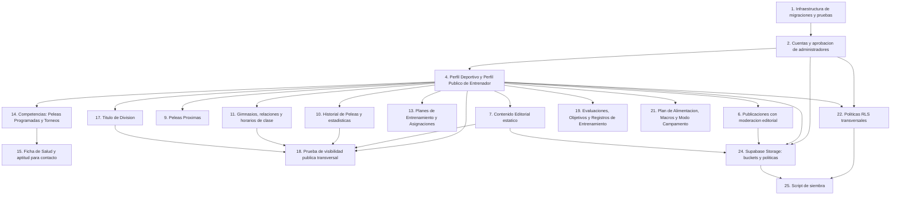

# Implementation Plan: Supabase Database Schema

## Overview

Este plan implementa el esquema de Supabase de `corazon_jab` de forma incremental: primero la infraestructura de migraciones y pruebas, luego cada grupo de tablas en el mismo orden que el documento de diseño (identidad → perfiles → contenido → competencias → salud/nutrición), aplicando en cada paso las funciones/triggers y políticas RLS correspondientes, y cerrando cada bloque con las pruebas de propiedades (`fast-check`, mínimo 100 iteraciones, autenticadas con el SDK de Supabase) y pruebas unitarias/`pgTAP` que le correspondan según el diseño. Las 35 Correctness Properties del diseño se implementan como sub-tareas de prueba individuales, ubicadas junto a la implementación que validan; las cuatro propiedades transversales de RLS (32–35) y la propiedad de validación de dominio (5) se ubican al final de sus respectivos bloques porque requieren que existan varias tablas relacionadas.

Todas las migraciones SQL se numeran secuencialmente en `supabase/migrations/`. Todo bloque de tablas nuevo se cierra habilitando `ROW LEVEL SECURITY` y sus políticas antes de pasar al siguiente bloque, para que ninguna tabla quede temporalmente sin protección.

**Asunciones documentadas (ADR-5 y ADR-6, pendientes de confirmación de producto):**
- **ADR-5**: se implementa `ON DELETE CASCADE` desde `accounts` hacia `perfiles_deportivos`/`perfiles_publicos_entrenador`, y desde ahí hacia el resto de historial. Queda documentado en comentarios SQL de las migraciones correspondientes como reversible a soft-delete.
- **ADR-6**: los buckets `avatars`, `entrenador-galeria`, `publicaciones` y `contenido-editorial` se implementan como públicos de solo lectura. Queda documentado en la tarea de Storage como reversible a URLs firmadas.

## Tasks

- [x] 1. Configurar infraestructura de migraciones y entornos de prueba
  - Crear la carpeta `supabase/migrations/` con la migración inicial que habilita las extensiones `pgcrypto`/`uuid-ossp` (para `gen_random_uuid()`)
  - Crear la carpeta `supabase/tests/pgtap/` para las pruebas unitarias/de integración en SQL
  - Crear un proyecto Node/TypeScript en `supabase/tests/property/` con `fast-check`, `@supabase/supabase-js` y el runner de pruebas (p. ej. `vitest` o `jest`) como dependencias, y un helper de autenticación reutilizable que inicia sesión con usuarios de prueba sembrados mediante el SDK (no `service_role`)
  - Documentar en un `README.md` del spec cómo levantar Supabase local (`supabase start`) y ejecutar ambas suites de pruebas
  - _Requirements: 20.1_

- [ ] 2. Implementar Cuentas y aprobación de administradores (Requirement 1, 2)
  - [x] 2.1 Migración: tabla `accounts` con columnas, `CHECK` de `rol` y `estado_cuenta`, y `ALTER TABLE ... ENABLE ROW LEVEL SECURITY`
    - Sin columna de contraseña ni credencial; comentario SQL documentando ADR-5 (`ON DELETE CASCADE` desde `auth.users`)
    - _Requirements: 1.1, 1.2, 1.4, 1.5, 1.6, 2.1_
  - [x] 2.2 Migración: función `handle_new_user()` y trigger `on_auth_user_created` sobre `auth.users`
    - Lee `rol` desde `raw_user_meta_data`, fija `estado_cuenta = 'pendiente'` si `rol = 'admin'`, `'aprobado'` en otro caso
    - Verificado en la base remota: función `handle_new_user` y trigger `on_auth_user_created` (AFTER INSERT) existen sobre `auth.users`
    - _Requirements: 1.3, 2.2, 2.6_
  - [x] 2.3 Migración: funciones `es_admin_aprobado()` y `rol_actual()` (`SECURITY DEFINER STABLE`)
    - Verificado en la base remota: ambas funciones existen
    - _Requirements: 2.3, 20.2_
  - [x] 2.4 Migración: función/RPC `aprobar_cuenta_admin(cuenta_id uuid)`
    - Actualiza `estado_cuenta`, `aprobado_por`, `aprobado_en`; solo ejecutable por una Cuenta admin aprobada
    - Verificado en la base remota: función `aprobar_cuenta_admin` existe
    - _Requirements: 2.4, 2.5_
  - [x] 2.5 Migración: políticas RLS de `accounts` (`accounts_select_propia`, `accounts_select_publica_entrenador`, `accounts_update_propia`, `accounts_admin_todo`)
    - Verificado en la base remota: las 4 políticas existen sobre `accounts`
    - _Requirements: 20.2, 20.5_
  - [ ]* 2.6 Escribir pruebas `pgTAP` de esquema para `accounts`
    - Verificar columnas, tipos, `CHECK` de `rol`/`estado_cuenta`, ausencia de columna de credencial
    - _Requirements: 1.1, 1.2, 1.4, 2.1_
  - [ ]* 2.7 Escribir prueba de propiedad para creación automática de Cuenta
    - **Property 1: Creación automática y coherente de Cuenta**
    - **Validates: Requirements 1.3, 1.4, 1.5**
  - [ ]* 2.8 Escribir prueba de propiedad para rechazo de rol inválido
    - **Property 2: Rechazo de rol inválido**
    - **Validates: Requirements 1.4**
  - [ ]* 2.9 Escribir prueba de propiedad para estado inicial de aprobación según rol
    - **Property 3: Estado inicial de aprobación según rol**
    - **Validates: Requirements 2.2, 2.6**
  - [ ]* 2.10 Escribir prueba de propiedad para aprobación de Cuenta admin
    - **Property 4: Aprobación de Cuenta admin habilita acceso y registra auditoría**
    - **Validates: Requirements 2.3, 2.4, 2.5**

- [x] 3. Checkpoint — Ensure all tests pass, ask the user if questions arise.
  - Verificado directamente contra la base remota de Supabase Cloud (SQL Editor): tabla, funciones y políticas de `accounts` existen y coinciden con el diseño.

- [ ] 4. Implementar Perfil Deportivo y Perfil Público de Entrenador (Requirement 3, 4)
  - [x] 4.1 Migración: tabla `perfiles_deportivos`, columna `perfil_publico boolean not null default false`, `CHECK` compuesto de `origen_entrenador`, `UNIQUE (cuenta_id)`, RLS habilitado
    - Verificado en la base remota: columnas y `CHECK` (`chk_origen_entrenador`) presentes
    - _Requirements: 3.1, 3.2, 3.3, 3.4, 3.5, 3.6, 3.8_
  - [x] 4.2 Migración: trigger `limpiar_origen_entrenador()` (`BEFORE UPDATE ON perfiles_deportivos`)
    - Verificado en la base remota: trigger `trg_limpiar_origen_entrenador` presente
    - _Requirements: 3.7_
  - [x] 4.3 Migración: funciones `es_propio_perfil(uuid)` y `es_entrenador_de(uuid)` (`SECURITY DEFINER STABLE`)
    - Verificado en la base remota: ambas funciones existen
    - _Requirements: 20.3, 20.4, 20.5, 20.6_
  - [x] 4.4 Migración: políticas RLS de `perfiles_deportivos` (`select`, `insert`, `update`, `delete`)
    - Verificado en la base remota: las 4 políticas existen
    - _Requirements: 20.2, 20.3, 20.4, 20.5, 20.6_
  - [x] 4.5 Migración: tabla `perfiles_publicos_entrenador` con `UNIQUE (cuenta_id)`, y tablas hijas `logros_entrenador`, `redes_sociales_entrenador`, `galeria_entrenador`, todas con RLS habilitado
    - Verificado en la base remota: las 4 tablas existen con RLS habilitado
    - _Requirements: 4.1, 4.2, 4.3, 4.4, 4.6_
  - [x] 4.6 Migración: políticas RLS de `perfiles_publicos_entrenador` y sus tres tablas hijas (lectura pública, escritura restringida al dueño o admin)
    - Verificado en la base remota: políticas presentes en las 4 tablas
    - _Requirements: 4.5, 4.6, 20.2_
  - [ ]* 4.7 Escribir prueba de propiedad para coherencia de `Origen_Entrenador`
    - **Property 6: Coherencia de campos condicionados por Origen_Entrenador**
    - **Validates: Requirements 3.4, 3.5, 3.6, 3.7**
  - [ ]* 4.8 Escribir prueba de propiedad para unicidad de Perfil_Deportivo y Perfil_Publico_Entrenador por Cuenta
    - **Property 7: Unicidad de Perfil_Deportivo y Perfil_Publico_Entrenador por Cuenta**
    - **Validates: Requirements 3.8, 4.6**
  - [ ]* 4.9 Escribir pruebas `pgTAP` de esquema para `perfiles_deportivos` y `perfiles_publicos_entrenador` (columnas, `UNIQUE`, tablas hijas)
    - _Requirements: 3.1, 4.1_

- [x] 5. Checkpoint — Ensure all tests pass, ask the user if questions arise.
  - Verificado directamente contra la base remota: `perfiles_deportivos` y `perfiles_publicos_entrenador` (+ tablas hijas) existen con RLS, triggers y CHECK correctos.

- [ ] 6. Implementar Publicaciones con moderación editorial (Requirement 5)
  - [x] 6.1 Migración: tabla `publicaciones` con `CHECK` de `tipo`/`estado_publicacion`, columnas condicionales (`icono`, `motivo_rechazo`), RLS habilitado
    - Verificado en la base remota: columnas y CHECKs (`chk_icono_solo_logro`, `chk_motivo_rechazo`) presentes
    - _Requirements: 5.1, 5.2, 5.4, 5.6_
  - [x] 6.2 Migración: trigger `validar_autor_publicacion()` (`BEFORE INSERT ON publicaciones`, ADR-3)
    - Verificado en la base remota: trigger `trg_validar_autor_publicacion` presente
    - _Requirements: 5.2_
  - [x] 6.3 Migración: políticas RLS de `publicaciones` (`select` pública/propia, `insert` propia, `update` de moderación admin, `delete` autor/admin)
    - Verificado en la base remota: las 5 políticas existen
    - _Requirements: 5.3, 5.5, 5.6, 5.7, 5.9_
  - [ ]* 6.4 Escribir prueba de propiedad para restricción de rol del autor
    - **Property 8: Restricción de rol del autor de Publicacion**
    - **Validates: Requirements 5.2**
  - [ ]* 6.5 Escribir prueba de propiedad para el ciclo de moderación
    - **Property 9: Ciclo de moderación de Publicacion**
    - **Validates: Requirements 5.3, 5.5, 5.6**
  - [ ]* 6.6 Escribir prueba de propiedad para visibilidad pública filtrada por estado
    - **Property 10: Visibilidad pública filtrada por estado de Publicacion**
    - **Validates: Requirements 5.7**
  - [ ]* 6.7 Escribir prueba de propiedad para visibilidad de logros aprobados en el historial del alumno
    - **Property 11: Visibilidad de logros aprobados en historial del alumno**
    - **Validates: Requirements 5.8**
  - [ ]* 6.8 Escribir prueba de propiedad para eliminación restringida a autor o admin
    - **Property 12: Eliminación de Publicacion restringida a autor o admin**
    - **Validates: Requirements 5.9**

- [ ] 7. Implementar Contenido Editorial estático (Requirement 6)
  - [x] 7.1 Migración: tabla `contenido_editorial` con `clave` única, RLS habilitado
    - Verificado en la base remota
    - _Requirements: 6.1_
  - [x] 7.2 Migración: políticas RLS de `contenido_editorial` (lectura pública, escritura solo admin)
    - Verificado en la base remota: `contenido_editorial_admin_escribe`, `contenido_editorial_select_publica`
    - _Requirements: 6.2, 6.3, 6.4_
  - [ ]* 7.3 Escribir prueba de propiedad para unicidad y aislamiento por clave
    - **Property 13: Unicidad y aislamiento de Contenido_Editorial por clave**
    - **Validates: Requirements 6.1, 6.2, 6.3**

- [x] 8. Checkpoint — Ensure all tests pass, ask the user if questions arise.
  - Verificado directamente contra la base remota: `publicaciones` y `contenido_editorial` con RLS y triggers correctos.

- [ ] 9. Implementar Peleas Próximas (Requirement 7)
  - [x] 9.1 Migración: tabla `peleas_proximas`, RLS habilitado
    - Verificado en la base remota
    - _Requirements: 7.1_
  - [x] 9.2 Migración: políticas RLS de `peleas_proximas` (`select`/`write` propio, entrenador, admin)
    - Verificado en la base remota: `peleas_proximas_select`, `peleas_proximas_write`
    - _Requirements: 7.2, 7.3, 7.4_
  - [ ]* 9.3 Escribir prueba de propiedad para aislamiento por Alumno y visibilidad total para Admin
    - **Property 15: Aislamiento de Pelea_Proxima por Alumno y visibilidad total para Admin**
    - **Validates: Requirements 7.2, 7.4**
  - [ ]* 9.4 Escribir prueba de propiedad para visibilidad de contrincante solo con pelea futura
    - **Property 16: Visibilidad de contrincante solo con Pelea_Proxima futura**
    - **Validates: Requirements 7.3**

- [ ] 10. Implementar Historial de Peleas y estadísticas (Requirement 8)
  - [x] 10.1 Migración: tabla `registros_pelea` con `CHECK` de `resultado` y constraint de rival, RLS habilitado
    - Verificado en la base remota: `registros_pelea_resultado_check`, `chk_rival`
    - _Requirements: 8.1, 8.2, 8.3_
  - [x] 10.2 Migración: función `estadisticas_pelea(alumno_id uuid)` (agregación `STABLE`, ADR-4)
    - Verificado en la base remota
    - _Requirements: 8.4_
  - [x] 10.3 Migración: políticas RLS de `registros_pelea` (propio/entrenador/admin y lectura pública condicionada a `perfiles_deportivos.perfil_publico`)
    - Verificado en la base remota: `registros_pelea_select_propio`, `registros_pelea_select_publica`, `registros_pelea_write`
    - _Requirements: 8.5, 20.3, 20.5_
  - [ ]* 10.4 Escribir prueba de propiedad para consistencia de estadísticas de historial
    - **Property 17: Estadísticas de historial de peleas consistentes con los registros**
    - **Validates: Requirements 8.4**
  - [ ]* 10.5 Escribir pruebas `pgTAP` de esquema para `registros_pelea` (`CHECK` de resultado, constraint de rival)
    - _Requirements: 8.1, 8.2, 8.3_

- [ ] 11. Implementar Gimnasios, relaciones con entrenadores y horarios de clase (Requirement 9, 10)
  - [x] 11.1 Migración: tabla `gimnasios`, RLS habilitado
    - Verificado en la base remota
    - _Requirements: 9.1_
  - [x] 11.2 Migración: tabla `relaciones_gimnasio_entrenador` con `CHECK` condicional de `tipo_relacion`, RLS habilitado
    - Verificado en la base remota: `chk_tipo_relacion`
    - _Requirements: 9.2, 9.3, 9.4_
  - [x] 11.3 Migración: políticas RLS de `gimnasios` y `relaciones_gimnasio_entrenador` (lectura pública, escritura admin/entrenador propio)
    - Verificado en la base remota
    - _Requirements: 9.5_
  - [x] 11.4 Migración: tabla `horarios_clase` con `CHECK (hora_fin > hora_inicio)`, RLS habilitado
    - Verificado en la base remota: `horarios_clase_check`
    - _Requirements: 10.1, 10.2_
  - [x] 11.5 Migración: políticas RLS de `horarios_clase` (lectura autenticada, escritura del entrenador propio o admin)
    - Verificado en la base remota: `horarios_select_autenticado`, `horarios_write_propio`
    - _Requirements: 10.3, 10.4_
  - [ ]* 11.6 Escribir prueba de propiedad para coherencia según Tipo_Relacion_Gimnasio
    - **Property 18: Coherencia de campos condicionados por Tipo_Relacion_Gimnasio**
    - **Validates: Requirements 9.3, 9.4**
  - [ ]* 11.7 Escribir prueba de propiedad para orden cronológico de Horario_Clase
    - **Property 19: Orden cronológico de Horario_Clase**
    - **Validates: Requirements 10.2**
  - [ ]* 11.8 Escribir prueba de propiedad para gestión de Horario_Clase restringida al Entrenador asociado
    - **Property 20: Gestión de Horario_Clase restringida al Entrenador asociado**
    - **Validates: Requirements 10.3, 10.4**

- [x] 12. Checkpoint — Ensure all tests pass, ask the user if questions arise.
  - Verificado directamente contra la base remota: `gimnasios`, `relaciones_gimnasio_entrenador`, `horarios_clase` con RLS y CHECK correctos.

- [ ] 13. Implementar Planes de Entrenamiento y Asignaciones (Requirement 11)
  - [x] 13.1 Migración: tabla `plantillas_plan`, RLS habilitado
    - Verificado en la base remota
    - _Requirements: 11.1_
  - [x] 13.2 Migración: tabla `asignaciones_plan` con FK a `perfiles_deportivos.id`, RLS habilitado
    - Verificado en la base remota
    - _Requirements: 11.2, 11.5_
  - [x] 13.3 Migración: políticas RLS de `plantillas_plan` y `asignaciones_plan` (gestión del entrenador autor, lectura del alumno asignado)
    - Verificado en la base remota: `plantillas_plan_propio`, `asignaciones_plan_entrenador`, `asignaciones_plan_alumno_lee`
    - _Requirements: 11.3, 11.4_
  - [ ]* 13.4 Escribir prueba de propiedad para gestión restringida al autor y lectura restringida al alumno asignado
    - **Property 21: Gestión de Plantilla_Plan/Asignacion_Plan restringida al autor; lectura restringida al Alumno asignado**
    - **Validates: Requirements 11.3, 11.4**
  - [ ]* 13.5 Escribir prueba de propiedad para rechazo de asignación hacia alumno sin perfil deportivo
    - **Property 22: Rechazo de Asignacion_Plan hacia Alumno sin Perfil_Deportivo**
    - **Validates: Requirements 11.5**

- [ ] 14. Implementar Competencias: Peleas Programadas y Torneos (Requirement 12)
  - [x] 14.1 Migración: tabla `peleas_programadas` con `CHECK` condicional de `metodo`, RLS habilitado
    - Verificado en la base remota: `peleas_programadas_estado_check`, `chk_metodo`
    - _Requirements: 12.1, 12.2, 12.3_
  - [x] 14.2 Migración: tabla `torneos` y tabla puente `torneo_participantes`, RLS habilitado en ambas
    - Verificado en la base remota
    - _Requirements: 12.4, 12.5_
  - [x] 14.3 Migración: políticas RLS de `peleas_programadas`, `torneos` y `torneo_participantes` (gestión del entrenador del alumno, lectura del alumno participante, lectura autenticada de `torneos`)
    - Verificado en la base remota
    - _Requirements: 12.6, 12.7_
  - [ ]* 14.4 Escribir prueba de propiedad para coherencia de método según Estado_Pelea_Programada
    - **Property 23: Coherencia de método según Estado_Pelea_Programada**
    - **Validates: Requirements 12.3**
  - [ ]* 14.5 Escribir prueba de propiedad para gestión y visibilidad de competencias
    - **Property 24: Gestión de competencias restringida al Entrenador de cada Alumno; visibilidad restringida al Alumno participante**
    - **Validates: Requirements 12.6, 12.7**

- [ ] 15. Implementar Ficha de Salud y restricción de aptitud para contacto (Requirement 13)
  - [x] 15.1 Migración: tabla `fichas_salud` con columnas condicionales por `lesionado`, RLS habilitado
    - Verificado en la base remota: `chk_lesion`
    - _Requirements: 13.1, 13.2_
  - [x] 15.2 Migración: función `es_apto_para_contacto(perfil_deportivo_id uuid)`
    - Verificado en la base remota
    - _Requirements: 13.3_
  - [x] 15.3 Migración: trigger `validar_aptitud_contacto()` aplicado a `peleas_programadas` y `torneo_participantes` (`BEFORE INSERT`), lanzando excepción explícita
    - Verificado en la base remota: `trg_validar_aptitud_peleas_programadas`, `trg_validar_aptitud_torneo_participantes`
    - _Requirements: 13.3_
  - [x] 15.4 Migración: políticas RLS de `fichas_salud` (gestión del entrenador asociado, lectura del propio alumno)
    - Verificado en la base remota: `fichas_salud_entrenador`, `fichas_salud_alumno_lee`
    - _Requirements: 13.4, 13.5_
  - [ ]* 15.5 Escribir prueba de propiedad para restricción de aptitud para contacto
    - **Property 25: Restricción de aptitud para contacto según Ficha_Salud**
    - **Validates: Requirements 13.3**
  - [ ]* 15.6 Escribir prueba de propiedad para acceso a Ficha_Salud restringido por rol y permiso de escritura
    - **Property 26: Acceso a Ficha_Salud restringido por rol y permiso de escritura**
    - **Validates: Requirements 13.4, 13.5**

- [x] 16. Checkpoint — Ensure all tests pass, ask the user if questions arise.
  - Verificado directamente contra la base remota: `plantillas_plan`, `asignaciones_plan`, `peleas_programadas`, `torneos`, `torneo_participantes`, `fichas_salud` con RLS, CHECK y triggers correctos.

- [ ] 17. Implementar Título de División (Requirement 14)
  - [x] 17.1 Migración: tabla `titulos_division` con `CHECK` de `federacion` cuando `es_campeon = true`, RLS habilitado
    - Verificado en la base remota: `chk_federacion`
    - _Requirements: 14.1, 14.2_
  - [x] 17.2 Migración: políticas RLS de `titulos_division` (gestión del entrenador asociado, lectura pública condicionada a `perfil_publico`)
    - Verificado en la base remota: `titulos_division_entrenador`, `titulos_division_select_publica`
    - _Requirements: 14.3, 14.4_
  - [ ]* 17.3 Escribir prueba de propiedad para coherencia de Titulo_Division cuando es campeón
    - **Property 27: Coherencia de Titulo_Division cuando es campeón**
    - **Validates: Requirements 14.2**
  - [ ]* 17.4 Escribir prueba de propiedad para gestión restringida al Entrenador del Alumno
    - **Property 28: Gestión de Titulo_Division restringida al Entrenador del Alumno**
    - **Validates: Requirements 14.3**

- [ ] 18. Escribir prueba de propiedad de visibilidad pública transversal (Requirement 4, 6, 8, 9, 14)
  - Ejercitar en una sola prueba consultas sin sesión sobre `perfiles_publicos_entrenador`, `contenido_editorial`, `gimnasios`, `relaciones_gimnasio_entrenador`, `titulos_division` y `registros_pelea` de un alumno con `perfil_publico = true`
  - [ ]* 18.1 Escribir prueba de propiedad para visibilidad pública sin sesión de datos marcados como públicos
    - **Property 14: Visibilidad pública sin sesión de datos marcados como públicos**
    - **Validates: Requirements 4.5, 6.4, 8.5, 9.5, 14.4**

- [ ] 19. Implementar Evaluaciones de Habilidades, Objetivos y Registros de Entrenamiento (Requirement 15, 16, 17)
  - [x] 19.1 Migración: tabla `evaluaciones_habilidades` con `CHECK` de rango 0-100 por columna y `UNIQUE (perfil_deportivo_id, fecha)`, RLS habilitado
    - Verificado en la base remota: CHECKs de rango en las 6 columnas
    - _Requirements: 15.1, 15.2_
  - [x] 19.2 Migración: tabla `objetivos_alumno` con `CHECK` de `tipo_objetivo`, RLS habilitado
    - Verificado en la base remota: `objetivos_alumno_tipo_objetivo_check`
    - _Requirements: 16.1, 16.2_
  - [x] 19.3 Migración: tabla `registros_entrenamiento` con `CHECK` de `tipo` e `intensidad`, RLS habilitado
    - Verificado en la base remota: `registros_entrenamiento_tipo_check`, `registros_entrenamiento_intensidad_check`
    - _Requirements: 17.1, 17.2_
  - [x] 19.4 Migración: políticas RLS de las tres tablas (entrenador escribe evaluaciones/entrenamientos y lee objetivos; alumno gestiona objetivos/entrenamientos y lee evaluaciones)
    - Verificado en la base remota: las 6 políticas correspondientes existen
    - _Requirements: 15.4, 15.5, 16.3, 16.4, 17.3, 17.4_
  - [ ]* 19.5 Escribir prueba de propiedad para unicidad por fecha y orden de progreso
    - **Property 29: Unicidad de Evaluacion_Habilidades por fecha y orden de progreso**
    - **Validates: Requirements 15.2, 15.3**
  - [ ]* 19.6 Escribir prueba de propiedad para acceso restringido por rol y permiso de escritura
    - **Property 30: Acceso a Evaluacion_Habilidades, Objetivo_Alumno y Registro_Entrenamiento restringido por rol y permiso de escritura**
    - **Validates: Requirements 15.4, 15.5, 16.3, 16.4, 17.3, 17.4**
  - [ ]* 19.7 Escribir prueba de propiedad de validación de dominio (enums y rangos) sobre todas las columnas restringidas del esquema
    - **Property 5: Validación de dominio por entidad (enums y rangos)**
    - **Validates: Requirements 3.2, 3.3, 8.2, 9.2, 12.2, 12.5, 15.1, 16.2, 17.1, 17.2**

- [x] 20. Checkpoint — Ensure all tests pass, ask the user if questions arise.
  - Verificado directamente contra la base remota: `titulos_division`, `evaluaciones_habilidades`, `objetivos_alumno`, `registros_entrenamiento` con RLS y CHECK correctos.

- [ ] 21. Implementar Plan de Alimentación, Registro de Macros y Modo Campamento (Requirement 18, 19)
  - [x] 21.1 Migración: tabla `planes_alimentacion` y tabla hija `comidas_plan`, RLS habilitado en ambas
    - Verificado en la base remota
    - _Requirements: 18.1, 18.2_
  - [x] 21.2 Migración: tabla `registros_macros`, RLS habilitado
    - Verificado en la base remota
    - _Requirements: 18.3_
  - [x] 21.3 Migración: tabla `modos_campamento` con columna `plan_semanal jsonb`, RLS habilitado
    - Verificado en la base remota
    - _Requirements: 19.1, 19.3_
  - [x] 21.4 Migración: tabla `controles_peso` con `UNIQUE (modo_campamento_id, fecha)`, RLS habilitado
    - Verificado en la base remota
    - _Requirements: 19.2_
  - [x] 21.5 Migración: políticas RLS de las cinco tablas (gestión exclusiva del alumno propietario; lectura del entrenador solo para `modos_campamento`)
    - Verificado en la base remota: `nutricion_propio`, `comidas_plan_propio`, `registros_macros_propio`, `modos_campamento_propio`, `modos_campamento_entrenador_lee`, `controles_peso_propio`
    - _Requirements: 18.4, 19.4, 19.5_
  - [ ]* 21.6 Escribir prueba de propiedad para aislamiento de datos de nutrición y campamento por Alumno propietario
    - **Property 31: Aislamiento de datos de nutrición y campamento por Alumno propietario**
    - **Validates: Requirements 18.4, 19.4, 19.5**

- [ ] 22. Verificar y probar las políticas RLS transversales (Requirement 20)
  - [x] 22.1 Migración de verificación: confirmar mediante consulta a `pg_tables`/`pg_policies` que toda tabla de negocio tiene `rowsecurity = true` y al menos una política declarada; corregir cualquier tabla omitida
    - Verificado manualmente vía SQL Editor contra la base remota: las 28 tablas de `public` tienen `rowsecurity = true` y 59 políticas distribuidas coherentemente entre ellas; ninguna tabla quedó sin política
    - _Requirements: 20.1_
  - [ ]* 22.2 Escribir prueba de propiedad transversal — admin aprobado accede a todo
    - **Property 32: Regla transversal — Admin aprobado accede a todo**
    - **Validates: Requirements 20.2**
  - [ ]* 22.3 Escribir prueba de propiedad transversal — entrenador limitado a sus alumnos de directorio
    - **Property 33: Regla transversal — Entrenador limitado a sus alumnos de directorio**
    - **Validates: Requirements 20.3, 20.4**
  - [ ]* 22.4 Escribir prueba de propiedad transversal — alumno limitado a su propio Perfil_Deportivo
    - **Property 34: Regla transversal — Alumno limitado a su propio Perfil_Deportivo**
    - **Validates: Requirements 20.5, 20.6**
  - [ ]* 22.5 Escribir prueba de propiedad transversal — denegación de acceso anónimo a tablas no públicas
    - **Property 35: Regla transversal — denegación de acceso anónimo a tablas no públicas**
    - **Validates: Requirements 20.7**
  - [ ]* 22.6 Escribir pruebas `pgTAP` de esquema que verifiquen `rowsecurity = true` en cada tabla de negocio (smoke test único, no aleatorizado)
    - _Requirements: 20.1_

- [x] 23. Checkpoint — Ensure all tests pass, ask the user if questions arise.
  - Verificado directamente contra la base remota: RLS habilitado en las 28 tablas de `public`, con 59 políticas distribuidas correctamente (Requirement 20 cumplido).

- [ ] 24. Configurar Supabase Storage: buckets y políticas (Requirement 1, 4, 5, 6)
  - [x] 24.1 Migración/configuración: crear buckets `avatars`, `entrenador-galeria`, `publicaciones` y `contenido-editorial` como públicos de solo lectura
    - Documentar en comentario la asunción ADR-6 (públicos vs. URLs firmadas) y su reversibilidad
    - Verificado en la base remota (`storage.buckets`): los 4 buckets existen con `public = true`
    - _Requirements: 1.6, 4.1, 4.4, 5.1, 6.1_
  - [x] 24.2 Migración: política `storage_lectura_publica` sobre `storage.objects` para los cuatro buckets
    - Verificado en la base remota: política `storage_lectura_publica` cubre los 4 buckets
    - _Requirements: 4.5, 6.4_
  - [x] 24.3 Migración: políticas de escritura por bucket (`storage_avatars_escribe`/`actualiza`, `storage_galeria_escribe`, `storage_publicaciones_escribe`, `storage_contenido_editorial_escribe`) validando el prefijo de carpeta contra `auth.uid()` o el `perfil_entrenador_id`/rol admin correspondiente
    - Verificado en la base remota: las 5 políticas de escritura existen con la lógica de prefijo/rol correcta
    - _Requirements: 1.6, 4.4, 5.1, 6.2, 6.3_
  - [ ]* 24.4 Escribir pruebas de integración de Storage (1-3 ejemplos por bucket): subir un archivo autenticado, verificar `getPublicUrl`, y verificar que un usuario ajeno no puede escribir en el prefijo de otro
    - _Requirements: 1.6, 4.4, 5.1, 6.2, 6.3_

- [ ] 25. Crear script de siembra (seed) para desarrollo y pruebas
  - Sembrar usuarios de prueba vía SDK admin (`service_role`, solo para creación de usuarios) cubriendo los tres roles, un admin pendiente y uno aprobado, y datos representativos mínimos de cada tabla para habilitar las suites de `pgTAP` y `fast-check` de las tareas anteriores
  - _Requirements: 1.3, 2.2, 2.4_

- [ ] 26. Checkpoint final — Ensure all tests pass, ask the user if questions arise.

## Notes

- Las tareas marcadas con `*` son de prueba (unitarias/`pgTAP` o de propiedades con `fast-check`) y son opcionales: pueden omitirse para un MVP más rápido, pero se recomienda ejecutarlas antes de considerar cerrado cada bloque.
- Cada prueba de propiedad debe configurarse con mínimo 100 iteraciones y etiquetarse como **Feature: supabase-database-schema, Property {n}: {texto de la propiedad}**.
- Las pruebas de propiedad autentican con el SDK de Supabase usando usuarios de prueba sembrados (tarea 25), nunca con `service_role`, para que las políticas RLS se evalúen igual que en producción.
- ADR-5 (borrado en cascada) y ADR-6 (buckets públicos) quedan implementados según la opción provisional del diseño y documentados en comentarios SQL; son reversibles sin rediseñar el esquema completo si el equipo de producto decide lo contrario.
- Este plan no incluye tareas de integración con el frontend de `corazon_jab`: cubre exclusivamente el esquema de Base_Datos, funciones/triggers, políticas RLS y configuración de Storage.

## Task Dependency Graph



```json
{
  "waves": [
    { "wave": 1, "tasks": ["1"] },
    { "wave": 2, "tasks": ["2"] },
    { "wave": 3, "tasks": ["3"] },
    { "wave": 4, "tasks": ["4"] },
    { "wave": 5, "tasks": ["5"] },
    { "wave": 6, "tasks": ["6", "7", "9", "10", "11", "13", "19", "21"] },
    { "wave": 7, "tasks": ["8", "12", "14"] },
    { "wave": 8, "tasks": ["15"] },
    { "wave": 9, "tasks": ["16", "17"] },
    { "wave": 10, "tasks": ["18", "22"] },
    { "wave": 11, "tasks": ["20", "23"] },
    { "wave": 12, "tasks": ["24"] },
    { "wave": 13, "tasks": ["25"] },
    { "wave": 14, "tasks": ["26"] }
  ]
}
```
